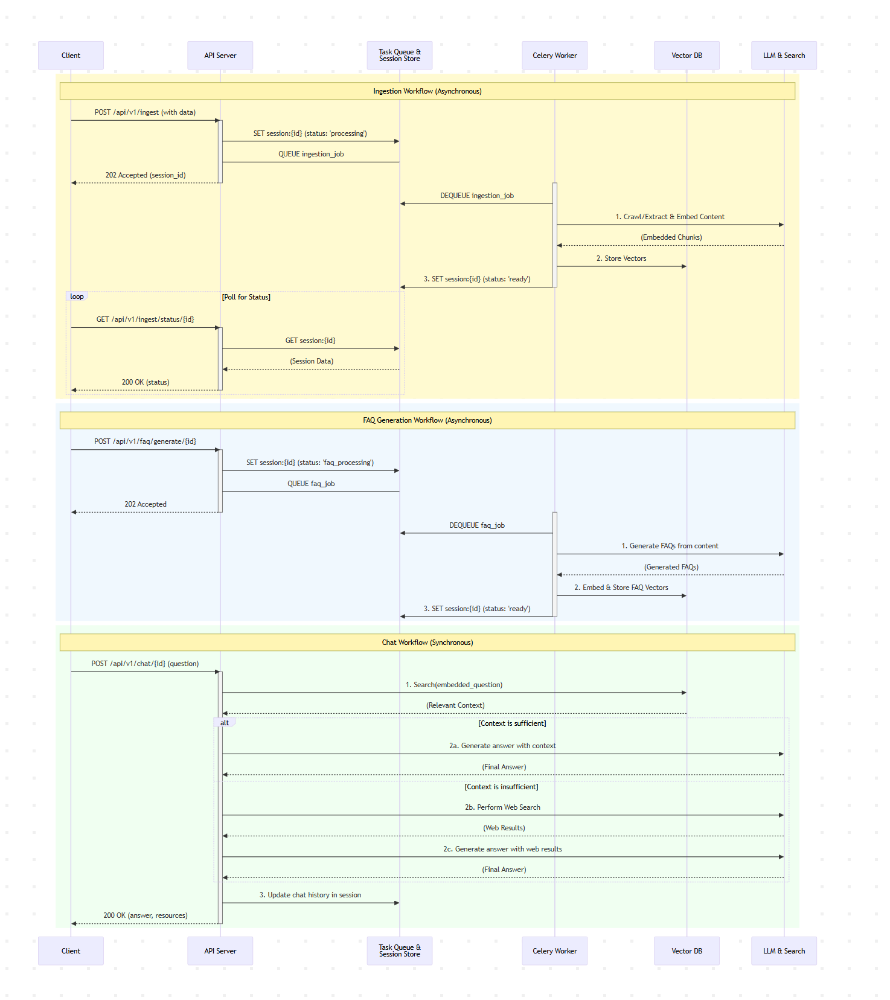

Of course. I will integrate the specified diagrams into your README to provide excellent visual context for the architecture and data flows.

I'll place the `High-Level Architecture Diagram.png` in the "How It Works" section to give a bird's-eye view, and the `Sequence-Diagram.png` in the "Behind the Scenes" section to visually support the detailed file-by-file breakdown.

Here is the updated `README.md` with the diagrams included:

---

# RAG Chat Application API: Your Smart Document & Web Information Service

This project provides a powerful backend API for interacting with information from websites and PDF documents. It allows other applications to ingest content, generate frequently asked questions, and get intelligent answers to user queries, all through simple API calls.

---

## How It Works: Simple Pieces, Powerful System

Our application is built with a clear structure to handle complex tasks smoothly. Imagine it like this:

*   **`utils/` is your Toolkit.** These are simple, reusable functions that do one specific job.
*   **`nodes/` is your Instruction Steps.** These are the smart "brains" that tell the toolkit what to do and when.
*   **`app/` is your API Front Door.** This is where other programs send their requests, and it decides which set of "instruction steps" to run.

This design keeps the API fast and responsive, as heavy processing happens in the background (using Celery). All session data, including your processed content and chat history, is stored efficiently in **Redis** and **Qdrant** (a specialized database for AI searches).

The diagram below provides a high-level overview of this architecture:

<div align="center">
  
</div>

---

## Behind the Scenes: A File-by-File Flow

This section traces the execution path, file by file, for each major API call. The sequence diagram below visualizes these interactions over time, showing the difference between asynchronous (fire-and-forget) and synchronous (wait-for-response) workflows.

<div align="center">
  
</div>

#### `POST /api/v1/ingest` (Asynchronous)

This endpoint kicks off the content processing workflow in the background.

1.  **API Server (Immediate Response):**
    *   `app/api/endpoints/ingest.py` -> `ingest_content()` receives the request.
    *   `app/core/session.py` -> `create_session()` generates a `session_id` and saves initial data to Redis with a `"processing"` status.
    *   `app/workers/tasks.py` -> `run_ingestion_flow.delay()` sends the job to the Celery queue.
    *   The API immediately returns a `202 Accepted` response to the client.

2.  **Celery Worker (Background Processing):**
    *   `app/workers/tasks.py` -> `run_ingestion_flow()` is executed by the worker.
    *   `app/flows.py` -> `create_setup_flow()` is called to build the workflow.
    *   The flow executes `nodes/content_processing_node.py` -> `ContentProcessingNode`:
        *   **For websites:** It calls `utils/firecrawl_utils.py` -> `crawl_website()`.
        *   **For PDFs:** It calls `utils/llamaindex_pdf_extractor.py` -> `extract_text_from_pdf()`.
        *   It then calls `utils/create_embedding.py` -> `process_and_embed_yaml()` to chunk the text and create vector embeddings.
        *   Next, it calls `utils/qdrant_storage.py` -> `store_embeddings_in_qdrant()` to save the embeddings to the vector database.
        *   Finally, it calls `app/core/session.py` -> `update_session()` to set the status to `"ready"`.

#### `POST /api/v1/faq/generate/{session_id}` (Asynchronous)

This also runs as a background task.

1.  **API Server (Immediate Response):**
    *   `app/api/endpoints/faq.py` -> `generate_faq()` receives the request.
    *   `app/core/session.py` -> `update_session()` sets the status to `"faq_processing"`.
    *   `app/workers/tasks.py` -> `run_faq_generation_flow.delay()` sends the job to the Celery queue.
    *   The API immediately returns a `202 Accepted` response.

2.  **Celery Worker (Background Processing):**
    *   `app/workers/tasks.py` -> `run_faq_generation_flow()` is executed.
    *   `app/flows.py` -> `create_faq_flow()` is called.
    *   The flow executes `nodes/faq_generation_node.py` -> `FAQGenerationNode`:
        *   It calls `utils/openrouter_faq_generator.py` -> `generate_faqs()` to create FAQs using an LLM.
        *   It then calls `utils/create_embedding.py` -> `create_embedding()` to embed the new FAQs.
        *   Finally, it calls `utils/qdrant_storage.py` -> `store_embeddings_in_qdrant()` to add the FAQ embeddings to the existing collection, enriching the context.
        *   It updates the session status back to `"ready"` via `app/core/session.py`.

#### `POST /api/v1/chat/{session_id}` (Synchronous)

This endpoint handles a live chat query and waits for the full process to complete.

1.  **API Server (Full Process):**
    *   `app/api/endpoints/chat.py` -> `chat_with_content()` receives the request.
    *   It checks the session status with `app/core/session.py` -> `get_session()`.
    *   It **directly invokes** `nodes/chat_query_node.py` -> `ChatQueryNode` (no background task).
    *   Inside the `ChatQueryNode`:
        *   The core RAG logic is performed by calling `utils/rag_query_engine.py` -> `query_content()`. This utility function:
            *   Embeds the user's question using an OpenAI client.
            *   Connects to the vector DB via `utils/qdrant_storage.py` -> `get_qdrant_client()`.
            *   Searches **Qdrant** for relevant text chunks.
        *   If the RAG context is insufficient, it may call `utils/web_search.py` -> `web_search()`.
        *   It sends the context and question to an LLM via `utils/call_llm.py` -> `call_llm()` to generate the final answer.
        *   It updates the chat history via `app/core/session.py` -> `update_session()`.
    *   The API returns the final answer to the client.

---

## Get Started:

1.  **Get the code:** Clone this repository.

2.  **Set up the Virtual Environment:**
    *   First, create the virtual environment:
        ```bash
        python -m venv venv
        ```
    *   Next, activate it. The command differs based on your operating system and shell:
        *   **Windows (PowerShell):**
            ```powershell
            .\venv\Scripts\Activate.ps1
            ```
        *   **Windows (Command Prompt):**
            ```bash
            .\venv\Scripts\activate.bat
            ```
        *   **Linux / macOS (bash/zsh):**
            ```bash
            source venv/bin/activate
            ```

3.  **Install Dependencies:** With your virtual environment active, install the required libraries:
    ```bash
    pip install -r requirements.txt
    ```

4.  **Configure Secrets:** Create a `.env` file in the project root. You'll need API keys for OpenAI/OpenRouter, Firecrawl, LlamaCloud, and connection details for your Redis (Dragonfly) and Qdrant databases. Check `app/core/config.py` for all required variables.

5.  **Run the Application:** You have three options:

    *   **On Windows:** Use the `run.bat` script. This will open two new command prompts and start both the API server and the background worker for you.

    *   **With Docker:** Run `docker-compose up --build`. This will build the images and start both services in containers.

    *   **For Developers (Manual Start):** This is ideal for debugging or if you're not on Windows. **Open two separate terminals and activate the virtual environment in both of them** using the commands from Step 2.

        **Terminal 1: Start the Celery Worker**
        ```bash
        # (venv) is active
        celery -A app.workers.tasks worker --loglevel=info --pool=solo
        ```

        **Terminal 2: Start the FastAPI Server**
        ```bash
        # (venv) is active
        python -m uvicorn app.main:app --reload --host 0.0.0.0 --port 8000
        ```

6.  **Test the API:** Use the `scripts/api_tests.http` file (with a tool like VS Code's REST Client extension) to interact with the API endpoints.

---

## Project Layout:

- `my_project/`
    - `app/`                  # Main FastAPI application, API routes, core settings, session handling, and process flows.
        - `api/`              # API endpoints (ingestion, chat, FAQ, session management).
        - `core/`             # Fundamental application settings and Redis session functions.
        - `schemas/`          # Data structures for API requests/responses.
        - `workers/`          # Celery worker setup and background tasks.
        - `flows.py`          # Defines the order of operations (PocketFlow "Flows").
    - `nodes/`                # Individual processing steps (PocketFlow "Nodes") that use the 'utils'.
    - `utils/`                # A collection of simple, reusable helper functions (e.g., calling LLMs, crawling).
    - `docs/`                 # Project documentation (design, API details, PocketFlow guides).
    - `scripts/`              # Useful scripts (API tests, cleanup).
    - `Dockerfile`            # Instructions to build the Docker image.
    - `docker-compose.yml`    # Defines how to run services (API, worker) using Docker.
    - `requirements.txt`      # List of Python libraries needed.
    - `README.md`             # This file.