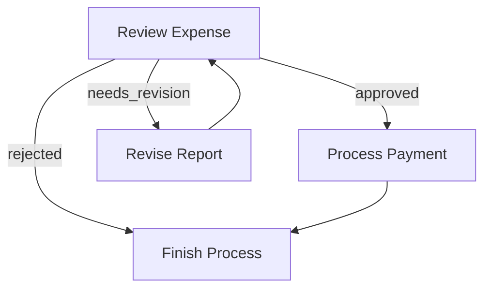
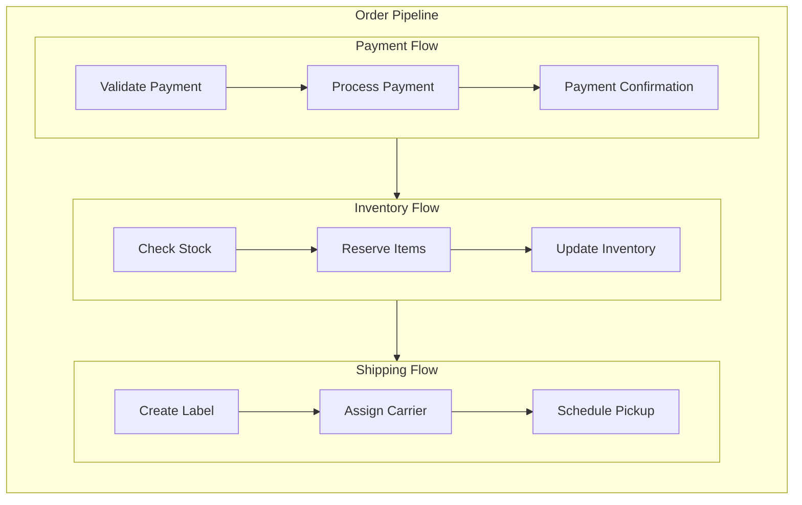

# Combined Project Codebase

This document contains the consolidated code from key project files and directories.

## Documentation and Root Configuration

---
### File: `docs/design.md`
---

```markdown
# Design Doc: Website & PDF Chat Application

> Please DON'T remove notes for AI

## Configuration Constants

- `NUM_FAQS_TO_GENERATE`: 5 (Default number of FAQs to generate)

## Requirements

> Notes for AI: Keep it simple and clear.
> If the requirements are abstract, write concrete user stories

This application aims to provide users with an intelligent chat interface to extract information and generate FAQs from both website content and uploaded PDF documents. The core problems it solves are:

1.  **Information Retrieval**: Users can quickly get answers to questions from large documents or websites without manual searching.
2.  **Content Summarization/Extraction**: Automatically generate a set number of FAQs from the provided content, offering a quick overview.
3.  **Versatility**: Support both web content (crawling) and local documents (PDFs).

## Flow Design

> Notes for AI:
> 1. Consider the design patterns of agent, map-reduce, rag, and workflow. Apply them if they fit.
> 2. Present a concise, high-level description of the workflow.

### Applicable Design Pattern:

1.  **RAG (Retrieval-Augmented Generation)**: For answering questions, the system will retrieve relevant chunks of information from the processed website/PDF content and then use an LLM to generate a coherent answer.
2.  **Workflow**: A sequential flow for processing user input, crawling/uploading, generating FAQs, and handling chat queries.

### Flow high-level Design:

1.  **Input Node**: User provides a website URL or uploads a PDF document.
2.  **Content Processing Node**: Based on input type, either crawls the website or extracts text from the PDF.
3.  **FAQ Generation Node (Optional)**: Generates a configurable number of FAQs from the processed content. This step can be skipped based on user preference.
4.  **Chat/Query Node**: User asks questions, and the system retrieves relevant information and generates answers, potentially looping for continuous interaction.

```mermaid
flowchart TD
    Input[User Input (URL/PDF)] --> ContentProcessing[Content Processing (Crawl/Extract)]
    ContentProcessing --> FAQGeneration{FAQ Generation?}
    FAQGeneration -- Yes --> GenerateFAQs[Generate FAQs]
    FAQGeneration -- No --> ChatQuery[Chat/Query Interface]
    GenerateFAQs --> ChatQuery
    ChatQuery --> Answer[Provide Answer]
```

## Utility Functions

> Notes for AI:
> 1. Understand the utility function definition thoroughly by reviewing the doc.
> 2. Include only the necessary utility functions, based on nodes in the flow.
> 3. **Error Handling**: Each utility function should include robust error handling (e.g., try-except blocks, logging specific errors, returning error indicators or raising custom exceptions) to indicate success or failure and provide detailed error messages.

1.  **`call_llm`** (`utils/call_llm.py`)
    -   *Input*: `prompt` (str)
    -   *Output*: `response` (str)
    -   *Necessity*: Used by `generate_faqs` and `query_content` for LLM interactions.

2.  **`create_embedding`** (`utils/create_embedding.py`)
    -   *Input*: `text` (str)
    -   *Output*: `vector` (list of floats)
    -   *Necessity*: Used by LlamaIndex for generating embeddings for indexing and querying, specifically using OpenAI's small embedding model.

3.  **`crawl_website`** (`utils/firecrawl_utils.py`)
    -   *Input*: `url` (str)
    -   *Output*: `crawled_content` (str)
    -   *Necessity*: To fetch and process content from a given website URL using Firecrawl.

4.  **`generate_faqs`** (`utils/openrouter_faq_generator.py`)
    -   *Input*: `content` (str), `num_faqs` (int)
    -   *Output*: `faqs` (list of dicts, e.g., `[{"question": "...", "answer": "..."}]`)
    -   *Necessity*: To generate a specified number of FAQs from text using OpenRouter.

5.  **`extract_text_from_pdf`** (`utils/llamaindex_pdf_extractor.py`)
    -   *Input*: `file_path` (str)
    -   *Output*: `text_content` (str)
    -   *Necessity*: To extract raw text content from a PDF document using LlamaIndex's PDF reader capabilities.

6.  **`store_embeddings_in_redis`** (`utils/upstash_vector_storage.py`)
    -   *Input*: `documents` (list of dicts, each with 'id', 'text', 'metadata')
    -   *Output*: `success` (bool)
    -   *Necessity*: To take processed documents, generate embeddings using `create_embedding`, and store them directly into the Upstash vector database. This function ensures the content is ready for retrieval.

7.  **`web_search`** (`utils/web_search.py`)
    -   *Input*: `query` (str)
    -   *Output*: `search_results` (str)
    -   *Necessity*: To perform web searches using OpenRouter's `perplexity/sonar-reasoning-pro` model for general knowledge or external information.

8.  **`manage_user_session`** (`utils/redis_session_manager.py`)
    -   *Input*: `user_session_id` (str), `action` (str: 'save' or 'load'), `data` (dict, optional)
    -   *Output*: `session_data` (dict, if 'load' action)
    -   *Necessity*: To save and load user-specific interaction data (like chat history) to/from Redis, using a dedicated keyspace.

9.  **`query_vector_db`** (`utils/rag_query_engine.py`)
    -   *Input*: `user_session_id` (str), `query` (str)
    -   *Output*: `answer` (str), `resources` (list of dicts, e.g., `[{'source': 'filename.pdf', 'page': 1, 'line_range': '10-20', 'text_snippet': '...'}]` or `[{'source': 'website_url', 'text_snippet': '...'}]`)
    -   *Necessity*: To answer user questions by querying the Upstash vector database directly, retrieving relevant information based on the user's query and session context. It uses `create_embedding` to embed the query and then performs a similarity search.

### PocketFlow Flow Mechanics

In PocketFlow, a `Flow` orchestrates a collection of `Nodes`, defining the execution path through your workflow. It's the overall instruction set that tells the system the sequence of steps and what to do next based on the outcome of a step.

-   **Connecting Nodes with Actions**: Nodes are connected using the result of the previous Node's `post()` method, which returns an `Action` string. 
    -   The `>>` operator defines a default connection: `node_a >> node_b` means if `node_a.post()` returns "default" (or None), `node_b` runs next.
    -   Named action connections use `- "action" >>`: `node_a - "action_name" >> node_b` means if `node_a.post()` returns "action_name", `node_b` runs next.

-   **Creating and Running a Flow**: A `Flow` is created by specifying its `start` node (e.g., `my_flow = Flow(start=my_start_node)`). The entire workflow is executed by calling `flow.run(shared_data)`, which orchestrates the sequence of nodes based on their returned actions.

-   **Node.run() vs. Flow.run()**: `node.run(shared)` executes only that single node in isolation, useful for testing. `flow.run(shared)` executes the complete workflow pipeline by following the defined connections.

-   **Nested Flows**: A `Flow` can act as a `Node`, allowing for complex workflows to be broken down into smaller, reusable sub-flows. When a nested `Flow` is encountered, it executes its internal orchestration, and its `post()` method determines the next step in the parent `Flow`.

## Node Design

### Shared Store

> Notes for AI: Try to minimize data redundancy

The shared store structure will hold the state of the application, including user input, processed content, generated FAQs, and chat history.

```python
shared = {
    "input_type": "website" or "pdf",
    "input_value": "url" or "file_path",
    "processed_content": "string_of_all_text",

    "generated_faqs": [], # List of {'question': '...', 'answer': '...'}
    "web_search_results": "string", # Results from web_search utility
    "chat_history": [], # List of {'role': 'user'/'assistant', 'content': '...', 'timestamp': 'ISO_FORMAT_DATETIME'}
    "current_question": "string",
    "current_answer": "string",
    "current_answer_resources": [], # List of resources (metadata) for the current answer
    "user_session_id": "string", # Unique ID for the user's session
    "context_is_ready": False, # Flag to indicate if the vector DB is ready for querying
    "active_namespaces": [] # List of namespaces (e.g., user_session_id) where embeddings are stored

}
```

### Main Application Flow

The application will primarily consist of a single main flow that orchestrates the defined nodes. This flow will handle the end-to-end process from user input to providing chat responses and FAQs.

```python
# Assuming nodes are instantiated: input_node, content_processing_node, faq_generation_node, chat_query_node

# Define the main flow connections
input_node >> content_processing_node

# FAQ Generation is an optional branch
content_processing_node - "generate_faqs" >> faq_generation_node
content_processing_node - "skip_faqs" >> chat_query_node # If user opts out of FAQ generation

faq_generation_node >> chat_query_node

# The chat_query_node will likely loop internally for continuous interaction
# or transition to an 'end' state when the user exits.

main_app_flow = Flow(start=input_node)
```

### Node Steps

> Notes for AI: Carefully decide whether to use Batch/Async Node/Flow.

1.  **InputNode**
    -   *Purpose*: Get the initial input from the user (URL or PDF file).
    -   *Type*: Regular
    -   *Steps*:
        -   *prep*: None
        -   *exec*: Prompt user for URL or file upload. Implement input validation to ensure valid URL or PDF file path. If input is invalid, report error.
        -   *post*: Store `input_type` and `input_value` in `shared`. Generate or retrieve `user_session_id` and store it in `shared`. Attempt to load existing session data using `manage_user_session`. If loading fails, log the error but proceed with a new session.

2.  **ContentProcessingNode**
    -   *Purpose*: Process the input (crawl website or extract text from PDF).
    -   *Type*: Regular (or Async if crawling is long-running)
    -   *Steps*:
        -   *prep*: Read `input_type` and `input_value` from `shared`.
        -   *exec*: If `input_type` is "website", attempt to call `crawl_website`. If `input_type` is "pdf", attempt to call `extract_text_from_pdf`. Implement try-except blocks to catch potential errors during crawling/extraction, log them, and set a flag indicating failure if an error occurs.
        -   *post*: If `exec` was successful, store `processed_content` in `shared`. Then, attempt to call `store_embeddings_in_redis` with the processed content. Catch and log any errors during storage. If `store_embeddings_in_redis` is successful, set `shared["context_is_ready"] = True` and add the `user_session_id` to `shared["active_namespaces"]`. If any step fails, ensure appropriate error messages are available in `shared` or logged.

3.  **FAQGenerationNode**
    -   *Purpose*: Generate FAQs from the processed content.
    -   *Type*: Regular
    -   *Steps*:
        -   *prep*: Read `processed_content` from `shared` and `NUM_FAQS_TO_GENERATE` constant. Check if `processed_content` is available and valid. If not, report error.
        -   *exec*: Attempt to call `generate_faqs`. Implement try-except blocks to catch potential errors during FAQ generation, log them, and set a flag indicating failure if an error occurs.
        -   *post*: If `exec` was successful, store `generated_faqs` in `shared`. If any step fails, ensure appropriate error messages are available in `shared` or logged.

4.  **ChatQueryNode**
    -   *Purpose*: Handle user questions and provide answers.
    -   *Type*: Regular
    -   *Steps*:
        -   *prep*: Read `chat_history`, `user_session_id`, and `context_is_ready` from `shared`. Check if `context_is_ready` is `True`. If not, report an error or handle the case where the vector DB is not ready for querying.
        -   *exec*: Get user query. If `context_is_ready` is `True`, attempt to call `query_vector_db` with `user_session_id` and the user query. The `query_vector_db` utility will return both the `answer` and `resources`. Implement robust error handling (try-except blocks, logging) to catch potential errors during query processing. Consider integrating `web_search` here if a relevant answer is not found in the indexed content, and handle potential errors from `web_search` as well. If `context_is_ready` is `False`, provide a default response indicating that the content is not yet processed.
        -   *post*: If `exec` was successful, store `current_question`, `current_answer`, `current_answer_resources`, and update `chat_history` in `shared`. Attempt to save updated `chat_history` and other relevant session data using `manage_user_session`. Catch and log any errors during session saving. If any step fails, ensure appropriate error messages are available in `shared` or logged.

```

---
### File: `docs/api_docs.md`
---

```markdown
# **API Service Documentation: RAG Chat Application**

## 1. System Architecture

This document outlines the architecture for a scalable API service that provides intelligent chat capabilities over user-provided documents and websites. The system is designed for multi-user environments, ensuring a responsive user experience by decoupling immediate requests from long-running processes.

### 1.1. Architectural Pattern: API Server & Background Worker

The architecture is composed of two primary, independent components:

1.  **API Server (FastAPI):** A high-performance web server that serves as the main entry point for all client interactions. It handles authentication, request validation, and immediate responses. For time-consuming operations, it delegates work to the Background Worker.
2.  **Background Worker (Celery & Redis):** A dedicated process pool that executes computationally intensive tasks asynchronously. This includes content crawling, document parsing, text embedding, and feature enhancements like FAQ generation.

This separation ensures the API remains available and responsive, even under heavy processing load.

### 1.2. Data and Process Flow

The system supports two primary asynchronous workflows initiated by the user: initial content ingestion and on-demand FAQ generation.

```mermaid
flowchart TD
    subgraph "Client Application"
        A[1. POST /ingest] --> B{API Server (FastAPI)};
        B --> C[2. Returns {session_id, status: 'processing'}];
        D[3. GET /ingest/status/{session_id}] --> B;
        B --> E[4. Returns {status: 'ready'}];
        
        F[5. POST /chat/{session_id}] --> B;
        B --> G[6. Returns {answer: '...'}];

        H[7. POST /faq/generate/{session_id}] --> B;
        B --> I[8. Returns {status: 'faq_processing'}];
    end

    subgraph "Backend Infrastructure"
        B -- "Adds Ingestion Job" --> J((Task Queue - Redis));
        B -- "Adds FAQ Gen. Job" --> J;

        K[Background Worker (Celery)] -- "Picks up Job" --> J;
        K -- "Runs Ingestion or FAQ Flow" --> L[PocketFlow Engine];
        L -- "Uses" --> M[Nodes & Utils];
        M -- "Interacts with" --> N[External Services: Upstash, OpenAI, etc.];
    end
```

### 1.3. API Abstraction and Internal Workflows

A core design principle of this architecture is the separation of the public API from the internal business logic. The API exposes high-level, goal-oriented endpoints for the client (e.g., "ingest this document," "generate FAQs for this session").

The complex, multi-step processes required to fulfill these requests—such as text chunking, **embedding, vector storage, and retrieval**—are encapsulated within the **PocketFlow Engine**. These internal workflows **are not exposed as individual API endpoints**. Instead, they are triggered by the high-level API calls.

*   **Ingestion Workflow (Embedding & Upserting):**
    *   **Trigger:** A client sends a request to the `POST /ingest` endpoint.
    *   **Execution:** The API server places a single `run_ingestion_flow` job onto the task queue. The Background Worker picks up this job and executes the `setup_flow`. Within this flow, the `ContentProcessingNode` orchestrates the calls to the embedding and vector storage utilities.

*   **FAQ Generation Workflow:**
    *   **Trigger:** A client sends a request to the `POST /faq/generate/{session_id}` endpoint for an already ingested session.
    *   **Execution:** The API server places a `run_faq_generation_flow` job onto the task queue. The Background Worker executes a separate, dedicated flow that starts with the `FAQGenerationNode`, which generates, embeds, and upserts the new FAQ content into the existing session's vector store namespace.

*   **Chat Workflow (Retrieval & Generation):**
    *   **Trigger:** A client sends a request to the `POST /chat/{session_id}` endpoint.
    *   **Execution:** The API server directly invokes the `ChatQueryNode`. This node's internal logic handles the retrieval of relevant context from the vector store to generate a final answer.

## 2. API Endpoint Specification

All endpoints are versioned and prefixed with `/api/v1`.

### 2.1. Domain: Ingestion

Handles the initial processing of new content sources.

---

#### `POST /ingest`

*   **Description:** Initiates the asynchronous ingestion of new content. The server immediately returns a `session_id` for tracking the background job.
*   **Request (for Website):** `Content-Type: application/json`, Body: `{"input_type": "website", "input_value": "..."}`
*   **Request (for PDF):** `Content-Type: multipart/form-data`, Form Fields: `input_type`: "pdf", `file`: (file data)
*   **Success Response (202 Accepted):**
    ```json
    {
      "session_id": "a1b2c3d4-e5f6-g7h8-i9j0-k1l2m3n4o5p6",
      "status": "processing",
      "message": "Content ingestion has started. Use the status endpoint to check for completion."
    }
    ```

---

#### `GET /ingest/status/{session_id}`

*   **Description:** Polls for the status of a specific content ingestion job.
*   **Request Parameters:** `session_id` (string, path parameter).
*   **Success Response (200 OK):**
    ```json
    {
      "session_id": "...",
      "status": "ready",
      "message": "Content is ready for chat."
    }
    ```
    *   **Note:** The `status` field can be one of `processing`, `ready`, or `error`.

---

### 2.2. Domain: Chat

Handles the interactive chat functionality.

---

#### `POST /chat/{session_id}`

*   **Description:** Submits a question to an active session and receives a context-aware answer. Requires ingestion status to be `ready`.
*   **Request Parameters:** `session_id` (string, path parameter).
*   **Request Body:** `{"question": "..."}`
*   **Success Response (200 OK):**
    ```json
    {
      "answer": "...",
      "resources": [...]
    }
    ```

---

### 2.3. Domain: FAQ Generation

Handles the on-demand creation and indexing of FAQs for an existing session.

---

#### `POST /faq/generate/{session_id}`

*   **Description:** Initiates an asynchronous job to generate FAQs for an already ingested session. This enhances the session's context for future chat queries.
*   **Request Parameters:** `session_id` (string, path parameter).
*   **Success Response (202 Accepted):**
    ```json
    {
      "session_id": "...",
      "status": "faq_processing",
      "message": "FAQ generation has started."
    }
    ```

---

### 2.4. Domain: Session Management

Provides endpoints for direct interaction with session data.

---

#### `GET /session/{session_id}`

*   **Description:** Retrieves the complete data object for a given session.
*   **Request Parameters:** `session_id` (string, path parameter).
*   **Success Response (200 OK):** A JSON object representing the full session state, including `chat_history`, `generated_faqs`, etc.

---

#### `PUT /session/{session_id}`

*   **Description:** Updates a session object with the provided data.
*   **Request Parameters:** `session_id` (string, path parameter).
*   **Request Body:** A JSON object representing the session fields to update.
*   **Success Response (200 OK):** `{"message": "Session updated successfully."}`

## 3. Implementation Plan

### Phase 1: Project Setup & Structure

1.  **Initialize Project Structure:** Reorganize the codebase into the `app/`, `nodes/`, and `utils/` directories.
2.  **Define Dependencies:** Update `requirements.txt` to include `fastapi`, `uvicorn[standard]`, `celery`, `redis`, `python-dotenv`, and `python-multipart`.
3.  **Centralize Configuration:** Create `app/core/config.py` to manage all settings.
4.  **Define Data Schemas:** Create `app/schemas/chat.py` to define all Pydantic models.

### Phase 2: Background Worker Implementation

1.  **Configure Celery:** Create `app/workers/celery_app.py` to define the Celery application instance.
2.  **Isolate Flow Logic:** Create `app/flows.py` to house the PocketFlow `Flow` definitions. This will include a `create_setup_flow` and a separate `create_faq_flow`.
3.  **Implement Worker Tasks:** Create `app/workers/tasks.py` to define two Celery tasks: `run_ingestion_flow` and `run_faq_generation_flow`.

### Phase 3: API Endpoint Implementation

1.  **Implement Ingestion Endpoints:** Create `app/api/endpoints/ingest.py`.
2.  **Implement Chat Endpoint:** Create `app/api/endpoints/chat.py`.
3.  **Implement FAQ Endpoint:** Create `app/api/endpoints/faq.py` to define the `POST /faq/generate/{session_id}` route.
4.  **Implement Session Endpoints:** Create `app/api/endpoints/session.py`.
5.  **Refactor Nodes for API:** Modify `ContentProcessingNode` to remove the interactive FAQ prompt and always return a `"default"` action. The `ChatQueryNode`'s web search prompt will be made non-interactive (e.g., automatically search if the initial RAG result is poor).

### Phase 4: Assembly and Verification

1.  **Assemble API Server:** Create `app/main.py` to initialize the FastAPI application and include all endpoint routers.
2.  **Create Run Script:** Develop a `run.sh` script to concurrently start the Celery worker and the Uvicorn API server.
3.  **End-to-End Testing:** Conduct comprehensive testing of all workflows:
    *   Test ingestion (URL and PDF).
    *   Test status polling.
    *   Test chat functionality.
    *   Test on-demand FAQ generation and verify that subsequent chat queries can leverage the new context.
```

---
### File: `README.md`
---

```markdown
The separation of concerns is the key:

*   **`utils/` is your toolbox.** These are your fundamental, reusable "verbs." They do one thing and do it well (crawl a site, extract text, create an embedding, send an email). They know nothing about flows or business logic.
*   **`nodes/` is your playbook.** These are the "brains" that orchestrate the tools. A node's job is to call one or more utilities in a specific sequence to achieve a small, logical step in a larger process.
*   **`app/` is your public interface.** This is the "front door" to your application. The API endpoints decide *which* playbook (flow) to run based on a user's request.

```

---
### File: `requirements.txt`
---

```text
# filename: requirements.txt

# Core FastAPI and Server
fastapi
uvicorn[standard]

# Background Tasks
celery
redis

# PocketFlow Engine
pocketflow>=0.0.1
qdrant-client

# Data Processing & External Services
llama-index
pypdf
firecrawl
redis
python-dotenv
python-multipart

pydantic>=2.0

certifi
```

---
### File: `.windsurfrules`
---

```text
---
layout: default
title: "Agentic Coding"
---

# Agentic Coding: Humans Design, Agents code!

> If you are an AI agent involved in building LLM Systems, read this guide **VERY, VERY** carefully! This is the most important chapter in the entire document. Throughout development, you should always (1) start with a small and simple solution, (2) design at a high level (`docs/design.md`) before implementation, and (3) frequently ask humans for feedback and clarification.
{: .warning }

## Agentic Coding Steps

Agentic Coding should be a collaboration between Human System Design and Agent Implementation:

| Steps                  | Human      | AI        | Comment                                                                 |
|:-----------------------|:----------:|:---------:|:------------------------------------------------------------------------|
| 1. Requirements | ★★★ High  | ★☆☆ Low   | Humans understand the requirements and context.                    |
| 2. Flow          | ★★☆ Medium | ★★☆ Medium |  Humans specify the high-level design, and the AI fills in the details. |
| 3. Utilities   | ★★☆ Medium | ★★☆ Medium | Humans provide available external APIs and integrations, and the AI helps with implementation. |
| 4. Data          | ★☆☆ Low    | ★★★ High   | AI designs the data schema, and humans verify.                            |
| 5. Node          | ★☆☆ Low   | ★★★ High  | The AI helps design the node based on the flow.          |
| 6. Implementation      | ★☆☆ Low   | ★★★ High  |  The AI implements the flow based on the design. |
| 7. Optimization        | ★★☆ Medium | ★★☆ Medium | Humans evaluate the results, and the AI helps optimize. |
| 8. Reliability         | ★☆☆ Low   | ★★★ High  |  The AI writes test cases and addresses corner cases.     |

1. **Requirements**: Clarify the requirements for your project, and evaluate whether an AI system is a good fit. 
    - Understand AI systems' strengths and limitations:
      - **Good for**: Routine tasks requiring common sense (filling forms, replying to emails)
      - **Good for**: Creative tasks with well-defined inputs (building slides, writing SQL)
      - **Not good for**: Ambiguous problems requiring complex decision-making (business strategy, startup planning)
    - **Keep It User-Centric:** Explain the "problem" from the user's perspective rather than just listing features.
    - **Balance complexity vs. impact**: Aim to deliver the highest value features with minimal complexity early.

2. **Flow Design**: Outline at a high level, describe how your AI system orchestrates nodes.
    - Identify applicable design patterns (e.g., [Map Reduce](./design_pattern/mapreduce.md), [Agent](./design_pattern/agent.md), [RAG](./design_pattern/rag.md)).
      - For each node in the flow, start with a high-level one-line description of what it does.
      - If using **Map Reduce**, specify how to map (what to split) and how to reduce (how to combine).
      - If using **Agent**, specify what are the inputs (context) and what are the possible actions.
      - If using **RAG**, specify what to embed, noting that there's usually both offline (indexing) and online (retrieval) workflows.
    - Outline the flow and draw it in a mermaid diagram. For example:
      ```mermaid
      flowchart LR
          start[Start] --> batch[Batch]
          batch --> check[Check]
          check -->|OK| process
          check -->|Error| fix[Fix]
          fix --> check
          
          subgraph process[Process]
            step1[Step 1] --> step2[Step 2]
          end
          
          process --> endNode[End]
      ```
    - > **If Humans can't specify the flow, AI Agents can't automate it!** Before building an LLM system, thoroughly understand the problem and potential solution by manually solving example inputs to develop intuition.  
      {: .best-practice }

3. **Utilities**: Based on the Flow Design, identify and implement necessary utility functions.
    - Think of your AI system as the brain. It needs a body—these *external utility functions*—to interact with the real world:
        <div align="center"></div>

        - Reading inputs (e.g., retrieving Slack messages, reading emails)
        - Writing outputs (e.g., generating reports, sending emails)
        - Using external tools (e.g., calling LLMs, searching the web)
        - **NOTE**: *LLM-based tasks* (e.g., summarizing text, analyzing sentiment) are **NOT** utility functions; rather, they are *core functions* internal in the AI system.
    - For each utility function, implement it and write a simple test.
    - Document their input/output, as well as why they are necessary. For example:
      - `name`: `get_embedding` (`utils/get_embedding.py`)
      - `input`: `str`
      - `output`: a vector of 3072 floats
      - `necessity`: Used by the second node to embed text
    - Example utility implementation:
      ```python
      # utils/call_llm.py
      from openai import OpenAI

      def call_llm(prompt):    
          client = OpenAI(api_key="YOUR_API_KEY_HERE")
          r = client.chat.completions.create(
              model="gpt-4o",
              messages=[{"role": "user", "content": prompt}]
          )
          return r.choices[0].message.content
          
      if __name__ == "__main__":
          prompt = "What is the meaning of life?"
          print(call_llm(prompt))
      ```
    - > **Sometimes, design Utilities before Flow:**  For example, for an LLM project to automate a legacy system, the bottleneck will likely be the available interface to that system. Start by designing the hardest utilities for interfacing, and then build the flow around them.
      {: .best-practice }
    - > **Avoid Exception Handling in Utilities**: If a utility function is called from a Node's `exec()` method, avoid using `try...except` blocks within the utility. Let the Node's built-in retry mechanism handle failures.
      {: .warning }

4. **Data Design**: Design the shared store that nodes will use to communicate.
   - One core design principle for PocketFlow is to use a well-designed [shared store](./core_abstraction/communication.md)—a data contract that all nodes agree upon to retrieve and store data.
      - For simple systems, use an in-memory dictionary.
      - For more complex systems or when persistence is required, use a database.
      - **Don't Repeat Yourself**: Use in-memory references or foreign keys.
      - Example shared store design:
        ```python
        shared = {
            "user": {
                "id": "user123",
                "context": {                # Another nested dict
                    "weather": {"temp": 72, "condition": "sunny"},
                    "location": "San Francisco"
                }
            },
            "results": {}                   # Empty dict to store outputs
        }
        ```

5. **Node Design**: Plan how each node will read and write data, and use utility functions.
   - For each [Node](./core_abstraction/node.md), describe its type, how it reads and writes data, and which utility function it uses. Keep it specific but high-level without codes. For example:
     - `type`: Regular (or Batch, or Async)
     - `prep`: Read "text" from the shared store
     - `exec`: Call the embedding utility function. **Avoid exception handling here**; let the Node's retry mechanism manage failures.
     - `post`: Write "embedding" to the shared store

6. **Implementation**: Implement the initial nodes and flows based on the design.
   - 🎉 If you've reached this step, humans have finished the design. Now *Agentic Coding* begins!
   - **"Keep it simple, stupid!"** Avoid complex features and full-scale type checking.
   - **FAIL FAST**! Leverage the built-in [Node](./core_abstraction/node.md) retry and fallback mechanisms to handle failures gracefully. This helps you quickly identify weak points in the system.
   - Add logging throughout the code to facilitate debugging.

7. **Optimization**:
   - **Use Intuition**: For a quick initial evaluation, human intuition is often a good start.
   - **Redesign Flow (Back to Step 3)**: Consider breaking down tasks further, introducing agentic decisions, or better managing input contexts.
   - If your flow design is already solid, move on to micro-optimizations:
     - **Prompt Engineering**: Use clear, specific instructions with examples to reduce ambiguity.
     - **In-Context Learning**: Provide robust examples for tasks that are difficult to specify with instructions alone.

   - > **You'll likely iterate a lot!** Expect to repeat Steps 3–6 hundreds of times.
     >
     > <div align="center"></div>
     {: .best-practice }

8. **Reliability**  
   - **Node Retries**: Add checks in the node `exec` to ensure outputs meet requirements, and consider increasing `max_retries` and `wait` times.
   - **Logging and Visualization**: Maintain logs of all attempts and visualize node results for easier debugging.
   - **Self-Evaluation**: Add a separate node (powered by an LLM) to review outputs when results are uncertain.

## Example LLM Project File Structure

```
my_project/
├── main.py
├── nodes.py
├── flow.py
├── utils/
│   ├── __init__.py
│   ├── call_llm.py
│   └── search_web.py
├── requirements.txt
└── docs/
    └── design.md
```

- **`docs/design.md`**: Contains project documentation for each step above. This should be *high-level* and *no-code*.
- **`utils/`**: Contains all utility functions.
  - It's recommended to dedicate one Python file to each API call, for example `call_llm.py` or `search_web.py`.
  - Each file should also include a `main()` function to try that API call
- **`nodes.py`**: Contains all the node definitions.
  ```python
  # nodes.py
  from pocketflow import Node
  from utils.call_llm import call_llm

  class GetQuestionNode(Node):
      def exec(self, _):
          # Get question directly from user input
          user_question = input("Enter your question: ")
          return user_question
      
      def post(self, shared, prep_res, exec_res):
          # Store the user's question
          shared["question"] = exec_res
          return "default"  # Go to the next node

  class AnswerNode(Node):
      def prep(self, shared):
          # Read question from shared
          return shared["question"]
      
      def exec(self, question):
          # Call LLM to get the answer
          return call_llm(question)
      
      def post(self, shared, prep_res, exec_res):
          # Store the answer in shared
          shared["answer"] = exec_res
  ```
- **`flow.py`**: Implements functions that create flows by importing node definitions and connecting them.
  ```python
  # flow.py
  from pocketflow import Flow
  from nodes import GetQuestionNode, AnswerNode

  def create_qa_flow():
      """Create and return a question-answering flow."""
      # Create nodes
      get_question_node = GetQuestionNode()
      answer_node = AnswerNode()
      
      # Connect nodes in sequence
      get_question_node >> answer_node
      
      # Create flow starting with input node
      return Flow(start=get_question_node)
  ```
- **`main.py`**: Serves as the project's entry point.
  ```python
  # main.py
  from flow import create_qa_flow

  # Example main function
  # Please replace this with your own main function
  def main():
      shared = {
          "question": None,  # Will be populated by GetQuestionNode from user input
          "answer": None     # Will be populated by AnswerNode
      }

      # Create the flow and run it
      qa_flow = create_qa_flow()
      qa_flow.run(shared)
      print(f"Question: {shared['question']}")
      print(f"Answer: {shared['answer']}")

  if __name__ == "__main__":
      main()
  ```

================================================
File: docs/index.md
================================================
---
layout: default
title: "Home"
nav_order: 1
---

# Pocket Flow

A [100-line](https://github.com/the-pocket/PocketFlow/blob/main/pocketflow/__init__.py) minimalist LLM framework for *Agents, Task Decomposition, RAG, etc*.

- **Lightweight**: Just the core graph abstraction in 100 lines. ZERO dependencies, and vendor lock-in.
- **Expressive**: Everything you love from larger frameworks—([Multi-](./design_pattern/multi_agent.html))[Agents](./design_pattern/agent.html), [Workflow](./design_pattern/workflow.html), [RAG](./design_pattern/rag.html), and more.  
- **Agentic-Coding**: Intuitive enough for AI agents to help humans build complex LLM applications.

<div align="center">
  
</div>

## Core Abstraction

We model the LLM workflow as a **Graph + Shared Store**:

- [Node](./core_abstraction/node.md) handles simple (LLM) tasks.
- [Flow](./core_abstraction/flow.md) connects nodes through **Actions** (labeled edges).
- [Shared Store](./core_abstraction/communication.md) enables communication between nodes within flows.
- [Batch](./core_abstraction/batch.md) nodes/flows allow for data-intensive tasks.
- [Async](./core_abstraction/async.md) nodes/flows allow waiting for asynchronous tasks.
- [(Advanced) Parallel](./core_abstraction/parallel.md) nodes/flows handle I/O-bound tasks.

<div align="center">
  
</div>

## Design Pattern

From there, it’s easy to implement popular design patterns:

- [Agent](./design_pattern/agent.md) autonomously makes decisions.
- [Workflow](./design_pattern/workflow.md) chains multiple tasks into pipelines.
- [RAG](./design_pattern/rag.md) integrates data retrieval with generation.
- [Map Reduce](./design_pattern/mapreduce.md) splits data tasks into Map and Reduce steps.
- [Structured Output](./design_pattern/structure.md) formats outputs consistently.
- [(Advanced) Multi-Agents](./design_pattern/multi_agent.md) coordinate multiple agents.

<div align="center">
  
</div>

## Utility Function

We **do not** provide built-in utilities. Instead, we offer *examples*—please *implement your own*:

- [LLM Wrapper](./utility_function/llm.md)
- [Viz and Debug](./utility_function/viz.md)
- [Web Search](./utility_function/websearch.md)
- [Chunking](./utility_function/chunking.md)
- [Embedding](./utility_function/embedding.md)
- [Vector Databases](./utility_function/vector.md)
- [Text-to-Speech](./utility_function/text_to_speech.md)

**Why not built-in?**: I believe it's a *bad practice* for vendor-specific APIs in a general framework:
- *API Volatility*: Frequent changes lead to heavy maintenance for hardcoded APIs.
- *Flexibility*: You may want to switch vendors, use fine-tuned models, or run them locally.
- *Optimizations*: Prompt caching, batching, and streaming are easier without vendor lock-in.

## Ready to build your Apps? 

Check out [Agentic Coding Guidance](./guide.md), the fastest way to develop LLM projects with Pocket Flow!

================================================
File: docs/core_abstraction/async.md
================================================
---
layout: default
title: "(Advanced) Async"
parent: "Core Abstraction"
nav_order: 5
---

# (Advanced) Async

**Async** Nodes implement `prep_async()`, `exec_async()`, `exec_fallback_async()`, and/or `post_async()`. This is useful for:

1. **prep_async()**: For *fetching/reading data (files, APIs, DB)* in an I/O-friendly way.
2. **exec_async()**: Typically used for async LLM calls.
3. **post_async()**: For *awaiting user feedback*, *coordinating across multi-agents* or any additional async steps after `exec_async()`.

**Note**: `AsyncNode` must be wrapped in `AsyncFlow`. `AsyncFlow` can also include regular (sync) nodes.

### Example

```python
class SummarizeThenVerify(AsyncNode):
    async def prep_async(self, shared):
        # Example: read a file asynchronously
        doc_text = await read_file_async(shared["doc_path"])
        return doc_text

    async def exec_async(self, prep_res):
        # Example: async LLM call
        summary = await call_llm_async(f"Summarize: {prep_res}")
        return summary

    async def post_async(self, shared, prep_res, exec_res):
        # Example: wait for user feedback
        decision = await gather_user_feedback(exec_res)
        if decision == "approve":
            shared["summary"] = exec_res
            return "approve"
        return "deny"

summarize_node = SummarizeThenVerify()
final_node = Finalize()

# Define transitions
summarize_node - "approve" >> final_node
summarize_node - "deny"    >> summarize_node  # retry

flow = AsyncFlow(start=summarize_node)

async def main():
    shared = {"doc_path": "document.txt"}
    await flow.run_async(shared)
    print("Final Summary:", shared.get("summary"))

asyncio.run(main())
```

================================================
File: docs/core_abstraction/batch.md
================================================
---
layout: default
title: "Batch"
parent: "Core Abstraction"
nav_order: 4
---

# Batch

**Batch** makes it easier to handle large inputs in one Node or **rerun** a Flow multiple times. Example use cases:
- **Chunk-based** processing (e.g., splitting large texts).
- **Iterative** processing over lists of input items (e.g., user queries, files, URLs).

## 1. BatchNode

A **BatchNode** extends `Node` but changes `prep()` and `exec()`:

- **`prep(shared)`**: returns an **iterable** (e.g., list, generator).
- **`exec(item)`**: called **once** per item in that iterable.
- **`post(shared, prep_res, exec_res_list)`**: after all items are processed, receives a **list** of results (`exec_res_list`) and returns an **Action**.


### Example: Summarize a Large File

```python
class MapSummaries(BatchNode):
    def prep(self, shared):
        # Suppose we have a big file; chunk it
        content = shared["data"]
        chunk_size = 10000
        chunks = [content[i:i+chunk_size] for i in range(0, len(content), chunk_size)]
        return chunks

    def exec(self, chunk):
        prompt = f"Summarize this chunk in 10 words: {chunk}"
        summary = call_llm(prompt)
        return summary

    def post(self, shared, prep_res, exec_res_list):
        combined = "\n".join(exec_res_list)
        shared["summary"] = combined
        return "default"

map_summaries = MapSummaries()
flow = Flow(start=map_summaries)
flow.run(shared)
```

---

## 2. BatchFlow

A **BatchFlow** runs a **Flow** multiple times, each time with different `params`. Think of it as a loop that replays the Flow for each parameter set.

### Example: Summarize Many Files

```python
class SummarizeAllFiles(BatchFlow):
    def prep(self, shared):
        # Return a list of param dicts (one per file)
        filenames = list(shared["data"].keys())  # e.g., ["file1.txt", "file2.txt", ...]
        return [{"filename": fn} for fn in filenames]

# Suppose we have a per-file Flow (e.g., load_file >> summarize >> reduce):
summarize_file = SummarizeFile(start=load_file)

# Wrap that flow into a BatchFlow:
summarize_all_files = SummarizeAllFiles(start=summarize_file)
summarize_all_files.run(shared)
```

### Under the Hood
1. `prep(shared)` returns a list of param dicts—e.g., `[{filename: "file1.txt"}, {filename: "file2.txt"}, ...]`.
2. The **BatchFlow** loops through each dict. For each one:
   - It merges the dict with the BatchFlow’s own `params`.
   - It calls `flow.run(shared)` using the merged result.
3. This means the sub-Flow is run **repeatedly**, once for every param dict.

---

## 3. Nested or Multi-Level Batches

You can nest a **BatchFlow** in another **BatchFlow**. For instance:
- **Outer** batch: returns a list of diretory param dicts (e.g., `{"directory": "/pathA"}`, `{"directory": "/pathB"}`, ...).
- **Inner** batch: returning a list of per-file param dicts.

At each level, **BatchFlow** merges its own param dict with the parent’s. By the time you reach the **innermost** node, the final `params` is the merged result of **all** parents in the chain. This way, a nested structure can keep track of the entire context (e.g., directory + file name) at once.

```python

class FileBatchFlow(BatchFlow):
    def prep(self, shared):
        directory = self.params["directory"]
        # e.g., files = ["file1.txt", "file2.txt", ...]
        files = [f for f in os.listdir(directory) if f.endswith(".txt")]
        return [{"filename": f} for f in files]

class DirectoryBatchFlow(BatchFlow):
    def prep(self, shared):
        directories = [ "/path/to/dirA", "/path/to/dirB"]
        return [{"directory": d} for d in directories]

# MapSummaries have params like {"directory": "/path/to/dirA", "filename": "file1.txt"}
inner_flow = FileBatchFlow(start=MapSummaries())
outer_flow = DirectoryBatchFlow(start=inner_flow)
```

================================================
File: docs/core_abstraction/communication.md
================================================
---
layout: default
title: "Communication"
parent: "Core Abstraction"
nav_order: 3
---

# Communication

Nodes and Flows **communicate** in 2 ways:

1. **Shared Store (for almost all the cases)** 

   - A global data structure (often an in-mem dict) that all nodes can read ( `prep()`) and write (`post()`).  
   - Great for data results, large content, or anything multiple nodes need.
   - You shall design the data structure and populate it ahead.
     
   - > **Separation of Concerns:** Use `Shared Store` for almost all cases to separate *Data Schema* from *Compute Logic*!  This approach is both flexible and easy to manage, resulting in more maintainable code. `Params` is more a syntax sugar for [Batch](./batch.md).
     {: .best-practice }

2. **Params (only for [Batch](./batch.md))** 
   - Each node has a local, ephemeral `params` dict passed in by the **parent Flow**, used as an identifier for tasks. Parameter keys and values shall be **immutable**.
   - Good for identifiers like filenames or numeric IDs, in Batch mode.

If you know memory management, think of the **Shared Store** like a **heap** (shared by all function calls), and **Params** like a **stack** (assigned by the caller).

---

## 1. Shared Store

### Overview

A shared store is typically an in-mem dictionary, like:
```python
shared = {"data": {}, "summary": {}, "config": {...}, ...}
```

It can also contain local file handlers, DB connections, or a combination for persistence. We recommend deciding the data structure or DB schema first based on your app requirements.

### Example

```python
class LoadData(Node):
    def post(self, shared, prep_res, exec_res):
        # We write data to shared store
        shared["data"] = "Some text content"
        return None

class Summarize(Node):
    def prep(self, shared):
        # We read data from shared store
        return shared["data"]

    def exec(self, prep_res):
        # Call LLM to summarize
        prompt = f"Summarize: {prep_res}"
        summary = call_llm(prompt)
        return summary

    def post(self, shared, prep_res, exec_res):
        # We write summary to shared store
        shared["summary"] = exec_res
        return "default"

load_data = LoadData()
summarize = Summarize()
load_data >> summarize
flow = Flow(start=load_data)

shared = {}
flow.run(shared)
```

Here:
- `LoadData` writes to `shared["data"]`.
- `Summarize` reads from `shared["data"]`, summarizes, and writes to `shared["summary"]`.

---

## 2. Params

**Params** let you store *per-Node* or *per-Flow* config that doesn't need to live in the shared store. They are:
- **Immutable** during a Node's run cycle (i.e., they don't change mid-`prep->exec->post`).
- **Set** via `set_params()`.
- **Cleared** and updated each time a parent Flow calls it.

> Only set the uppermost Flow params because others will be overwritten by the parent Flow. 
> 
> If you need to set child node params, see [Batch](./batch.md).
{: .warning }

Typically, **Params** are identifiers (e.g., file name, page number). Use them to fetch the task you assigned or write to a specific part of the shared store.

### Example

```python
# 1) Create a Node that uses params
class SummarizeFile(Node):
    def prep(self, shared):
        # Access the node's param
        filename = self.params["filename"]
        return shared["data"].get(filename, "")

    def exec(self, prep_res):
        prompt = f"Summarize: {prep_res}"
        return call_llm(prompt)

    def post(self, shared, prep_res, exec_res):
        filename = self.params["filename"]
        shared["summary"][filename] = exec_res
        return "default"

# 2) Set params
node = SummarizeFile()

# 3) Set Node params directly (for testing)
node.set_params({"filename": "doc1.txt"})
node.run(shared)

# 4) Create Flow
flow = Flow(start=node)

# 5) Set Flow params (overwrites node params)
flow.set_params({"filename": "doc2.txt"})
flow.run(shared)  # The node summarizes doc2, not doc1
```

================================================
File: docs/core_abstraction/flow.md
================================================
---
layout: default
title: "Flow"
parent: "Core Abstraction"
nav_order: 2
---

# Flow

A **Flow** orchestrates a graph of Nodes. You can chain Nodes in a sequence or create branching depending on the **Actions** returned from each Node's `post()`.

## 1. Action-based Transitions

Each Node's `post()` returns an **Action** string. By default, if `post()` doesn't return anything, we treat that as `"default"`.

You define transitions with the syntax:

1. **Basic default transition**: `node_a >> node_b`
  This means if `node_a.post()` returns `"default"`, go to `node_b`. 
  (Equivalent to `node_a - "default" >> node_b`)

2. **Named action transition**: `node_a - "action_name" >> node_b`
  This means if `node_a.post()` returns `"action_name"`, go to `node_b`.

It's possible to create loops, branching, or multi-step flows.

## 2. Creating a Flow

A **Flow** begins with a **start** node. You call `Flow(start=some_node)` to specify the entry point. When you call `flow.run(shared)`, it executes the start node, looks at its returned Action from `post()`, follows the transition, and continues until there's no next node.

### Example: Simple Sequence

Here's a minimal flow of two nodes in a chain:

```python
node_a >> node_b
flow = Flow(start=node_a)
flow.run(shared)
```

- When you run the flow, it executes `node_a`.  
- Suppose `node_a.post()` returns `"default"`.  
- The flow then sees `"default"` Action is linked to `node_b` and runs `node_b`.  
- `node_b.post()` returns `"default"` but we didn't define `node_b >> something_else`. So the flow ends there.

### Example: Branching & Looping

Here's a simple expense approval flow that demonstrates branching and looping. The `ReviewExpense` node can return three possible Actions:

- `"approved"`: expense is approved, move to payment processing
- `"needs_revision"`: expense needs changes, send back for revision 
- `"rejected"`: expense is denied, finish the process

We can wire them like this:

```python
# Define the flow connections
review - "approved" >> payment        # If approved, process payment
review - "needs_revision" >> revise   # If needs changes, go to revision
review - "rejected" >> finish         # If rejected, finish the process

revise >> review   # After revision, go back for another review
payment >> finish  # After payment, finish the process

flow = Flow(start=review)
```

Let's see how it flows:

1. If `review.post()` returns `"approved"`, the expense moves to the `payment` node
2. If `review.post()` returns `"needs_revision"`, it goes to the `revise` node, which then loops back to `review`
3. If `review.post()` returns `"rejected"`, it moves to the `finish` node and stops



### Running Individual Nodes vs. Running a Flow

- `node.run(shared)`: Just runs that node alone (calls `prep->exec->post()`), returns an Action. 
- `flow.run(shared)`: Executes from the start node, follows Actions to the next node, and so on until the flow can't continue.

> `node.run(shared)` **does not** proceed to the successor.
> This is mainly for debugging or testing a single node.
> 
> Always use `flow.run(...)` in production to ensure the full pipeline runs correctly.
{: .warning }

## 3. Nested Flows

A **Flow** can act like a Node, which enables powerful composition patterns. This means you can:

1. Use a Flow as a Node within another Flow's transitions.  
2. Combine multiple smaller Flows into a larger Flow for reuse.  
3. Node `params` will be a merging of **all** parents' `params`.

### Flow's Node Methods

A **Flow** is also a **Node**, so it will run `prep()` and `post()`. However:

- It **won't** run `exec()`, as its main logic is to orchestrate its nodes.
- `post()` always receives `None` for `exec_res` and should instead get the flow execution results from the shared store.

### Basic Flow Nesting

Here's how to connect a flow to another node:

```python
# Create a sub-flow
node_a >> node_b
subflow = Flow(start=node_a)

# Connect it to another node
subflow >> node_c

# Create the parent flow
parent_flow = Flow(start=subflow)
```

When `parent_flow.run()` executes:
1. It starts `subflow`
2. `subflow` runs through its nodes (`node_a->node_b`)
3. After `subflow` completes, execution continues to `node_c`

### Example: Order Processing Pipeline

Here's a practical example that breaks down order processing into nested flows:

```python
# Payment processing sub-flow
validate_payment >> process_payment >> payment_confirmation
payment_flow = Flow(start=validate_payment)

# Inventory sub-flow
check_stock >> reserve_items >> update_inventory
inventory_flow = Flow(start=check_stock)

# Shipping sub-flow
create_label >> assign_carrier >> schedule_pickup
shipping_flow = Flow(start=create_label)

# Connect the flows into a main order pipeline
payment_flow >> inventory_flow >> shipping_flow

# Create the master flow
order_pipeline = Flow(start=payment_flow)

# Run the entire pipeline
order_pipeline.run(shared_data)
```

This creates a clean separation of concerns while maintaining a clear execution path:



================================================
File: docs/core_abstraction/node.md
================================================
---
layout: default
title: "Node"
parent: "Core Abstraction"
nav_order: 1
---

# Node

A **Node** is the smallest building block. Each Node has 3 steps `prep->exec->post`:

<div align="center">
  
</div>

1. `prep(shared)`
   - **Read and preprocess data** from `shared` store. 
   - Examples: *query DB, read files, or serialize data into a string*.
   - Return `prep_res`, which is used by `exec()` and `post()`.

2. `exec(prep_res)`
   - **Execute compute logic**, with optional retries and error handling (below).
   - Examples: *(mostly) LLM calls, remote APIs, tool use*.
   - ⚠️ This shall be only for compute and **NOT** access `shared`.
   - ⚠️ If retries enabled, ensure idempotent implementation.
   - ⚠️ Defer exception handling to the Node's built-in retry mechanism.
   - Return `exec_res`, which is passed to `post()`.

3. `post(shared, prep_res, exec_res)`
   - **Postprocess and write data** back to `shared`.
   - Examples: *update DB, change states, log results*.
   - **Decide the next action** by returning a *string* (`action = "default"` if *None*).

> **Why 3 steps?** To enforce the principle of *separation of concerns*. The data storage and data processing are operated separately.
>
> All steps are *optional*. E.g., you can only implement `prep` and `post` if you just need to process data.
{: .note }

### Fault Tolerance & Retries

You can **retry** `exec()` if it raises an exception via two parameters when define the Node:

- `max_retries` (int): Max times to run `exec()`. The default is `1` (**no** retry).
- `wait` (int): The time to wait (in **seconds**) before next retry. By default, `wait=0` (no waiting). 
`wait` is helpful when you encounter rate-limits or quota errors from your LLM provider and need to back off.

```python 
my_node = SummarizeFile(max_retries=3, wait=10)
```

When an exception occurs in `exec()`, the Node automatically retries until:

- It either succeeds, or
- The Node has retried `max_retries - 1` times already and fails on the last attempt.

You can get the current retry times (0-based) from `self.cur_retry`.

```python 
class RetryNode(Node):
    def exec(self, prep_res):
        print(f"Retry {self.cur_retry} times")
        raise Exception("Failed")
```

### Graceful Fallback

To **gracefully handle** the exception (after all retries) rather than raising it, override:

```python 
def exec_fallback(self, prep_res, exc):
    raise exc
```

By default, it just re-raises exception. But you can return a fallback result instead, which becomes the `exec_res` passed to `post()`.

### Example: Summarize file

```python 
class SummarizeFile(Node):
    def prep(self, shared):
        return shared["data"]

    def exec(self, prep_res):
        if not prep_res:
            return "Empty file content"
        prompt = f"Summarize this text in 10 words: {prep_res}"
        summary = call_llm(prompt)  # might fail
        return summary

    def exec_fallback(self, prep_res, exc):
        # Provide a simple fallback instead of crashing
        return "There was an error processing your request."

    def post(self, shared, prep_res, exec_res):
        shared["summary"] = exec_res
        # Return "default" by not returning

summarize_node = SummarizeFile(max_retries=3)

# node.run() calls prep->exec->post
# If exec() fails, it retries up to 3 times before calling exec_fallback()
action_result = summarize_node.run(shared)

print("Action returned:", action_result)  # "default"
print("Summary stored:", shared["summary"])
```

================================================
File: docs/core_abstraction/parallel.md
================================================
---
layout: default
title: "(Advanced) Parallel"
parent: "Core Abstraction"
nav_order: 6
---

# (Advanced) Parallel

**Parallel** Nodes and Flows let you run multiple **Async** Nodes and Flows  **concurrently**—for example, summarizing multiple texts at once. This can improve performance by overlapping I/O and compute. 

> Because of Python’s GIL, parallel nodes and flows can’t truly parallelize CPU-bound tasks (e.g., heavy numerical computations). However, they excel at overlapping I/O-bound work—like LLM calls, database queries, API requests, or file I/O.
{: .warning }

> - **Ensure Tasks Are Independent**: If each item depends on the output of a previous item, **do not** parallelize.
> 
> - **Beware of Rate Limits**: Parallel calls can **quickly** trigger rate limits on LLM services. You may need a **throttling** mechanism (e.g., semaphores or sleep intervals).
> 
> - **Consider Single-Node Batch APIs**: Some LLMs offer a **batch inference** API where you can send multiple prompts in a single call. This is more complex to implement but can be more efficient than launching many parallel requests and mitigates rate limits.
{: .best-practice }

## AsyncParallelBatchNode

Like **AsyncBatchNode**, but run `exec_async()` in **parallel**:

```python
class ParallelSummaries(AsyncParallelBatchNode):
    async def prep_async(self, shared):
        # e.g., multiple texts
        return shared["texts"]

    async def exec_async(self, text):
        prompt = f"Summarize: {text}"
        return await call_llm_async(prompt)

    async def post_async(self, shared, prep_res, exec_res_list):
        shared["summary"] = "\n\n".join(exec_res_list)
        return "default"

node = ParallelSummaries()
flow = AsyncFlow(start=node)
```

## AsyncParallelBatchFlow

Parallel version of **BatchFlow**. Each iteration of the sub-flow runs **concurrently** using different parameters:

```python
class SummarizeMultipleFiles(AsyncParallelBatchFlow):
    async def prep_async(self, shared):
        return [{"filename": f} for f in shared["files"]]

sub_flow = AsyncFlow(start=LoadAndSummarizeFile())
parallel_flow = SummarizeMultipleFiles(start=sub_flow)
await parallel_flow.run_async(shared)
```

================================================
File: docs/design_pattern/agent.md
================================================
---
layout: default
title: "Agent"
parent: "Design Pattern"
nav_order: 1
---

# Agent

Agent is a powerful design pattern in which nodes can take dynamic actions based on the context.

<div align="center">
  
</div>

## Implement Agent with Graph

1. **Context and Action:** Implement nodes that supply context and perform actions.  
2. **Branching:** Use branching to connect each action node to an agent node. Use action to allow the agent to direct the [flow](../core_abstraction/flow.md) between nodes—and potentially loop back for multi-step.
3. **Agent Node:** Provide a prompt to decide action—for example:

```python
f"""
### CONTEXT
Task: {task_description}
Previous Actions: {previous_actions}
Current State: {current_state}

### ACTION SPACE
[1] search
  Description: Use web search to get results
  Parameters:
    - query (str): What to search for

[2] answer
  Description: Conclude based on the results
  Parameters:
    - result (str): Final answer to provide

### NEXT ACTION
Decide the next action based on the current context and available action space.
Return your response in the following format:

```yaml
thinking: |
    <your step-by-step reasoning process>
action: <action_name>
parameters:
    <parameter_name>: <parameter_value>
```"""
```

The core of building **high-performance** and **reliable** agents boils down to:

1. **Context Management:** Provide *relevant, minimal context.* For example, rather than including an entire chat history, retrieve the most relevant via [RAG](./rag.md). Even with larger context windows, LLMs still fall victim to ["lost in the middle"](https://arxiv.org/abs/2307.03172), overlooking mid-prompt content.

2. **Action Space:** Provide *a well-structured and unambiguous* set of actions—avoiding overlap like separate `read_databases` or  `read_csvs`. Instead, import CSVs into the database.

## Example Good Action Design

- **Incremental:** Feed content in manageable chunks (500 lines or 1 page) instead of all at once.

- **Overview-zoom-in:** First provide high-level structure (table of contents, summary), then allow drilling into details (raw texts).

- **Parameterized/Programmable:** Instead of fixed actions, enable parameterized (columns to select) or programmable (SQL queries) actions, for example, to read CSV files.

- **Backtracking:** Let the agent undo the last step instead of restarting entirely, preserving progress when encountering errors or dead ends.

## Example: Search Agent

This agent:
1. Decides whether to search or answer
2. If searches, loops back to decide if more search needed
3. Answers when enough context gathered

```python
class DecideAction(Node):
    def prep(self, shared):
        context = shared.get("context", "No previous search")
        query = shared["query"]
        return query, context
        
    def exec(self, inputs):
        query, context = inputs
        prompt = f"""
Given input: {query}
Previous search results: {context}
Should I: 1) Search web for more info 2) Answer with current knowledge
Output in yaml:
```yaml
action: search/answer
reason: why this action
search_term: search phrase if action is search
```"""
        resp = call_llm(prompt)
        yaml_str = resp.split("```yaml")[1].split("```")[0].strip()
        result = yaml.safe_load(yaml_str)
        
        assert isinstance(result, dict)
        assert "action" in result
        assert "reason" in result
        assert result["action"] in ["search", "answer"]
        if result["action"] == "search":
            assert "search_term" in result
        
        return result

    def post(self, shared, prep_res, exec_res):
        if exec_res["action"] == "search":
            shared["search_term"] = exec_res["search_term"]
        return exec_res["action"]

class SearchWeb(Node):
    def prep(self, shared):
        return shared["search_term"]
        
    def exec(self, search_term):
        return search_web(search_term)
    
    def post(self, shared, prep_res, exec_res):
        prev_searches = shared.get("context", [])
        shared["context"] = prev_searches + [
            {"term": shared["search_term"], "result": exec_res}
        ]
        return "decide"
        
class DirectAnswer(Node):
    def prep(self, shared):
        return shared["query"], shared.get("context", "")
        
    def exec(self, inputs):
        query, context = inputs
        return call_llm(f"Context: {context}\nAnswer: {query}")

    def post(self, shared, prep_res, exec_res):
       print(f"Answer: {exec_res}")
       shared["answer"] = exec_res

# Connect nodes
decide = DecideAction()
search = SearchWeb()
answer = DirectAnswer()

decide - "search" >> search
decide - "answer" >> answer
search - "decide" >> decide  # Loop back

flow = Flow(start=decide)
flow.run({"query": "Who won the Nobel Prize in Physics 2024?"})
```

================================================
File: docs/design_pattern/mapreduce.md
================================================
---
layout: default
title: "Map Reduce"
parent: "Design Pattern"
nav_order: 4
---

# Map Reduce

MapReduce is a design pattern suitable when you have either:
- Large input data (e.g., multiple files to process), or
- Large output data (e.g., multiple forms to fill)

and there is a logical way to break the task into smaller, ideally independent parts. 

<div align="center">
  
</div>

You first break down the task using [BatchNode](../core_abstraction/batch.md) in the map phase, followed by aggregation in the reduce phase.

### Example: Document Summarization

```python
class SummarizeAllFiles(BatchNode):
    def prep(self, shared):
        files_dict = shared["files"]  # e.g. 10 files
        return list(files_dict.items())  # [("file1.txt", "aaa..."), ("file2.txt", "bbb..."), ...]

    def exec(self, one_file):
        filename, file_content = one_file
        summary_text = call_llm(f"Summarize the following file:\n{file_content}")
        return (filename, summary_text)

    def post(self, shared, prep_res, exec_res_list):
        shared["file_summaries"] = dict(exec_res_list)

class CombineSummaries(Node):
    def prep(self, shared):
        return shared["file_summaries"]

    def exec(self, file_summaries):
        # format as: "File1: summary\nFile2: summary...\n"
        text_list = []
        for fname, summ in file_summaries.items():
            text_list.append(f"{fname} summary:\n{summ}\n")
        big_text = "\n---\n".join(text_list)

        return call_llm(f"Combine these file summaries into one final summary:\n{big_text}")

    def post(self, shared, prep_res, final_summary):
        shared["all_files_summary"] = final_summary

batch_node = SummarizeAllFiles()
combine_node = CombineSummaries()
batch_node >> combine_node

flow = Flow(start=batch_node)

shared = {
    "files": {
        "file1.txt": "Alice was beginning to get very tired of sitting by her sister...",
        "file2.txt": "Some other interesting text ...",
        # ...
    }
}
flow.run(shared)
print("Individual Summaries:", shared["file_summaries"])
print("\nFinal Summary:\n", shared["all_files_summary"])
```

================================================
File: docs/design_pattern/rag.md
================================================
---
layout: default
title: "RAG"
parent: "Design Pattern"
nav_order: 3
---

# RAG (Retrieval Augmented Generation)

For certain LLM tasks like answering questions, providing relevant context is essential. One common architecture is a **two-stage** RAG pipeline:

<div align="center">
  
</div>

1. **Offline stage**: Preprocess and index documents ("building the index").
2. **Online stage**: Given a question, generate answers by retrieving the most relevant context.

---
## Stage 1: Offline Indexing

We create three Nodes:
1. `ChunkDocs` – [chunks](../utility_function/chunking.md) raw text.
2. `EmbedDocs` – [embeds](../utility_function/embedding.md) each chunk.
3. `StoreIndex` – stores embeddings into a [vector database](../utility_function/vector.md).

```python
class ChunkDocs(BatchNode):
    def prep(self, shared):
        # A list of file paths in shared["files"]. We process each file.
        return shared["files"]

    def exec(self, filepath):
        # read file content. In real usage, do error handling.
        with open(filepath, "r", encoding="utf-8") as f:
            text = f.read()
        # chunk by 100 chars each
        chunks = []
        size = 100
        for i in range(0, len(text), size):
            chunks.append(text[i : i + size])
        return chunks
    
    def post(self, shared, prep_res, exec_res_list):
        # exec_res_list is a list of chunk-lists, one per file.
        # flatten them all into a single list of chunks.
        all_chunks = []
        for chunk_list in exec_res_list:
            all_chunks.extend(chunk_list)
        shared["all_chunks"] = all_chunks

class EmbedDocs(BatchNode):
    def prep(self, shared):
        return shared["all_chunks"]

    def exec(self, chunk):
        return get_embedding(chunk)

    def post(self, shared, prep_res, exec_res_list):
        # Store the list of embeddings.
        shared["all_embeds"] = exec_res_list
        print(f"Total embeddings: {len(exec_res_list)}")

class StoreIndex(Node):
    def prep(self, shared):
        # We'll read all embeds from shared.
        return shared["all_embeds"]

    def exec(self, all_embeds):
        # Create a vector index (faiss or other DB in real usage).
        index = create_index(all_embeds)
        return index

    def post(self, shared, prep_res, index):
        shared["index"] = index

# Wire them in sequence
chunk_node = ChunkDocs()
embed_node = EmbedDocs()
store_node = StoreIndex()

chunk_node >> embed_node >> store_node

OfflineFlow = Flow(start=chunk_node)
```

Usage example:

```python
shared = {
    "files": ["doc1.txt", "doc2.txt"],  # any text files
}
OfflineFlow.run(shared)
```

---
## Stage 2: Online Query & Answer

We have 3 nodes:
1. `EmbedQuery` – embeds the user’s question.
2. `RetrieveDocs` – retrieves top chunk from the index.
3. `GenerateAnswer` – calls the LLM with the question + chunk to produce the final answer.

```python
class EmbedQuery(Node):
    def prep(self, shared):
        return shared["question"]

    def exec(self, question):
        return get_embedding(question)

    def post(self, shared, prep_res, q_emb):
        shared["q_emb"] = q_emb

class RetrieveDocs(Node):
    def prep(self, shared):
        # We'll need the query embedding, plus the offline index/chunks
        return shared["q_emb"], shared["index"], shared["all_chunks"]

    def exec(self, inputs):
        q_emb, index, chunks = inputs
        I, D = search_index(index, q_emb, top_k=1)
        best_id = I[0][0]
        relevant_chunk = chunks[best_id]
        return relevant_chunk

    def post(self, shared, prep_res, relevant_chunk):
        shared["retrieved_chunk"] = relevant_chunk
        print("Retrieved chunk:", relevant_chunk[:60], "...")

class GenerateAnswer(Node):
    def prep(self, shared):
        return shared["question"], shared["retrieved_chunk"]

    def exec(self, inputs):
        question, chunk = inputs
        prompt = f"Question: {question}\nContext: {chunk}\nAnswer:"
        return call_llm(prompt)

    def post(self, shared, prep_res, answer):
        shared["answer"] = answer
        print("Answer:", answer)

embed_qnode = EmbedQuery()
retrieve_node = RetrieveDocs()
generate_node = GenerateAnswer()

embed_qnode >> retrieve_node >> generate_node
OnlineFlow = Flow(start=embed_qnode)
```

Usage example:

```python
# Suppose we already ran OfflineFlow and have:
# shared["all_chunks"], shared["index"], etc.
shared["question"] = "Why do people like cats?"

OnlineFlow.run(shared)
# final answer in shared["answer"]
```

================================================
File: docs/design_pattern/structure.md
================================================
---
layout: default
title: "Structured Output"
parent: "Design Pattern"
nav_order: 5
---

# Structured Output

In many use cases, you may want the LLM to output a specific structure, such as a list or a dictionary with predefined keys.

There are several approaches to achieve a structured output:
- **Prompting** the LLM to strictly return a defined structure.
- Using LLMs that natively support **schema enforcement**.
- **Post-processing** the LLM's response to extract structured content.

In practice, **Prompting** is simple and reliable for modern LLMs.

### Example Use Cases

- Extracting Key Information 

```yaml
product:
  name: Widget Pro
  price: 199.99
  description: |
    A high-quality widget designed for professionals.
    Recommended for advanced users.
```

- Summarizing Documents into Bullet Points

```yaml
summary:
  - This product is easy to use.
  - It is cost-effective.
  - Suitable for all skill levels.
```

- Generating Configuration Files

```yaml
server:
  host: 127.0.0.1
  port: 8080
  ssl: true
```

## Prompt Engineering

When prompting the LLM to produce **structured** output:
1. **Wrap** the structure in code fences (e.g., `yaml`).
2. **Validate** that all required fields exist (and let `Node` handles retry).

### Example Text Summarization

```python
class SummarizeNode(Node):
    def exec(self, prep_res):
        # Suppose `prep_res` is the text to summarize.
        prompt = f"""
Please summarize the following text as YAML, with exactly 3 bullet points

{prep_res}

Now, output:
```yaml
summary:
  - bullet 1
  - bullet 2
  - bullet 3
```"""
        response = call_llm(prompt)
        yaml_str = response.split("```yaml")[1].split("```")[0].strip()

        import yaml
        structured_result = yaml.safe_load(yaml_str)

        assert "summary" in structured_result
        assert isinstance(structured_result["summary"], list)

        return structured_result
```

> Besides using `assert` statements, another popular way to validate schemas is [Pydantic](https://github.com/pydantic/pydantic)
{: .note }

### Why YAML instead of JSON?

Current LLMs struggle with escaping. YAML is easier with strings since they don't always need quotes.

**In JSON**  

```json
{
  "dialogue": "Alice said: \"Hello Bob.\\nHow are you?\\nI am good.\""
}
```

- Every double quote inside the string must be escaped with `\"`.
- Each newline in the dialogue must be represented as `\n`.

**In YAML**  

```yaml
dialogue: |
  Alice said: "Hello Bob.
  How are you?
  I am good."
```

- No need to escape interior quotes—just place the entire text under a block literal (`|`).
- Newlines are naturally preserved without needing `\n`.

================================================
File: docs/design_pattern/workflow.md
================================================
---
layout: default
title: "Workflow"
parent: "Design Pattern"
nav_order: 2
---

# Workflow

Many real-world tasks are too complex for one LLM call. The solution is to **Task Decomposition**: decompose them into a [chain](../core_abstraction/flow.md) of multiple Nodes.

<div align="center">
  
</div>

> - You don't want to make each task **too coarse**, because it may be *too complex for one LLM call*.
> - You don't want to make each task **too granular**, because then *the LLM call doesn't have enough context* and results are *not consistent across nodes*.
> 
> You usually need multiple *iterations* to find the *sweet spot*. If the task has too many *edge cases*, consider using [Agents](./agent.md).
{: .best-practice }

### Example: Article Writing

```python
class GenerateOutline(Node):
    def prep(self, shared): return shared["topic"]
    def exec(self, topic): return call_llm(f"Create a detailed outline for an article about {topic}")
    def post(self, shared, prep_res, exec_res): shared["outline"] = exec_res

class WriteSection(Node):
    def prep(self, shared): return shared["outline"]
    def exec(self, outline): return call_llm(f"Write content based on this outline: {outline}")
    def post(self, shared, prep_res, exec_res): shared["draft"] = exec_res

class ReviewAndRefine(Node):
    def prep(self, shared): return shared["draft"]
    def exec(self, draft): return call_llm(f"Review and improve this draft: {draft}")
    def post(self, shared, prep_res, exec_res): shared["final_article"] = exec_res

# Connect nodes
outline = GenerateOutline()
write = WriteSection()
review = ReviewAndRefine()

outline >> write >> review

# Create and run flow
writing_flow = Flow(start=outline)
shared = {"topic": "AI Safety"}
writing_flow.run(shared)
```

For *dynamic cases*, consider using [Agents](./agent.md).

================================================
File: docs/utility_function/llm.md
================================================
---
layout: default
title: "LLM Wrapper"
parent: "Utility Function"
nav_order: 1
---

# LLM Wrappers

Check out libraries like [litellm](https://github.com/BerriAI/litellm). 
Here, we provide some minimal example implementations:

1. OpenAI
    ```python
    def call_llm(prompt):
        from openai import OpenAI
        client = OpenAI(api_key="YOUR_API_KEY_HERE")
        r = client.chat.completions.create(
            model="gpt-4o",
            messages=[{"role": "user", "content": prompt}]
        )
        return r.choices[0].message.content

    # Example usage
    call_llm("How are you?")
    ```
    > Store the API key in an environment variable like OPENAI_API_KEY for security.
    {: .best-practice }

2. Claude (Anthropic)
    ```python
    def call_llm(prompt):
        from anthropic import Anthropic
        client = Anthropic(api_key="YOUR_API_KEY_HERE")
        response = client.messages.create(
            model="claude-2",
            messages=[{"role": "user", "content": prompt}],
            max_tokens=100
        )
        return response.content
    ```

3. Google (Generative AI Studio / PaLM API)
    ```python
    def call_llm(prompt):
        import google.generativeai as genai
        genai.configure(api_key="YOUR_API_KEY_HERE")
        response = genai.generate_text(
            model="models/text-bison-001",
            prompt=prompt
        )
        return response.result
    ```

4. Azure (Azure OpenAI)
    ```python
    def call_llm(prompt):
        from openai import AzureOpenAI
        client = AzureOpenAI(
            azure_endpoint="https://<YOUR_RESOURCE_NAME>.openai.azure.com/",
            api_key="YOUR_API_KEY_HERE",
            api_version="2023-05-15"
        )
        r = client.chat.completions.create(
            model="<YOUR_DEPLOYMENT_NAME>",
            messages=[{"role": "user", "content": prompt}]
        )
        return r.choices[0].message.content
    ```

5. Ollama (Local LLM)
    ```python
    def call_llm(prompt):
        from ollama import chat
        response = chat(
            model="llama2",
            messages=[{"role": "user", "content": prompt}]
        )
        return response.message.content
    ```

## Improvements
Feel free to enhance your `call_llm` function as needed. Here are examples:

- Handle chat history:

```python
def call_llm(messages):
    from openai import OpenAI
    client = OpenAI(api_key="YOUR_API_KEY_HERE")
    r = client.chat.completions.create(
        model="gpt-4o",
        messages=messages
    )
    return r.choices[0].message.content
```

- Add in-memory caching 

```python
from functools import lru_cache

@lru_cache(maxsize=1000)
def call_llm(prompt):
    # Your implementation here
    pass
```

> ⚠️ Caching conflicts with Node retries, as retries yield the same result.
>
> To address this, you could use cached results only if not retried.
{: .warning }


```python
from functools import lru_cache

@lru_cache(maxsize=1000)
def cached_call(prompt):
    pass

def call_llm(prompt, use_cache):
    if use_cache:
        return cached_call(prompt)
    # Call the underlying function directly
    return cached_call.__wrapped__(prompt)

class SummarizeNode(Node):
    def exec(self, text):
        return call_llm(f"Summarize: {text}", self.cur_retry==0)
```

- Enable logging:

```python
def call_llm(prompt):
    import logging
    logging.info(f"Prompt: {prompt}")
    response = ... # Your implementation here
    logging.info(f"Response: {response}")
    return response
```
```

---
### File: `.clinerules` (Not Found or Excluded)
---

---
### File: `.cursorrules` (Not Found or Excluded)
---

---
### File: `.gitignore`
---

```text
# Dependencies
node_modules/
vendor/
.pnp/
.pnp.js

# Build outputs
dist/
build/
out/
*.pyc
__pycache__/

# Environment files
.env
.env.local
.env.*.local
.env.development
.env.test
.env.production

# IDE - VSCode
.vscode/*
!.vscode/settings.json
!.vscode/tasks.json
!.vscode/launch.json
!.vscode/extensions.json

# IDE - JetBrains
.idea/
*.iml
*.iws
*.ipr

# IDE - Eclipse
.project
.classpath
.settings/

# Logs
logs/
*.log
npm-debug.log*
yarn-debug.log*
yarn-error.log*

# Operating System
.DS_Store
Thumbs.db
*.swp
*.swo

# Testing
coverage/
.nyc_output/

# Temporary files
*.tmp
*.temp
.cache/

# Compiled files
*.com
*.class
*.dll
*.exe
*.o
*.so

# Package files
*.7z
*.dmg
*.gz
*.iso
*.jar
*.rar
*.tar
*.zip

# Database
*.sqlite
*.sqlite3
*.db

# Optional npm cache directory
.npm

# Optional eslint cache
.eslintcache

# Optional REPL history
.node_repl_history 
```

---
### File: `.goosehints`
---

```text
---
layout: default
title: "Agentic Coding"
---

# Agentic Coding: Humans Design, Agents code!

> If you are an AI agent involved in building LLM Systems, read this guide **VERY, VERY** carefully! This is the most important chapter in the entire document. Throughout development, you should always (1) start with a small and simple solution, (2) design at a high level (`docs/design.md`) before implementation, and (3) frequently ask humans for feedback and clarification.
{: .warning }

## Agentic Coding Steps

Agentic Coding should be a collaboration between Human System Design and Agent Implementation:

| Steps                  | Human      | AI        | Comment                                                                 |
|:-----------------------|:----------:|:---------:|:------------------------------------------------------------------------|
| 1. Requirements | ★★★ High  | ★☆☆ Low   | Humans understand the requirements and context.                    |
| 2. Flow          | ★★☆ Medium | ★★☆ Medium |  Humans specify the high-level design, and the AI fills in the details. |
| 3. Utilities   | ★★☆ Medium | ★★☆ Medium | Humans provide available external APIs and integrations, and the AI helps with implementation. |
| 4. Data          | ★☆☆ Low    | ★★★ High   | AI designs the data schema, and humans verify.                            |
| 5. Node          | ★☆☆ Low   | ★★★ High  | The AI helps design the node based on the flow.          |
| 6. Implementation      | ★☆☆ Low   | ★★★ High  |  The AI implements the flow based on the design. |
| 7. Optimization        | ★★☆ Medium | ★★☆ Medium | Humans evaluate the results, and the AI helps optimize. |
| 8. Reliability         | ★☆☆ Low   | ★★★ High  |  The AI writes test cases and addresses corner cases.     |

1. **Requirements**: Clarify the requirements for your project, and evaluate whether an AI system is a good fit. 
    - Understand AI systems' strengths and limitations:
      - **Good for**: Routine tasks requiring common sense (filling forms, replying to emails)
      - **Good for**: Creative tasks with well-defined inputs (building slides, writing SQL)
      - **Not good for**: Ambiguous problems requiring complex decision-making (business strategy, startup planning)
    - **Keep It User-Centric:** Explain the "problem" from the user's perspective rather than just listing features.
    - **Balance complexity vs. impact**: Aim to deliver the highest value features with minimal complexity early.

2. **Flow Design**: Outline at a high level, describe how your AI system orchestrates nodes.
    - Identify applicable design patterns (e.g., [Map Reduce](./design_pattern/mapreduce.md), [Agent](./design_pattern/agent.md), [RAG](./design_pattern/rag.md)).
      - For each node in the flow, start with a high-level one-line description of what it does.
      - If using **Map Reduce**, specify how to map (what to split) and how to reduce (how to combine).
      - If using **Agent**, specify what are the inputs (context) and what are the possible actions.
      - If using **RAG**, specify what to embed, noting that there's usually both offline (indexing) and online (retrieval) workflows.
    - Outline the flow and draw it in a mermaid diagram. For example:
      ```mermaid
      flowchart LR
          start[Start] --> batch[Batch]
          batch --> check[Check]
          check -->|OK| process
          check -->|Error| fix[Fix]
          fix --> check
          
          subgraph process[Process]
            step1[Step 1] --> step2[Step 2]
          end
          
          process --> endNode[End]
      ```
    - > **If Humans can't specify the flow, AI Agents can't automate it!** Before building an LLM system, thoroughly understand the problem and potential solution by manually solving example inputs to develop intuition.  
      {: .best-practice }

3. **Utilities**: Based on the Flow Design, identify and implement necessary utility functions.
    - Think of your AI system as the brain. It needs a body—these *external utility functions*—to interact with the real world:
        <div align="center"></div>

        - Reading inputs (e.g., retrieving Slack messages, reading emails)
        - Writing outputs (e.g., generating reports, sending emails)
        - Using external tools (e.g., calling LLMs, searching the web)
        - **NOTE**: *LLM-based tasks* (e.g., summarizing text, analyzing sentiment) are **NOT** utility functions; rather, they are *core functions* internal in the AI system.
    - For each utility function, implement it and write a simple test.
    - Document their input/output, as well as why they are necessary. For example:
      - `name`: `get_embedding` (`utils/get_embedding.py`)
      - `input`: `str`
      - `output`: a vector of 3072 floats
      - `necessity`: Used by the second node to embed text
    - Example utility implementation:
      ```python
      # utils/call_llm.py
      from openai import OpenAI

      def call_llm(prompt):    
          client = OpenAI(api_key="YOUR_API_KEY_HERE")
          r = client.chat.completions.create(
              model="gpt-4o",
              messages=[{"role": "user", "content": prompt}]
          )
          return r.choices[0].message.content
          
      if __name__ == "__main__":
          prompt = "What is the meaning of life?"
          print(call_llm(prompt))
      ```
    - > **Sometimes, design Utilities before Flow:**  For example, for an LLM project to automate a legacy system, the bottleneck will likely be the available interface to that system. Start by designing the hardest utilities for interfacing, and then build the flow around them.
      {: .best-practice }
    - > **Avoid Exception Handling in Utilities**: If a utility function is called from a Node's `exec()` method, avoid using `try...except` blocks within the utility. Let the Node's built-in retry mechanism handle failures.
      {: .warning }

4. **Data Design**: Design the shared store that nodes will use to communicate.
   - One core design principle for PocketFlow is to use a well-designed [shared store](./core_abstraction/communication.md)—a data contract that all nodes agree upon to retrieve and store data.
      - For simple systems, use an in-memory dictionary.
      - For more complex systems or when persistence is required, use a database.
      - **Don't Repeat Yourself**: Use in-memory references or foreign keys.
      - Example shared store design:
        ```python
        shared = {
            "user": {
                "id": "user123",
                "context": {                # Another nested dict
                    "weather": {"temp": 72, "condition": "sunny"},
                    "location": "San Francisco"
                }
            },
            "results": {}                   # Empty dict to store outputs
        }
        ```

5. **Node Design**: Plan how each node will read and write data, and use utility functions.
   - For each [Node](./core_abstraction/node.md), describe its type, how it reads and writes data, and which utility function it uses. Keep it specific but high-level without codes. For example:
     - `type`: Regular (or Batch, or Async)
     - `prep`: Read "text" from the shared store
     - `exec`: Call the embedding utility function. **Avoid exception handling here**; let the Node's retry mechanism manage failures.
     - `post`: Write "embedding" to the shared store

6. **Implementation**: Implement the initial nodes and flows based on the design.
   - 🎉 If you've reached this step, humans have finished the design. Now *Agentic Coding* begins!
   - **"Keep it simple, stupid!"** Avoid complex features and full-scale type checking.
   - **FAIL FAST**! Leverage the built-in [Node](./core_abstraction/node.md) retry and fallback mechanisms to handle failures gracefully. This helps you quickly identify weak points in the system.
   - Add logging throughout the code to facilitate debugging.

7. **Optimization**:
   - **Use Intuition**: For a quick initial evaluation, human intuition is often a good start.
   - **Redesign Flow (Back to Step 3)**: Consider breaking down tasks further, introducing agentic decisions, or better managing input contexts.
   - If your flow design is already solid, move on to micro-optimizations:
     - **Prompt Engineering**: Use clear, specific instructions with examples to reduce ambiguity.
     - **In-Context Learning**: Provide robust examples for tasks that are difficult to specify with instructions alone.

   - > **You'll likely iterate a lot!** Expect to repeat Steps 3–6 hundreds of times.
     >
     > <div align="center"></div>
     {: .best-practice }

8. **Reliability**  
   - **Node Retries**: Add checks in the node `exec` to ensure outputs meet requirements, and consider increasing `max_retries` and `wait` times.
   - **Logging and Visualization**: Maintain logs of all attempts and visualize node results for easier debugging.
   - **Self-Evaluation**: Add a separate node (powered by an LLM) to review outputs when results are uncertain.

## Example LLM Project File Structure

```
my_project/
├── main.py
├── nodes.py
├── flow.py
├── utils/
│   ├── __init__.py
│   ├── call_llm.py
│   └── search_web.py
├── requirements.txt
└── docs/
    └── design.md
```

- **`docs/design.md`**: Contains project documentation for each step above. This should be *high-level* and *no-code*.
- **`utils/`**: Contains all utility functions.
  - It's recommended to dedicate one Python file to each API call, for example `call_llm.py` or `search_web.py`.
  - Each file should also include a `main()` function to try that API call
- **`nodes.py`**: Contains all the node definitions.
  ```python
  # nodes.py
  from pocketflow import Node
  from utils.call_llm import call_llm

  class GetQuestionNode(Node):
      def exec(self, _):
          # Get question directly from user input
          user_question = input("Enter your question: ")
          return user_question
      
      def post(self, shared, prep_res, exec_res):
          # Store the user's question
          shared["question"] = exec_res
          return "default"  # Go to the next node

  class AnswerNode(Node):
      def prep(self, shared):
          # Read question from shared
          return shared["question"]
      
      def exec(self, question):
          # Call LLM to get the answer
          return call_llm(question)
      
      def post(self, shared, prep_res, exec_res):
          # Store the answer in shared
          shared["answer"] = exec_res
  ```
- **`flow.py`**: Implements functions that create flows by importing node definitions and connecting them.
  ```python
  # flow.py
  from pocketflow import Flow
  from nodes import GetQuestionNode, AnswerNode

  def create_qa_flow():
      """Create and return a question-answering flow."""
      # Create nodes
      get_question_node = GetQuestionNode()
      answer_node = AnswerNode()
      
      # Connect nodes in sequence
      get_question_node >> answer_node
      
      # Create flow starting with input node
      return Flow(start=get_question_node)
  ```
- **`main.py`**: Serves as the project's entry point.
  ```python
  # main.py
  from flow import create_qa_flow

  # Example main function
  # Please replace this with your own main function
  def main():
      shared = {
          "question": None,  # Will be populated by GetQuestionNode from user input
          "answer": None     # Will be populated by AnswerNode
      }

      # Create the flow and run it
      qa_flow = create_qa_flow()
      qa_flow.run(shared)
      print(f"Question: {shared['question']}")
      print(f"Answer: {shared['answer']}")

  if __name__ == "__main__":
      main()
  ```

================================================
File: docs/index.md
================================================
---
layout: default
title: "Home"
nav_order: 1
---

# Pocket Flow

A [100-line](https://github.com/the-pocket/PocketFlow/blob/main/pocketflow/__init__.py) minimalist LLM framework for *Agents, Task Decomposition, RAG, etc*.

- **Lightweight**: Just the core graph abstraction in 100 lines. ZERO dependencies, and vendor lock-in.
- **Expressive**: Everything you love from larger frameworks—([Multi-](./design_pattern/multi_agent.html))[Agents](./design_pattern/agent.html), [Workflow](./design_pattern/workflow.html), [RAG](./design_pattern/rag.html), and more.  
- **Agentic-Coding**: Intuitive enough for AI agents to help humans build complex LLM applications.

<div align="center">
  
</div>

## Core Abstraction

We model the LLM workflow as a **Graph + Shared Store**:

- [Node](./core_abstraction/node.md) handles simple (LLM) tasks.
- [Flow](./core_abstraction/flow.md) connects nodes through **Actions** (labeled edges).
- [Shared Store](./core_abstraction/communication.md) enables communication between nodes within flows.
- [Batch](./core_abstraction/batch.md) nodes/flows allow for data-intensive tasks.
- [Async](./core_abstraction/async.md) nodes/flows allow waiting for asynchronous tasks.
- [(Advanced) Parallel](./core_abstraction/parallel.md) nodes/flows handle I/O-bound tasks.

<div align="center">
  
</div>

## Design Pattern

From there, it’s easy to implement popular design patterns:

- [Agent](./design_pattern/agent.md) autonomously makes decisions.
- [Workflow](./design_pattern/workflow.md) chains multiple tasks into pipelines.
- [RAG](./design_pattern/rag.md) integrates data retrieval with generation.
- [Map Reduce](./design_pattern/mapreduce.md) splits data tasks into Map and Reduce steps.
- [Structured Output](./design_pattern/structure.md) formats outputs consistently.
- [(Advanced) Multi-Agents](./design_pattern/multi_agent.md) coordinate multiple agents.

<div align="center">
  
</div>

## Utility Function

We **do not** provide built-in utilities. Instead, we offer *examples*—please *implement your own*:

- [LLM Wrapper](./utility_function/llm.md)
- [Viz and Debug](./utility_function/viz.md)
- [Web Search](./utility_function/websearch.md)
- [Chunking](./utility_function/chunking.md)
- [Embedding](./utility_function/embedding.md)
- [Vector Databases](./utility_function/vector.md)
- [Text-to-Speech](./utility_function/text_to_speech.md)

**Why not built-in?**: I believe it's a *bad practice* for vendor-specific APIs in a general framework:
- *API Volatility*: Frequent changes lead to heavy maintenance for hardcoded APIs.
- *Flexibility*: You may want to switch vendors, use fine-tuned models, or run them locally.
- *Optimizations*: Prompt caching, batching, and streaming are easier without vendor lock-in.

## Ready to build your Apps? 

Check out [Agentic Coding Guidance](./guide.md), the fastest way to develop LLM projects with Pocket Flow!

================================================
File: docs/core_abstraction/async.md
================================================
---
layout: default
title: "(Advanced) Async"
parent: "Core Abstraction"
nav_order: 5
---

# (Advanced) Async

**Async** Nodes implement `prep_async()`, `exec_async()`, `exec_fallback_async()`, and/or `post_async()`. This is useful for:

1. **prep_async()**: For *fetching/reading data (files, APIs, DB)* in an I/O-friendly way.
2. **exec_async()**: Typically used for async LLM calls.
3. **post_async()**: For *awaiting user feedback*, *coordinating across multi-agents* or any additional async steps after `exec_async()`.

**Note**: `AsyncNode` must be wrapped in `AsyncFlow`. `AsyncFlow` can also include regular (sync) nodes.

### Example

```python
class SummarizeThenVerify(AsyncNode):
    async def prep_async(self, shared):
        # Example: read a file asynchronously
        doc_text = await read_file_async(shared["doc_path"])
        return doc_text

    async def exec_async(self, prep_res):
        # Example: async LLM call
        summary = await call_llm_async(f"Summarize: {prep_res}")
        return summary

    async def post_async(self, shared, prep_res, exec_res):
        # Example: wait for user feedback
        decision = await gather_user_feedback(exec_res)
        if decision == "approve":
            shared["summary"] = exec_res
            return "approve"
        return "deny"

summarize_node = SummarizeThenVerify()
final_node = Finalize()

# Define transitions
summarize_node - "approve" >> final_node
summarize_node - "deny"    >> summarize_node  # retry

flow = AsyncFlow(start=summarize_node)

async def main():
    shared = {"doc_path": "document.txt"}
    await flow.run_async(shared)
    print("Final Summary:", shared.get("summary"))

asyncio.run(main())
```

================================================
File: docs/core_abstraction/batch.md
================================================
---
layout: default
title: "Batch"
parent: "Core Abstraction"
nav_order: 4
---

# Batch

**Batch** makes it easier to handle large inputs in one Node or **rerun** a Flow multiple times. Example use cases:
- **Chunk-based** processing (e.g., splitting large texts).
- **Iterative** processing over lists of input items (e.g., user queries, files, URLs).

## 1. BatchNode

A **BatchNode** extends `Node` but changes `prep()` and `exec()`:

- **`prep(shared)`**: returns an **iterable** (e.g., list, generator).
- **`exec(item)`**: called **once** per item in that iterable.
- **`post(shared, prep_res, exec_res_list)`**: after all items are processed, receives a **list** of results (`exec_res_list`) and returns an **Action**.


### Example: Summarize a Large File

```python
class MapSummaries(BatchNode):
    def prep(self, shared):
        # Suppose we have a big file; chunk it
        content = shared["data"]
        chunk_size = 10000
        chunks = [content[i:i+chunk_size] for i in range(0, len(content), chunk_size)]
        return chunks

    def exec(self, chunk):
        prompt = f"Summarize this chunk in 10 words: {chunk}"
        summary = call_llm(prompt)
        return summary

    def post(self, shared, prep_res, exec_res_list):
        combined = "\n".join(exec_res_list)
        shared["summary"] = combined
        return "default"

map_summaries = MapSummaries()
flow = Flow(start=map_summaries)
flow.run(shared)
```

---

## 2. BatchFlow

A **BatchFlow** runs a **Flow** multiple times, each time with different `params`. Think of it as a loop that replays the Flow for each parameter set.

### Example: Summarize Many Files

```python
class SummarizeAllFiles(BatchFlow):
    def prep(self, shared):
        # Return a list of param dicts (one per file)
        filenames = list(shared["data"].keys())  # e.g., ["file1.txt", "file2.txt", ...]
        return [{"filename": fn} for fn in filenames]

# Suppose we have a per-file Flow (e.g., load_file >> summarize >> reduce):
summarize_file = SummarizeFile(start=load_file)

# Wrap that flow into a BatchFlow:
summarize_all_files = SummarizeAllFiles(start=summarize_file)
summarize_all_files.run(shared)
```

### Under the Hood
1. `prep(shared)` returns a list of param dicts—e.g., `[{filename: "file1.txt"}, {filename: "file2.txt"}, ...]`.
2. The **BatchFlow** loops through each dict. For each one:
   - It merges the dict with the BatchFlow’s own `params`.
   - It calls `flow.run(shared)` using the merged result.
3. This means the sub-Flow is run **repeatedly**, once for every param dict.

---

## 3. Nested or Multi-Level Batches

You can nest a **BatchFlow** in another **BatchFlow**. For instance:
- **Outer** batch: returns a list of diretory param dicts (e.g., `{"directory": "/pathA"}`, `{"directory": "/pathB"}`, ...).
- **Inner** batch: returning a list of per-file param dicts.

At each level, **BatchFlow** merges its own param dict with the parent’s. By the time you reach the **innermost** node, the final `params` is the merged result of **all** parents in the chain. This way, a nested structure can keep track of the entire context (e.g., directory + file name) at once.

```python

class FileBatchFlow(BatchFlow):
    def prep(self, shared):
        directory = self.params["directory"]
        # e.g., files = ["file1.txt", "file2.txt", ...]
        files = [f for f in os.listdir(directory) if f.endswith(".txt")]
        return [{"filename": f} for f in files]

class DirectoryBatchFlow(BatchFlow):
    def prep(self, shared):
        directories = [ "/path/to/dirA", "/path/to/dirB"]
        return [{"directory": d} for d in directories]

# MapSummaries have params like {"directory": "/path/to/dirA", "filename": "file1.txt"}
inner_flow = FileBatchFlow(start=MapSummaries())
outer_flow = DirectoryBatchFlow(start=inner_flow)
```

================================================
File: docs/core_abstraction/communication.md
================================================
---
layout: default
title: "Communication"
parent: "Core Abstraction"
nav_order: 3
---

# Communication

Nodes and Flows **communicate** in 2 ways:

1. **Shared Store (for almost all the cases)** 

   - A global data structure (often an in-mem dict) that all nodes can read ( `prep()`) and write (`post()`).  
   - Great for data results, large content, or anything multiple nodes need.
   - You shall design the data structure and populate it ahead.
     
   - > **Separation of Concerns:** Use `Shared Store` for almost all cases to separate *Data Schema* from *Compute Logic*!  This approach is both flexible and easy to manage, resulting in more maintainable code. `Params` is more a syntax sugar for [Batch](./batch.md).
     {: .best-practice }

2. **Params (only for [Batch](./batch.md))** 
   - Each node has a local, ephemeral `params` dict passed in by the **parent Flow**, used as an identifier for tasks. Parameter keys and values shall be **immutable**.
   - Good for identifiers like filenames or numeric IDs, in Batch mode.

If you know memory management, think of the **Shared Store** like a **heap** (shared by all function calls), and **Params** like a **stack** (assigned by the caller).

---

## 1. Shared Store

### Overview

A shared store is typically an in-mem dictionary, like:
```python
shared = {"data": {}, "summary": {}, "config": {...}, ...}
```

It can also contain local file handlers, DB connections, or a combination for persistence. We recommend deciding the data structure or DB schema first based on your app requirements.

### Example

```python
class LoadData(Node):
    def post(self, shared, prep_res, exec_res):
        # We write data to shared store
        shared["data"] = "Some text content"
        return None

class Summarize(Node):
    def prep(self, shared):
        # We read data from shared store
        return shared["data"]

    def exec(self, prep_res):
        # Call LLM to summarize
        prompt = f"Summarize: {prep_res}"
        summary = call_llm(prompt)
        return summary

    def post(self, shared, prep_res, exec_res):
        # We write summary to shared store
        shared["summary"] = exec_res
        return "default"

load_data = LoadData()
summarize = Summarize()
load_data >> summarize
flow = Flow(start=load_data)

shared = {}
flow.run(shared)
```

Here:
- `LoadData` writes to `shared["data"]`.
- `Summarize` reads from `shared["data"]`, summarizes, and writes to `shared["summary"]`.

---

## 2. Params

**Params** let you store *per-Node* or *per-Flow* config that doesn't need to live in the shared store. They are:
- **Immutable** during a Node's run cycle (i.e., they don't change mid-`prep->exec->post`).
- **Set** via `set_params()`.
- **Cleared** and updated each time a parent Flow calls it.

> Only set the uppermost Flow params because others will be overwritten by the parent Flow. 
> 
> If you need to set child node params, see [Batch](./batch.md).
{: .warning }

Typically, **Params** are identifiers (e.g., file name, page number). Use them to fetch the task you assigned or write to a specific part of the shared store.

### Example

```python
# 1) Create a Node that uses params
class SummarizeFile(Node):
    def prep(self, shared):
        # Access the node's param
        filename = self.params["filename"]
        return shared["data"].get(filename, "")

    def exec(self, prep_res):
        prompt = f"Summarize: {prep_res}"
        return call_llm(prompt)

    def post(self, shared, prep_res, exec_res):
        filename = self.params["filename"]
        shared["summary"][filename] = exec_res
        return "default"

# 2) Set params
node = SummarizeFile()

# 3) Set Node params directly (for testing)
node.set_params({"filename": "doc1.txt"})
node.run(shared)

# 4) Create Flow
flow = Flow(start=node)

# 5) Set Flow params (overwrites node params)
flow.set_params({"filename": "doc2.txt"})
flow.run(shared)  # The node summarizes doc2, not doc1
```

================================================
File: docs/core_abstraction/flow.md
================================================
---
layout: default
title: "Flow"
parent: "Core Abstraction"
nav_order: 2
---

# Flow

A **Flow** orchestrates a graph of Nodes. You can chain Nodes in a sequence or create branching depending on the **Actions** returned from each Node's `post()`.

## 1. Action-based Transitions

Each Node's `post()` returns an **Action** string. By default, if `post()` doesn't return anything, we treat that as `"default"`.

You define transitions with the syntax:

1. **Basic default transition**: `node_a >> node_b`
  This means if `node_a.post()` returns `"default"`, go to `node_b`. 
  (Equivalent to `node_a - "default" >> node_b`)

2. **Named action transition**: `node_a - "action_name" >> node_b`
  This means if `node_a.post()` returns `"action_name"`, go to `node_b`.

It's possible to create loops, branching, or multi-step flows.

## 2. Creating a Flow

A **Flow** begins with a **start** node. You call `Flow(start=some_node)` to specify the entry point. When you call `flow.run(shared)`, it executes the start node, looks at its returned Action from `post()`, follows the transition, and continues until there's no next node.

### Example: Simple Sequence

Here's a minimal flow of two nodes in a chain:

```python
node_a >> node_b
flow = Flow(start=node_a)
flow.run(shared)
```

- When you run the flow, it executes `node_a`.  
- Suppose `node_a.post()` returns `"default"`.  
- The flow then sees `"default"` Action is linked to `node_b` and runs `node_b`.  
- `node_b.post()` returns `"default"` but we didn't define `node_b >> something_else`. So the flow ends there.

### Example: Branching & Looping

Here's a simple expense approval flow that demonstrates branching and looping. The `ReviewExpense` node can return three possible Actions:

- `"approved"`: expense is approved, move to payment processing
- `"needs_revision"`: expense needs changes, send back for revision 
- `"rejected"`: expense is denied, finish the process

We can wire them like this:

```python
# Define the flow connections
review - "approved" >> payment        # If approved, process payment
review - "needs_revision" >> revise   # If needs changes, go to revision
review - "rejected" >> finish         # If rejected, finish the process

revise >> review   # After revision, go back for another review
payment >> finish  # After payment, finish the process

flow = Flow(start=review)
```

Let's see how it flows:

1. If `review.post()` returns `"approved"`, the expense moves to the `payment` node
2. If `review.post()` returns `"needs_revision"`, it goes to the `revise` node, which then loops back to `review`
3. If `review.post()` returns `"rejected"`, it moves to the `finish` node and stops


### Running Individual Nodes vs. Running a Flow

- `node.run(shared)`: Just runs that node alone (calls `prep->exec->post()`), returns an Action. 
- `flow.run(shared)`: Executes from the start node, follows Actions to the next node, and so on until the flow can't continue.

> `node.run(shared)` **does not** proceed to the successor.
> This is mainly for debugging or testing a single node.
> 
> Always use `flow.run(...)` in production to ensure the full pipeline runs correctly.
{: .warning }

## 3. Nested Flows

A **Flow** can act like a Node, which enables powerful composition patterns. This means you can:

1. Use a Flow as a Node within another Flow's transitions.  
2. Combine multiple smaller Flows into a larger Flow for reuse.  
3. Node `params` will be a merging of **all** parents' `params`.

### Flow's Node Methods

A **Flow** is also a **Node**, so it will run `prep()` and `post()`. However:

- It **won't** run `exec()`, as its main logic is to orchestrate its nodes.
- `post()` always receives `None` for `exec_res` and should instead get the flow execution results from the shared store.

### Basic Flow Nesting

Here's how to connect a flow to another node:

```python
# Create a sub-flow
node_a >> node_b
subflow = Flow(start=node_a)

# Connect it to another node
subflow >> node_c

# Create the parent flow
parent_flow = Flow(start=subflow)
```

When `parent_flow.run()` executes:
1. It starts `subflow`
2. `subflow` runs through its nodes (`node_a->node_b`)
3. After `subflow` completes, execution continues to `node_c`

### Example: Order Processing Pipeline

Here's a practical example that breaks down order processing into nested flows:

```python
# Payment processing sub-flow
validate_payment >> process_payment >> payment_confirmation
payment_flow = Flow(start=validate_payment)

# Inventory sub-flow
check_stock >> reserve_items >> update_inventory
inventory_flow = Flow(start=check_stock)

# Shipping sub-flow
create_label >> assign_carrier >> schedule_pickup
shipping_flow = Flow(start=create_label)

# Connect the flows into a main order pipeline
payment_flow >> inventory_flow >> shipping_flow

# Create the master flow
order_pipeline = Flow(start=payment_flow)

# Run the entire pipeline
order_pipeline.run(shared_data)
```

This creates a clean separation of concerns while maintaining a clear execution path:


================================================
File: docs/core_abstraction/node.md
================================================
---
layout: default
title: "Node"
parent: "Core Abstraction"
nav_order: 1
---

# Node

A **Node** is the smallest building block. Each Node has 3 steps `prep->exec->post`:

<div align="center">
  
</div>

1. `prep(shared)`
   - **Read and preprocess data** from `shared` store. 
   - Examples: *query DB, read files, or serialize data into a string*.
   - Return `prep_res`, which is used by `exec()` and `post()`.

2. `exec(prep_res)`
   - **Execute compute logic**, with optional retries and error handling (below).
   - Examples: *(mostly) LLM calls, remote APIs, tool use*.
   - ⚠️ This shall be only for compute and **NOT** access `shared`.
   - ⚠️ If retries enabled, ensure idempotent implementation.
   - ⚠️ Defer exception handling to the Node's built-in retry mechanism.
   - Return `exec_res`, which is passed to `post()`.

3. `post(shared, prep_res, exec_res)`
   - **Postprocess and write data** back to `shared`.
   - Examples: *update DB, change states, log results*.
   - **Decide the next action** by returning a *string* (`action = "default"` if *None*).

> **Why 3 steps?** To enforce the principle of *separation of concerns*. The data storage and data processing are operated separately.
>
> All steps are *optional*. E.g., you can only implement `prep` and `post` if you just need to process data.
{: .note }

### Fault Tolerance & Retries

You can **retry** `exec()` if it raises an exception via two parameters when define the Node:

- `max_retries` (int): Max times to run `exec()`. The default is `1` (**no** retry).
- `wait` (int): The time to wait (in **seconds**) before next retry. By default, `wait=0` (no waiting). 
`wait` is helpful when you encounter rate-limits or quota errors from your LLM provider and need to back off.

```python 
my_node = SummarizeFile(max_retries=3, wait=10)
```

When an exception occurs in `exec()`, the Node automatically retries until:

- It either succeeds, or
- The Node has retried `max_retries - 1` times already and fails on the last attempt.

You can get the current retry times (0-based) from `self.cur_retry`.

```python 
class RetryNode(Node):
    def exec(self, prep_res):
        print(f"Retry {self.cur_retry} times")
        raise Exception("Failed")
```

### Graceful Fallback

To **gracefully handle** the exception (after all retries) rather than raising it, override:

```python 
def exec_fallback(self, prep_res, exc):
    raise exc
```

By default, it just re-raises exception. But you can return a fallback result instead, which becomes the `exec_res` passed to `post()`.

### Example: Summarize file

```python 
class SummarizeFile(Node):
    def prep(self, shared):
        return shared["data"]

    def exec(self, prep_res):
        if not prep_res:
            return "Empty file content"
        prompt = f"Summarize this text in 10 words: {prep_res}"
        summary = call_llm(prompt)  # might fail
        return summary

    def exec_fallback(self, prep_res, exc):
        # Provide a simple fallback instead of crashing
        return "There was an error processing your request."

    def post(self, shared, prep_res, exec_res):
        shared["summary"] = exec_res
        # Return "default" by not returning

summarize_node = SummarizeFile(max_retries=3)

# node.run() calls prep->exec->post
# If exec() fails, it retries up to 3 times before calling exec_fallback()
action_result = summarize_node.run(shared)

print("Action returned:", action_result)  # "default"
print("Summary stored:", shared["summary"])
```

================================================
File: docs/core_abstraction/parallel.md
================================================
---
layout: default
title: "(Advanced) Parallel"
parent: "Core Abstraction"
nav_order: 6
---

# (Advanced) Parallel

**Parallel** Nodes and Flows let you run multiple **Async** Nodes and Flows  **concurrently**—for example, summarizing multiple texts at once. This can improve performance by overlapping I/O and compute. 

> Because of Python’s GIL, parallel nodes and flows can’t truly parallelize CPU-bound tasks (e.g., heavy numerical computations). However, they excel at overlapping I/O-bound work—like LLM calls, database queries, API requests, or file I/O.
{: .warning }

> - **Ensure Tasks Are Independent**: If each item depends on the output of a previous item, **do not** parallelize.
> 
> - **Beware of Rate Limits**: Parallel calls can **quickly** trigger rate limits on LLM services. You may need a **throttling** mechanism (e.g., semaphores or sleep intervals).
> 
> - **Consider Single-Node Batch APIs**: Some LLMs offer a **batch inference** API where you can send multiple prompts in a single call. This is more complex to implement but can be more efficient than launching many parallel requests and mitigates rate limits.
{: .best-practice }

## AsyncParallelBatchNode

Like **AsyncBatchNode**, but run `exec_async()` in **parallel**:

```python
class ParallelSummaries(AsyncParallelBatchNode):
    async def prep_async(self, shared):
        # e.g., multiple texts
        return shared["texts"]

    async def exec_async(self, text):
        prompt = f"Summarize: {text}"
        return await call_llm_async(prompt)

    async def post_async(self, shared, prep_res, exec_res_list):
        shared["summary"] = "\n\n".join(exec_res_list)
        return "default"

node = ParallelSummaries()
flow = AsyncFlow(start=node)
```

## AsyncParallelBatchFlow

Parallel version of **BatchFlow**. Each iteration of the sub-flow runs **concurrently** using different parameters:

```python
class SummarizeMultipleFiles(AsyncParallelBatchFlow):
    async def prep_async(self, shared):
        return [{"filename": f} for f in shared["files"]]

sub_flow = AsyncFlow(start=LoadAndSummarizeFile())
parallel_flow = SummarizeMultipleFiles(start=sub_flow)
await parallel_flow.run_async(shared)
```

================================================
File: docs/design_pattern/agent.md
================================================
---
layout: default
title: "Agent"
parent: "Design Pattern"
nav_order: 1
---

# Agent

Agent is a powerful design pattern in which nodes can take dynamic actions based on the context.

<div align="center">
  
</div>

## Implement Agent with Graph

1. **Context and Action:** Implement nodes that supply context and perform actions.  
2. **Branching:** Use branching to connect each action node to an agent node. Use action to allow the agent to direct the [flow](../core_abstraction/flow.md) between nodes—and potentially loop back for multi-step.
3. **Agent Node:** Provide a prompt to decide action—for example:

```python
f"""
### CONTEXT
Task: {task_description}
Previous Actions: {previous_actions}
Current State: {current_state}

### ACTION SPACE
[1] search
  Description: Use web search to get results
  Parameters:
    - query (str): What to search for

[2] answer
  Description: Conclude based on the results
  Parameters:
    - result (str): Final answer to provide

### NEXT ACTION
Decide the next action based on the current context and available action space.
Return your response in the following format:

```yaml
thinking: |
    <your step-by-step reasoning process>
action: <action_name>
parameters:
    <parameter_name>: <parameter_value>
```"""
```

The core of building **high-performance** and **reliable** agents boils down to:

1. **Context Management:** Provide *relevant, minimal context.* For example, rather than including an entire chat history, retrieve the most relevant via [RAG](./rag.md). Even with larger context windows, LLMs still fall victim to ["lost in the middle"](https://arxiv.org/abs/2307.03172), overlooking mid-prompt content.

2. **Action Space:** Provide *a well-structured and unambiguous* set of actions—avoiding overlap like separate `read_databases` or  `read_csvs`. Instead, import CSVs into the database.

## Example Good Action Design

- **Incremental:** Feed content in manageable chunks (500 lines or 1 page) instead of all at once.

- **Overview-zoom-in:** First provide high-level structure (table of contents, summary), then allow drilling into details (raw texts).

- **Parameterized/Programmable:** Instead of fixed actions, enable parameterized (columns to select) or programmable (SQL queries) actions, for example, to read CSV files.

- **Backtracking:** Let the agent undo the last step instead of restarting entirely, preserving progress when encountering errors or dead ends.

## Example: Search Agent

This agent:
1. Decides whether to search or answer
2. If searches, loops back to decide if more search needed
3. Answers when enough context gathered

```python
class DecideAction(Node):
    def prep(self, shared):
        context = shared.get("context", "No previous search")
        query = shared["query"]
        return query, context
        
    def exec(self, inputs):
        query, context = inputs
        prompt = f"""
Given input: {query}
Previous search results: {context}
Should I: 1) Search web for more info 2) Answer with current knowledge
Output in yaml:
```yaml
action: search/answer
reason: why this action
search_term: search phrase if action is search
```"""
        resp = call_llm(prompt)
        yaml_str = resp.split("```yaml")[1].split("```")[0].strip()
        result = yaml.safe_load(yaml_str)
        
        assert isinstance(result, dict)
        assert "action" in result
        assert "reason" in result
        assert result["action"] in ["search", "answer"]
        if result["action"] == "search":
            assert "search_term" in result
        
        return result

    def post(self, shared, prep_res, exec_res):
        if exec_res["action"] == "search":
            shared["search_term"] = exec_res["search_term"]
        return exec_res["action"]

class SearchWeb(Node):
    def prep(self, shared):
        return shared["search_term"]
        
    def exec(self, search_term):
        return search_web(search_term)
    
    def post(self, shared, prep_res, exec_res):
        prev_searches = shared.get("context", [])
        shared["context"] = prev_searches + [
            {"term": shared["search_term"], "result": exec_res}
        ]
        return "decide"
        
class DirectAnswer(Node):
    def prep(self, shared):
        return shared["query"], shared.get("context", "")
        
    def exec(self, inputs):
        query, context = inputs
        return call_llm(f"Context: {context}\nAnswer: {query}")

    def post(self, shared, prep_res, exec_res):
       print(f"Answer: {exec_res}")
       shared["answer"] = exec_res

# Connect nodes
decide = DecideAction()
search = SearchWeb()
answer = DirectAnswer()

decide - "search" >> search
decide - "answer" >> answer
search - "decide" >> decide  # Loop back

flow = Flow(start=decide)
flow.run({"query": "Who won the Nobel Prize in Physics 2024?"})
```

================================================
File: docs/design_pattern/mapreduce.md
================================================
---
layout: default
title: "Map Reduce"
parent: "Design Pattern"
nav_order: 4
---

# Map Reduce

MapReduce is a design pattern suitable when you have either:
- Large input data (e.g., multiple files to process), or
- Large output data (e.g., multiple forms to fill)

and there is a logical way to break the task into smaller, ideally independent parts. 

<div align="center">
  
</div>

You first break down the task using [BatchNode](../core_abstraction/batch.md) in the map phase, followed by aggregation in the reduce phase.

### Example: Document Summarization

```python
class SummarizeAllFiles(BatchNode):
    def prep(self, shared):
        files_dict = shared["files"]  # e.g. 10 files
        return list(files_dict.items())  # [("file1.txt", "aaa..."), ("file2.txt", "bbb..."), ...]

    def exec(self, one_file):
        filename, file_content = one_file
        summary_text = call_llm(f"Summarize the following file:\n{file_content}")
        return (filename, summary_text)

    def post(self, shared, prep_res, exec_res_list):
        shared["file_summaries"] = dict(exec_res_list)

class CombineSummaries(Node):
    def prep(self, shared):
        return shared["file_summaries"]

    def exec(self, file_summaries):
        # format as: "File1: summary\nFile2: summary...\n"
        text_list = []
        for fname, summ in file_summaries.items():
            text_list.append(f"{fname} summary:\n{summ}\n")
        big_text = "\n---\n".join(text_list)

        return call_llm(f"Combine these file summaries into one final summary:\n{big_text}")

    def post(self, shared, prep_res, final_summary):
        shared["all_files_summary"] = final_summary

batch_node = SummarizeAllFiles()
combine_node = CombineSummaries()
batch_node >> combine_node

flow = Flow(start=batch_node)

shared = {
    "files": {
        "file1.txt": "Alice was beginning to get very tired of sitting by her sister...",
        "file2.txt": "Some other interesting text ...",
        # ...
    }
}
flow.run(shared)
print("Individual Summaries:", shared["file_summaries"])
print("\nFinal Summary:\n", shared["all_files_summary"])
```

================================================
File: docs/design_pattern/rag.md
================================================
---
layout: default
title: "RAG"
parent: "Design Pattern"
nav_order: 3
---

# RAG (Retrieval Augmented Generation)

For certain LLM tasks like answering questions, providing relevant context is essential. One common architecture is a **two-stage** RAG pipeline:

<div align="center">
  
</div>

1. **Offline stage**: Preprocess and index documents ("building the index").
2. **Online stage**: Given a question, generate answers by retrieving the most relevant context.

---
## Stage 1: Offline Indexing

We create three Nodes:
1. `ChunkDocs` – [chunks](../utility_function/chunking.md) raw text.
2. `EmbedDocs` – [embeds](../utility_function/embedding.md) each chunk.
3. `StoreIndex` – stores embeddings into a [vector database](../utility_function/vector.md).

```python
class ChunkDocs(BatchNode):
    def prep(self, shared):
        # A list of file paths in shared["files"]. We process each file.
        return shared["files"]

    def exec(self, filepath):
        # read file content. In real usage, do error handling.
        with open(filepath, "r", encoding="utf-8") as f:
            text = f.read()
        # chunk by 100 chars each
        chunks = []
        size = 100
        for i in range(0, len(text), size):
            chunks.append(text[i : i + size])
        return chunks
    
    def post(self, shared, prep_res, exec_res_list):
        # exec_res_list is a list of chunk-lists, one per file.
        # flatten them all into a single list of chunks.
        all_chunks = []
        for chunk_list in exec_res_list:
            all_chunks.extend(chunk_list)
        shared["all_chunks"] = all_chunks

class EmbedDocs(BatchNode):
    def prep(self, shared):
        return shared["all_chunks"]

    def exec(self, chunk):
        return get_embedding(chunk)

    def post(self, shared, prep_res, exec_res_list):
        # Store the list of embeddings.
        shared["all_embeds"] = exec_res_list
        print(f"Total embeddings: {len(exec_res_list)}")

class StoreIndex(Node):
    def prep(self, shared):
        # We'll read all embeds from shared.
        return shared["all_embeds"]

    def exec(self, all_embeds):
        # Create a vector index (faiss or other DB in real usage).
        index = create_index(all_embeds)
        return index

    def post(self, shared, prep_res, index):
        shared["index"] = index

# Wire them in sequence
chunk_node = ChunkDocs()
embed_node = EmbedDocs()
store_node = StoreIndex()

chunk_node >> embed_node >> store_node

OfflineFlow = Flow(start=chunk_node)
```

Usage example:

```python
shared = {
    "files": ["doc1.txt", "doc2.txt"],  # any text files
}
OfflineFlow.run(shared)
```

---
## Stage 2: Online Query & Answer

We have 3 nodes:
1. `EmbedQuery` – embeds the user’s question.
2. `RetrieveDocs` – retrieves top chunk from the index.
3. `GenerateAnswer` – calls the LLM with the question + chunk to produce the final answer.

```python
class EmbedQuery(Node):
    def prep(self, shared):
        return shared["question"]

    def exec(self, question):
        return get_embedding(question)

    def post(self, shared, prep_res, q_emb):
        shared["q_emb"] = q_emb

class RetrieveDocs(Node):
    def prep(self, shared):
        # We'll need the query embedding, plus the offline index/chunks
        return shared["q_emb"], shared["index"], shared["all_chunks"]

    def exec(self, inputs):
        q_emb, index, chunks = inputs
        I, D = search_index(index, q_emb, top_k=1)
        best_id = I[0][0]
        relevant_chunk = chunks[best_id]
        return relevant_chunk

    def post(self, shared, prep_res, relevant_chunk):
        shared["retrieved_chunk"] = relevant_chunk
        print("Retrieved chunk:", relevant_chunk[:60], "...")

class GenerateAnswer(Node):
    def prep(self, shared):
        return shared["question"], shared["retrieved_chunk"]

    def exec(self, inputs):
        question, chunk = inputs
        prompt = f"Question: {question}\nContext: {chunk}\nAnswer:"
        return call_llm(prompt)

    def post(self, shared, prep_res, answer):
        shared["answer"] = answer
        print("Answer:", answer)

embed_qnode = EmbedQuery()
retrieve_node = RetrieveDocs()
generate_node = GenerateAnswer()

embed_qnode >> retrieve_node >> generate_node
OnlineFlow = Flow(start=embed_qnode)
```

Usage example:

```python
# Suppose we already ran OfflineFlow and have:
# shared["all_chunks"], shared["index"], etc.
shared["question"] = "Why do people like cats?"

OnlineFlow.run(shared)
# final answer in shared["answer"]
```

================================================
File: docs/design_pattern/structure.md
================================================
---
layout: default
title: "Structured Output"
parent: "Design Pattern"
nav_order: 5
---

# Structured Output

In many use cases, you may want the LLM to output a specific structure, such as a list or a dictionary with predefined keys.

There are several approaches to achieve a structured output:
- **Prompting** the LLM to strictly return a defined structure.
- Using LLMs that natively support **schema enforcement**.
- **Post-processing** the LLM's response to extract structured content.

In practice, **Prompting** is simple and reliable for modern LLMs.

### Example Use Cases

- Extracting Key Information 

```yaml
product:
  name: Widget Pro
  price: 199.99
  description: |
    A high-quality widget designed for professionals.
    Recommended for advanced users.
```

- Summarizing Documents into Bullet Points

```yaml
summary:
  - This product is easy to use.
  - It is cost-effective.
  - Suitable for all skill levels.
```

- Generating Configuration Files

```yaml
server:
  host: 127.0.0.1
  port: 8080
  ssl: true
```

## Prompt Engineering

When prompting the LLM to produce **structured** output:
1. **Wrap** the structure in code fences (e.g., `yaml`).
2. **Validate** that all required fields exist (and let `Node` handles retry).

### Example Text Summarization

```python
class SummarizeNode(Node):
    def exec(self, prep_res):
        # Suppose `prep_res` is the text to summarize.
        prompt = f"""
Please summarize the following text as YAML, with exactly 3 bullet points

{prep_res}

Now, output:
```yaml
summary:
  - bullet 1
  - bullet 2
  - bullet 3
```"""
        response = call_llm(prompt)
        yaml_str = response.split("```yaml")[1].split("```")[0].strip()

        import yaml
        structured_result = yaml.safe_load(yaml_str)

        assert "summary" in structured_result
        assert isinstance(structured_result["summary"], list)

        return structured_result
```

> Besides using `assert` statements, another popular way to validate schemas is [Pydantic](https://github.com/pydantic/pydantic)
{: .note }

### Why YAML instead of JSON?

Current LLMs struggle with escaping. YAML is easier with strings since they don't always need quotes.

**In JSON**  

```json
{
  "dialogue": "Alice said: \"Hello Bob.\\nHow are you?\\nI am good.\""
}
```

- Every double quote inside the string must be escaped with `\"`.
- Each newline in the dialogue must be represented as `\n`.

**In YAML**  

```yaml
dialogue: |
  Alice said: "Hello Bob.
  How are you?
  I am good."
```

- No need to escape interior quotes—just place the entire text under a block literal (`|`).
- Newlines are naturally preserved without needing `\n`.

================================================
File: docs/design_pattern/workflow.md
================================================
---
layout: default
title: "Workflow"
parent: "Design Pattern"
nav_order: 2
---

# Workflow

Many real-world tasks are too complex for one LLM call. The solution is to **Task Decomposition**: decompose them into a [chain](../core_abstraction/flow.md) of multiple Nodes.

<div align="center">
  
</div>

> - You don't want to make each task **too coarse**, because it may be *too complex for one LLM call*.
> - You don't want to make each task **too granular**, because then *the LLM call doesn't have enough context* and results are *not consistent across nodes*.
> 
> You usually need multiple *iterations* to find the *sweet spot*. If the task has too many *edge cases*, consider using [Agents](./agent.md).
{: .best-practice }

### Example: Article Writing

```python
class GenerateOutline(Node):
    def prep(self, shared): return shared["topic"]
    def exec(self, topic): return call_llm(f"Create a detailed outline for an article about {topic}")
    def post(self, shared, prep_res, exec_res): shared["outline"] = exec_res

class WriteSection(Node):
    def prep(self, shared): return shared["outline"]
    def exec(self, outline): return call_llm(f"Write content based on this outline: {outline}")
    def post(self, shared, prep_res, exec_res): shared["draft"] = exec_res

class ReviewAndRefine(Node):
    def prep(self, shared): return shared["draft"]
    def exec(self, draft): return call_llm(f"Review and improve this draft: {draft}")
    def post(self, shared, prep_res, exec_res): shared["final_article"] = exec_res

# Connect nodes
outline = GenerateOutline()
write = WriteSection()
review = ReviewAndRefine()

outline >> write >> review

# Create and run flow
writing_flow = Flow(start=outline)
shared = {"topic": "AI Safety"}
writing_flow.run(shared)
```

For *dynamic cases*, consider using [Agents](./agent.md).

================================================
File: docs/utility_function/llm.md
================================================
---
layout: default
title: "LLM Wrapper"
parent: "Utility Function"
nav_order: 1
---

# LLM Wrappers

Check out libraries like [litellm](https://github.com/BerriAI/litellm). 
Here, we provide some minimal example implementations:

1. OpenAI
    ```python
    def call_llm(prompt):
        from openai import OpenAI
        client = OpenAI(api_key="YOUR_API_KEY_HERE")
        r = client.chat.completions.create(
            model="gpt-4o",
            messages=[{"role": "user", "content": prompt}]
        )
        return r.choices[0].message.content

    # Example usage
    call_llm("How are you?")
    ```
    > Store the API key in an environment variable like OPENAI_API_KEY for security.
    {: .best-practice }

2. Claude (Anthropic)
    ```python
    def call_llm(prompt):
        from anthropic import Anthropic
        client = Anthropic(api_key="YOUR_API_KEY_HERE")
        response = client.messages.create(
            model="claude-2",
            messages=[{"role": "user", "content": prompt}],
            max_tokens=100
        )
        return response.content
    ```

3. Google (Generative AI Studio / PaLM API)
    ```python
    def call_llm(prompt):
        import google.generativeai as genai
        genai.configure(api_key="YOUR_API_KEY_HERE")
        response = genai.generate_text(
            model="models/text-bison-001",
            prompt=prompt
        )
        return response.result
    ```

4. Azure (Azure OpenAI)
    ```python
    def call_llm(prompt):
        from openai import AzureOpenAI
        client = AzureOpenAI(
            azure_endpoint="https://<YOUR_RESOURCE_NAME>.openai.azure.com/",
            api_key="YOUR_API_KEY_HERE",
            api_version="2023-05-15"
        )
        r = client.chat.completions.create(
            model="<YOUR_DEPLOYMENT_NAME>",
            messages=[{"role": "user", "content": prompt}]
        )
        return r.choices[0].message.content
    ```

5. Ollama (Local LLM)
    ```python
    def call_llm(prompt):
        from ollama import chat
        response = chat(
            model="llama2",
            messages=[{"role": "user", "content": prompt}]
        )
        return response.message.content
    ```

## Improvements
Feel free to enhance your `call_llm` function as needed. Here are examples:

- Handle chat history:

```python
def call_llm(messages):
    from openai import OpenAI
    client = OpenAI(api_key="YOUR_API_KEY_HERE")
    r = client.chat.completions.create(
        model="gpt-4o",
        messages=messages
    )
    return r.choices[0].message.content
```

- Add in-memory caching 

```python
from functools import lru_cache

@lru_cache(maxsize=1000)
def call_llm(prompt):
    # Your implementation here
    pass
```

> ⚠️ Caching conflicts with Node retries, as retries yield the same result.
>
> To address this, you could use cached results only if not retried.
{: .warning }


```python
from functools import lru_cache

@lru_cache(maxsize=1000)
def cached_call(prompt):
    pass

def call_llm(prompt, use_cache):
    if use_cache:
        return cached_call(prompt)
    # Call the underlying function directly
    return cached_call.__wrapped__(prompt)

class SummarizeNode(Node):
    def exec(self, text):
        return call_llm(f"Summarize: {text}", self.cur_retry==0)
```

- Enable logging:

```python
def call_llm(prompt):
    import logging
    logging.info(f"Prompt: {prompt}")
    response = ... # Your implementation here
    logging.info(f"Response: {response}")
    return response
```
```

---
### File: `run.bat`
---

```batch
@echo off

rem Define the path to the virtual environment activation script
set VENV_ACTIVATE=.\venv\Scripts\activate.bat

echo Starting Celery worker...
rem The '/k' flag keeps the window open. We chain commands with '&&'.
rem First, activate the venv, then run the celery command.
rem **CRUCIAL FIX: Added --pool=solo for Windows compatibility**
start "Celery Worker" cmd /k "%VENV_ACTIVATE% && celery -A app.workers.tasks worker --loglevel=info --pool=solo"

echo Starting FastAPI server...
rem First, activate the venv, then run the uvicorn command.
rem **FIX: Using python -m uvicorn for better module resolution**
start "Uvicorn Server" cmd /k "%VENV_ACTIVATE% && python -m uvicorn app.main:app --reload --host 0.0.0.0 --port 8000"

echo.
echo Both services are starting in new windows.
echo To stop the services, close both new command prompt windows.
```

---
### File: `Dockerfile`
---

```dockerfile
# Stage 1: Build the base image with Python and dependencies
FROM python:3.11-slim as builder

# Set environment variables
ENV PYTHONDONTWRITEBYTECODE 1
ENV PYTHONUNBUFFERED 1

# Set the working directory
WORKDIR /app

# Copy the requirements file
COPY requirements.txt .

# Create a virtual environment
RUN python -m venv /opt/venv
ENV PATH="/opt/venv/bin:$PATH"

# Install dependencies into the virtual environment
RUN pip install --no-cache-dir -r requirements.txt

# Stage 2: Create the final, smaller production image
FROM python:3.11-slim

# Set environment variables
ENV PYTHONDONTWRITEBYTECODE 1
ENV PYTHONUNBUFFERED 1

# Set the working directory
WORKDIR /app

# Copy the virtual environment with dependencies from the builder stage
COPY --from=builder /opt/venv /opt/venv
ENV PATH="/opt/venv/bin:$PATH"

# Copy the entire application code into the image
COPY . .

# Expose the port the FastAPI server will run on
EXPOSE 8000
```

---
### File: `docker-compose.yml`
---

```yaml
version: '3.8'

services:
  # The FastAPI API Server
  api:
    build: .
    command: uvicorn app.main:app --host 0.0.0.0 --port 8000
    ports:
      - "7614:8000"
    environment:
      - PYTHONUNBUFFERED=1
    depends_on:
      - worker

  # The Celery Background Worker
  worker:
    build: .
    command: celery -A app.workers.tasks worker --loglevel=info --pool=prefork
    environment:
      - PYTHONUNBUFFERED=1

```

---
### File: `scripts/api_tests.http`
---

```http
### Test 1: Basic API Connectivity
GET http://localhost:8000/

### Test 2: Ingest a Website (Asynchronous)
# NOW USING multipart/form-data FOR WEBSITE INGESTION
POST http://localhost:8000/api/v1/ingest
Content-Type: multipart/form-data; boundary=WebAppBoundary

--WebAppBoundary
Content-Disposition: form-data; name="input_type"

website
--WebAppBoundary
Content-Disposition: form-data; name="web_url"

https://www.superdesign.dev/
--WebAppBoundary--

### Test 3: Check Ingestion Status (Poll until Ready)
# Replace {{ingestWebsiteSessionId}} with the actual session_id from Test 2's response
GET http://localhost:8000/api/v1/ingest/status/7a30c623-4315-444e-9d47-d7fc9a349d73

### Test 4: Ingest a PDF File (Asynchronous)
# Ensure 'files/cv.pdf' exists in your project root, or update the path.
POST http://localhost:8000/api/v1/ingest
Content-Type: multipart/form-data; boundary=WebAppBoundary

--WebAppBoundary
Content-Disposition: form-data; name="input_type"

pdf
--WebAppBoundary
Content-Disposition: form-data; name="pdf_file"; filename="cv.pdf"
Content-Type: application/pdf

< ./files/cv.pdf
--WebAppBoundary--

### Test 5: Chat with Content (Synchronous)
# Replace {{chatSessionId}} with a session_id that is confirmed "ready" from Test 3 or 4.
POST http://localhost:8000/api/v1/chat/7a30c623-4315-444e-9d47-d7fc9a349d73
Content-Type: application/json

{
  "question": "what to use for superdesign?"
}

### Test 6: Generate FAQs (Asynchronous)
# Replace {{faqSessionId}} with a session_id that is confirmed "ready".
POST http://localhost:8000/api/v1/faq/generate/7a30c623-4315-444e-9d47-d7fc9a349d73

### Test 7: Get Full Session Data (Debugging/Admin)
# Replace {{getSessionId}} with any session_id you've used.
GET http://localhost:8000/api/v1/session/7a30c623-4315-444e-9d47-d7fc9a349d73

### Test 8: Update Session Data (Admin)
# Replace {{updateSessionId}} with any session_id.
PUT http://localhost:8000/api/v1/session/{{updateSessionId}}
Content-Type: application/json

{
  "chat_history": []
}

```

## Directory: `app`

---
### File: `app\__init__.py`
---

```python

```

---
### File: `app\flows.py`
---

```python
# filename: app/flows.py

from pocketflow import Flow
from nodes.input_node import InputNode
from nodes.content_processing_node import ContentProcessingNode
from nodes.faq_generation_node import FAQGenerationNode
from nodes.end_node import EndNode

def create_setup_flow() -> Flow:
    """
    Creates and returns the one-time setup and ingestion flow.
    This flow handles initial content processing and embedding.
    """
    input_node = InputNode()
    content_processing_node = ContentProcessingNode()
    end_node = EndNode()

    input_node >> content_processing_node
    content_processing_node - "error" >> end_node
    content_processing_node >> end_node
    
    return Flow(start=input_node)

def create_faq_flow() -> Flow:
    """
    Creates and returns the on-demand FAQ generation flow.
    """
    faq_generation_node = FAQGenerationNode()
    end_node = EndNode()

    faq_generation_node - "error" >> end_node

    return Flow(start=faq_generation_node)
```

---
### File: `app\main.py`
---

```python
# filename: app/main.py

from fastapi import FastAPI
from app.core.config import PROJECT_NAME, PROJECT_VERSION, PROJECT_DESCRIPTION, API_V1_STR
from app.api.endpoints import ingest, chat, faq, session # Import all endpoint routers

# Initialize the FastAPI application with metadata
app = FastAPI(
    title=PROJECT_NAME,
    version=PROJECT_VERSION,
    description=PROJECT_DESCRIPTION,
    openapi_tags=[
        {"name": "Ingestion", "description": "Endpoints for content ingestion and status checks."},
        {"name": "Chat", "description": "Endpoints for interactive chat with ingested content."},
        {"name": "FAQ Generation", "description": "Endpoints for on-demand FAQ generation."},
        {"name": "Session Management", "description": "Endpoints for managing user sessions."},
    ]
)

# Include the routers from different modules
app.include_router(ingest.router, prefix=API_V1_STR, tags=["Ingestion"])
app.include_router(chat.router, prefix=API_V1_STR, tags=["Chat"])
app.include_router(faq.router, prefix=API_V1_STR, tags=["FAQ Generation"])
app.include_router(session.router, prefix=API_V1_STR, tags=["Session Management"])

@app.get("/", tags=["Root"])
async def read_root():
    """A simple root endpoint to confirm the API is running."""
    return {"message": f"Welcome to the {PROJECT_NAME}!"}
```

---
### File: `app\api\__init__.py`
---

```python

```

---
### File: `app\api\endpoints\__init__.py`
---

```python

```

---
### File: `app\api\endpoints\chat.py`
---

```python
# filename: app/api/endpoints/chat.py

import logging
from fastapi import APIRouter, HTTPException, status, Body
from app.schemas.models import ChatRequest, ChatResponse, SessionData # Import SessionData for type hinting
from app.core.session import get_session, update_session
from nodes.chat_query_node import ChatQueryNode # Import the actual PocketFlow node

router = APIRouter()
logger = logging.getLogger(__name__)

@router.post("/chat/{session_id}", response_model=ChatResponse, status_code=status.HTTP_200_OK)
async def chat_with_content(session_id: str, request: ChatRequest = Body(...)):
    """
    Submits a question to an active session and receives a context-aware answer.
    Requires the ingestion status to be 'ready'.
    """
    logger.info(f"Received chat request for session: {session_id} with question: '{request.question}'")

    session_obj: SessionData = get_session(session_id) # Type hint for clarity
    if not session_obj:
        logger.warning(f"Chat request for non-existent session: {session_id}")
        raise HTTPException(status_code=status.HTTP_404_NOT_FOUND, detail="Session not found.")

    if not session_obj.context_is_ready:
        logger.warning(f"Chat request for session {session_id} but content is not ready.")
        raise HTTPException(status_code=status.HTTP_400_BAD_REQUEST, detail="Content is not ready for chat. Please wait for ingestion to complete.")

    chat_node = ChatQueryNode()

    # Prepare the shared dictionary that the ChatQueryNode expects.
    # This replaces the interactive input() calls in the node.
    # We pass the current user query and the existing chat history from the session.
    shared_data_for_node = session_obj.model_dump() # Convert Pydantic model to dict
    shared_data_for_node["user_query"] = request.question # Add the current user's question

    # Execute the PocketFlow node's lifecycle methods.
    # The node's prep method will now read 'user_query' from shared_data_for_node.
    # It will also fetch the latest session data itself, so we don't need to pass chat_history directly here.
    try:
        # Step 1: Call prep() to get prepared resources
        prep_res = chat_node.prep(shared_data_for_node)
        
        # Step 2: Call exec() to perform the main logic (RAG, LLM calls)
        answer, resources, action = chat_node.exec(prep_res)
        
        # Step 3: Call post() to update shared state and determine next action
        # The post method will save the updated chat history back to Redis.
        post_action = chat_node.post(shared_data_for_node, prep_res, (answer, resources, action))

        if post_action == "error":
            error_message = shared_data_for_node.get("error_message", "An unknown error occurred during chat processing.")
            logger.error(f"Chat node returned error for session {session_id}: {error_message}")
            raise HTTPException(status_code=status.HTTP_500_INTERNAL_SERVER_ERROR, detail=error_message)
        
        if post_action == "exit":
            logger.info(f"Chat node requested exit for session {session_id}.")
            # You might want a specific response for exit, or just return the last answer.
            # For an API, 'exit' usually means the conversation is over, but the session remains.
            pass # Continue to return the answer

    except Exception as e:
        logger.error(f"Unexpected error during chat processing for session {session_id}: {e}", exc_info=True)
        # Attempt to update session status to error if an unexpected exception occurs
        update_session(session_id, {"status": "error", "message": f"An unexpected server error occurred: {e}"})
        raise HTTPException(
            status_code=status.HTTP_500_INTERNAL_SERVER_ERROR,
            detail="An unexpected error occurred while processing your request."
        )

    return ChatResponse(answer=answer, resources=resources)
```

---
### File: `app\api\endpoints\faq.py`
---

```python
# filename: app/api/endpoints/faq.py

from fastapi import APIRouter, HTTPException, status
from app.schemas.models import FAQGenerationResponse
from app.workers.tasks import run_faq_generation_flow
from app.core.session import get_session, update_session # Import update_session for setting status
import logging

router = APIRouter()
logger = logging.getLogger(__name__)

@router.post("/faq/generate/{session_id}", response_model=FAQGenerationResponse, status_code=status.HTTP_202_ACCEPTED)
async def generate_faq(session_id: str):
    """
    Initiates an asynchronous job to generate FAQs for an already ingested session.
    This enhances the session's context for future chat queries.
    """
    session_data = get_session(session_id)
    if not session_data:
        logger.warning(f"FAQ generation requested for non-existent session: {session_id}")
        raise HTTPException(status_code=status.HTTP_404_NOT_FOUND, detail="Session not found.")

    if not session_data.context_is_ready:
        logger.warning(f"FAQ generation requested for session {session_id} but content is not ready.")
        raise HTTPException(status_code=status.HTTP_400_BAD_REQUEST, detail="Content is not ready. Cannot generate FAQs.")

    # Update session status to indicate FAQ generation is in progress
    update_session(session_id, {"status": "faq_processing", "message": "FAQ generation in progress."})
    logger.info(f"Dispatching FAQ generation task for session: {session_id}")

    # Dispatch the background task.
    run_faq_generation_flow.delay(session_id)

    return FAQGenerationResponse(
        session_id=session_id,
        status="faq_processing",
        message="FAQ generation has started."
    )
```

---
### File: `app\api\endpoints\ingest.py`
---

```python
# filename: app/api/endpoints/ingest.py

import uuid
import base64
import logging
import os
from fastapi import APIRouter, UploadFile, File, Form, HTTPException, status
from app.schemas.models import IngestResponse, StatusResponse
from app.workers.tasks import run_ingestion_flow
from app.core.session import create_session, get_session

router = APIRouter()
logger = logging.getLogger(__name__)

@router.post("/ingest", response_model=IngestResponse, status_code=status.HTTP_202_ACCEPTED)
async def ingest_content(
    pdf_file: UploadFile = File(None),
    web_url: str = Form(None)
):
    if not pdf_file and not web_url:
        raise HTTPException(status_code=400, detail="Either a PDF file or a web URL must be provided.")
    if pdf_file and web_url:
        raise HTTPException(status_code=400, detail="Provide either a PDF file or a web URL, not both.")

    input_type = "pdf" if pdf_file else "website"
    input_value = pdf_file.filename if pdf_file else web_url
    
    session_obj = create_session(input_type=input_type, input_value=input_value)
    
    task_shared_data = session_obj.model_dump()
    
    if pdf_file:
        pdf_content_bytes = await pdf_file.read()
        task_shared_data["pdf_file_content_b64"] = base64.b64encode(pdf_content_bytes).decode('utf-8')

    run_ingestion_flow.delay(task_shared_data)
    
    return IngestResponse(
        session_id=session_obj.user_session_id,
        status="processing",
        message="Content ingestion started. Check status endpoint for progress."
    )

@router.get("/ingest/status/{session_id}", response_model=StatusResponse)
async def get_ingestion_status(session_id: str):
    session_data = get_session(session_id)
    if not session_data:
        raise HTTPException(status_code=404, detail="Session not found.")
    return StatusResponse(
        session_id=session_id,
        status=session_data.status,
        message=session_data.message
    )
```

---
### File: `app\api\endpoints\session.py`
---

```python
# filename: app/api/endpoints/session.py

import logging
from typing import Dict, Any

from fastapi import APIRouter, HTTPException, status, Body
from app.schemas.models import SessionData
from app.core.session import get_session, update_session

router = APIRouter()
logger = logging.getLogger(__name__)

@router.get("/session/{session_id}", response_model=SessionData, status_code=status.HTTP_200_OK)
async def get_session_data(session_id: str):
    """
    Retrieves the complete data object for a given session.
    """
    logger.info(f"Retrieving session data for session: {session_id}")
    session_data = get_session(session_id)
    if not session_data:
        logger.warning(f"Attempted to retrieve non-existent session: {session_id}")
        raise HTTPException(status_code=status.HTTP_404_NOT_FOUND, detail="Session not found.")
    return session_data

@router.put("/session/{session_id}", response_model=SessionData, status_code=status.HTTP_200_OK)
async def update_session_data(session_id: str, updates: Dict[str, Any] = Body(
    ...,
    examples=[
        {"chat_history": []}, # Example: Clear chat history
        {"status": "ready", "message": "Manually set to ready"}, # Example: Manually set status
        {"context_is_ready": False} # Example: Invalidate context
    ]
)):
    """
    Updates a session object with the provided data.
    Only provided fields will be updated.
    """
    logger.info(f"Updating session {session_id} with updates: {updates}")
    updated_session_data = update_session(session_id, updates)
    if not updated_session_data:
        logger.warning(f"Attempted to update non-existent session: {session_id}")
        raise HTTPException(status_code=status.HTTP_404_NOT_FOUND, detail="Session not found.")
    
    logger.info(f"Session {session_id} updated successfully.")
    return updated_session_data
```

---
### File: `app\core\__init__.py`
---

```python

```

---
### File: `app\core\config.py`
---

```python
# filename: app/core/config.py

import os
from dotenv import load_dotenv

# Load variables from .env file at the project root
load_dotenv()

# --- API Server Config ---
API_V1_STR: str = "/api/v1"
PROJECT_NAME: str = "RAG Chat API"
PROJECT_DESCRIPTION: str = "API for ingesting content, generating FAQs, and chatting with it."
PROJECT_VERSION: str = "1.0.0"

# --- PocketFlow & LLM Config ---
NUM_FAQS_TO_GENERATE: int = int(os.getenv("NUM_FAQS_TO_GENERATE", 5))
MAX_CRAWL_PAGES: int = int(os.getenv("MAX_CRAWL_PAGES", 1))

# Use OPENROUTER_MODEL from .env as the default LLM model
LLM_MODEL_DEFAULT: str = os.getenv("OPENROUTER_MODEL", "gpt-4o-mini") 
WEB_SEARCH_MODEL_DEFAULT: str = os.getenv("WEB_SEARCH_MODEL_DEFAULT", "perplexity/sonar-reasoning-pro")

EMBEDDING_MODEL_DEFAULT: str = os.getenv("EMBEDDING_MODEL_DEFAULT", "text-embedding-3-small")
EMBEDDING_MODEL_DIMENSION: int = int(os.getenv("EMBEDDING_MODEL_DIMENSION", 1536))

# --- External Service API Keys ---
OPENAI_API_KEY: str = os.getenv("OPENAI_API_KEY")
OPENROUTER_API_KEY: str = os.getenv("OPENROUTER_API_KEY")
FIRECRAWL_API_KEY: str = os.getenv("FIRECRAWL_API_KEY")
LLAMA_CLOUD_API_KEY: str = os.getenv("LLAMA_CLOUD_API_KEY")

# --- Database & Broker Config ---
# These variables MUST be set in your .env file.

# For Session Management and Celery Broker (now Dragonfly)
SESSION_DB_URL: str = os.getenv("SESSION_DB_URL") 
SESSION_DB_TOKEN: str = os.getenv("SESSION_DB_TOKEN")

# For RAG Vector Storage (now Qdrant)
QDRANT_HOST: str = os.getenv("QDRANT_HOST")
QDRANT_API_KEY: str = os.getenv("QDRANT_API_KEY")
```

---
### File: `app\core\session.py`
---

```python
# filename: app/core/session.py

import redis
import json
import uuid
from app.core.config import SESSION_DB_URL, SESSION_DB_TOKEN
from app.schemas.models import SessionData
import ssl
from urllib.parse import urlparse, parse_qs # Ensure parse_qs is imported

def get_redis_client():
    parsed_url = urlparse(SESSION_DB_URL)
    
    # Determine if SSL is being used based on the URL scheme (rediss://)
    use_ssl = parsed_url.scheme == "rediss"

    # Start with common connection arguments
    connection_kwargs = {
        "decode_responses": True
    }

    if use_ssl:
        # If SSL is enabled, parse and add SSL-specific arguments
        query_params = parse_qs(parsed_url.query)
        
        # Get ssl_cert_reqs from URL query, default to CERT_REQUIRED if not specified
        cert_reqs_str = query_params.get('ssl_cert_reqs', ['required'])[0]
        ssl_cert_reqs_map = {
            'required': ssl.CERT_REQUIRED,
            'optional': ssl.CERT_OPTIONAL,
            'none': ssl.CERT_NONE
        }
        connection_kwargs['ssl_cert_reqs'] = ssl_cert_reqs_map.get(cert_reqs_str.lower(), ssl.CERT_REQUIRED)

        # Get ssl_check_hostname from URL query, default to True (or False if specified in URL)
        check_hostname_str = query_params.get('ssl_check_hostname', ['true'])[0]
        connection_kwargs['ssl_check_hostname'] = check_hostname_str.lower() == 'true'
        
    # Pass the dynamically built kwargs to redis.from_url
    return redis.from_url(
        SESSION_DB_URL,
        **connection_kwargs # Use double asterisk to unpack the dictionary as keyword arguments
    )

redis_client = get_redis_client()

def create_session(input_type: str, input_value: str) -> SessionData:
    session_id = str(uuid.uuid4())
    session_data = SessionData(
        user_session_id=session_id,
        input_type=input_type,
        input_value=input_value,
        active_namespaces=[]
    )
    redis_client.set(f"session:{session_id}", session_data.model_dump_json())
    return session_data

def get_session(session_id: str) -> SessionData | None:
    data = redis_client.get(f"session:{session_id}")
    if data:
        return SessionData.model_validate_json(data)
    return None

def update_session(session_id: str, updates: dict) -> SessionData | None:
    session_data = get_session(session_id)
    if session_data:
        updated_data = session_data.model_copy(update=updates)
        redis_client.set(f"session:{session_id}", updated_data.model_dump_json())
        return updated_data
    return None
```

---
### File: `app\schemas\__init__.py`
---

```python
# filename: app/schemas/__init__.py

from .models import (
    IngestResponse,
    StatusResponse,
    ChatRequest,
    ChatResponse,
    FAQGenerationResponse,
    SessionData
)
```

---
### File: `app\schemas\models.py`
---

```python
# filename: app/schemas/models.py

from pydantic import BaseModel, Field
from typing import List, Dict, Any, Literal

class IngestResponse(BaseModel):
    session_id: str
    status: str
    message: str

class StatusResponse(BaseModel):
    session_id: str
    status: Literal["processing", "faq_processing", "ready", "error"]
    message: str

class ChatRequest(BaseModel):
    question: str = Field(..., examples=["What is the main topic of the document?"])

class ChatResponse(BaseModel):
    answer: str
    resources: List[Dict[str, Any]]

class FAQGenerationResponse(BaseModel):
    session_id: str
    status: str
    message: str

class SessionData(BaseModel):
    user_session_id: str
    input_type: str | None = None
    input_value: str | None = None
    processed_content: str | None = None
    pdf_file_content_b64: str | None = None
    
    generated_faqs: List[Dict[str, str]] = []
    chat_history: List[Dict[str, Any]] = []
    
    context_is_ready: bool = False
    active_namespaces: List[str] = []
    
    status: Literal["processing", "faq_processing", "ready", "error"] = "processing"
    message: str = "Session initialized."
```

---
### File: `app\workers\celery_app.py`
---

```python
from celery import Celery
from app.core.config import SESSION_DB_URL

# Initialize the Celery app instance.
# The first argument is the name of the current module.
# The 'broker' and 'backend' arguments point to your Redis instance.
# The 'include' argument tells Celery which modules contain your task definitions.
celery_app = Celery(
    "tasks",
    broker=SESSION_DB_URL,
    backend=SESSION_DB_URL,
    include=["app.workers.tasks"]
)

# Optional configuration for better serialization and timezone handling.
celery_app.conf.update(
    task_serializer="json",
    accept_content=["json"],
    result_serializer="json",
    timezone="UTC",
    enable_utc=True,
)

```

---
### File: `app\workers\tasks.py`
---

```python
# filename: app/workers/tasks.py

import logging
import tempfile
import base64
import os
from app.workers.celery_app import celery_app
from app.flows import create_setup_flow, create_faq_flow
from app.core.session import get_session, update_session

logging.basicConfig(level=logging.INFO)
logger = logging.getLogger(__name__)

@celery_app.task
def run_ingestion_flow(shared_data: dict):
    session_id = shared_data.get("user_session_id")
    input_type = shared_data.get("input_type")
    logger.info(f"Starting ingestion task for session_id: {session_id}, type: {input_type}")

    temp_pdf_path = None
    try:
        if input_type == "pdf" and shared_data.get("pdf_file_content_b64"):
            pdf_bytes = base64.b64decode(shared_data["pdf_file_content_b64"])
            fd, temp_pdf_path = tempfile.mkstemp(suffix=".pdf")
            os.close(fd)
            with open(temp_pdf_path, 'wb') as temp_pdf:
                temp_pdf.write(pdf_bytes)
            
            shared_data["original_filename"] = shared_data["input_value"]
            shared_data["input_value"] = temp_pdf_path
        
        setup_flow = create_setup_flow()
        setup_flow.run(shared_data)

    except Exception as e:
        logger.error(f"Error in ingestion flow for session_id: {session_id}: {e}", exc_info=True)
        update_session(session_id, {"status": "error", "message": str(e)})
    finally:
        if temp_pdf_path and os.path.exists(temp_pdf_path):
            os.remove(temp_pdf_path)

@celery_app.task
def run_faq_generation_flow(session_id: str):
    logger.info(f"Starting FAQ generation task for session_id: {session_id}")
    
    session_obj = get_session(session_id)
    if not session_obj or not session_obj.context_is_ready:
        update_session(session_id, {"status": "error", "message": "Content not ready for FAQ generation."})
        return

    try:
        shared_data = session_obj.model_dump()
        faq_flow = create_faq_flow()
        faq_flow.run(shared_data)
        update_session(session_id, {"status": "ready", "message": "FAQs generated and context updated."})
    except Exception as e:
        logger.error(f"Error in FAQ generation flow for session_id: {session_id}: {e}", exc_info=True)
        update_session(session_id, {"status": "error", "message": str(e)})
```

## Directory: `nodes`

---
### File: `nodes\__init__.py`
---

```python
# filename: nodes/__init__.py

from .chat_query_node import ChatQueryNode
from .content_processing_node import ContentProcessingNode
from .faq_generation_node import FAQGenerationNode
from .end_node import EndNode
from .input_node import InputNode
```

---
### File: `nodes\chat_query_node.py`
---

```python
# filename: nodes/chat_query_node.py

import datetime
import logging # Added for logging within the node

# Import utilities from your central 'utils' folder
from utils.rag_query_engine import query_content as query_vector_db # Renamed for clarity
from utils.web_search import web_search
from utils.call_llm import call_llm

# Import PocketFlow Node
from pocketflow import Node

# Import new session management from app.core
from app.core.session import get_session, update_session # Corrected imports

logger = logging.getLogger(__name__) # Initialize logger for this node

class ChatQueryNode(Node):
    def prep(self, shared: dict):
        """
        Prepares for execution by gathering user input and relevant context from the shared store.
        """
        logger.info("ChatQueryNode: Preparing...")

        # The user_query is now passed directly in the shared dictionary by the API endpoint.
        user_query = shared.get("user_query")
        user_session_id = shared.get("user_session_id")

        if not user_query:
            logger.warning(f"ChatQueryNode: No user query found in shared data for session {user_session_id}.")
            return (None, None, "exit", True) # Treat as exit or error if no query

        # Load the most current session data from Redis
        session_obj = get_session(user_session_id)
        if not session_obj:
            logger.error(f"ChatQueryNode: Session {user_session_id} not found in Redis.")
            return (user_query, [], user_session_id, True) # Proceed as contextless chat if session missing

        # Initialize chat_history from session_obj, ensuring it's a list
        chat_history = session_obj.chat_history if session_obj.chat_history is not None else []
        context_is_ready = session_obj.context_is_ready

        # Append the current user query to the chat history
        chat_history.append({
            "role": "user",
            "content": user_query,
            "timestamp": datetime.datetime.now().isoformat()
        })
        # Update the session with the new user message immediately
        update_session(user_session_id, {"chat_history": chat_history})

        # Determine if chat should be contextless
        contextless_chat = not context_is_ready

        logger.info(f"ChatQueryNode: Prepared for session {user_session_id}. Context ready: {context_is_ready}")
        return (user_query, chat_history, user_session_id, contextless_chat)

    def exec(self, prep_res: tuple) -> tuple:
        """
        Executes the core logic: querying content or LLM, with automated fallback.
        """
        user_query, chat_history, user_session_id, contextless_chat = prep_res

        if user_query is None or user_query.lower() == 'exit':
            return (None, None, "exit")

        logger.info(f"🤖 Assistant is thinking for session {user_session_id}...")
        answer = ""
        resources = []
        action = "default" # Default action is to continue chat

        if contextless_chat:
            logger.info("  Querying LLM directly (contextless chat)...")
            try:
                # Call LLM with the full chat history for context
                answer = call_llm(chat_history)
            except Exception as e:
                answer = f"Error calling LLM directly: {e}"
                action = "error"
                logger.error(f"Error in direct LLM call for session {user_session_id}: {e}", exc_info=True)
        else:
            logger.info("  Querying content from vector store...")
            try:
                # query_vector_db expects (query, user_session_id)
                answer, resources = query_vector_db(user_query, user_session_id)
            except Exception as e:
                logger.error(f"Error querying vector DB for session {user_session_id}: {e}", exc_info=True)
                answer = "" # Clear answer if there's an error in query_content

            # Automated fallback: If RAG fails or provides a non-answer, try web search.
            # "cannot answer" is a common LLM response when context is insufficient.
            if not answer or "cannot answer" in answer.lower() or "no relevant context" in answer.lower():
                logger.info("  No direct answer found in indexed content. Attempting web search...")
                try:
                    web_results = web_search(user_query)
                    if web_results:
                        answer = "(Web Search Result) " + web_results
                        resources.append({"source": "web_search", "text_snippet": web_results})
                        logger.info(f"  Web search successful for session {user_session_id}.")
                    else:
                        logger.info(f"  Web search yielded no results for session {user_session_id}. Falling back to general LLM chat.")
                        # Fallback to general LLM chat if web search also fails
                        answer = call_llm(chat_history)
                except Exception as e:
                    logger.error(f"Error during web search or fallback LLM call for session {user_session_id}: {e}", exc_info=True)
                    answer = f"I'm sorry, I encountered an error and couldn't find an answer."
                    action = "error"
            else:
                logger.info(f"  Answer found in vector store for session {user_session_id}.")

        logger.info(f"🤖 Assistant response for session {user_session_id}: {answer[:100]}...") # Log first 100 chars
        return (answer, resources, action)

    def post(self, shared: dict, prep_res: tuple, exec_res: tuple) -> str:
        """
        Updates the shared state with the results of the execution and saves to Redis.
        """
        user_query, chat_history_from_prep, user_session_id, contextless_chat_from_prep = prep_res
        answer, resources, action = exec_res

        if action == "exit":
            logger.info(f"ChatQueryNode: Exiting session {user_session_id}.")
            return action
        
        if action == "error":
            shared["error_message"] = answer # Store the error message
            logger.error(f"ChatQueryNode: Error encountered for session {user_session_id}: {answer}")
            # Update session with error status
            update_session(user_session_id, {"status": "error", "message": answer})
            return action # Propagate error action

        # Append the assistant's response to the chat history
        if answer:
            chat_history_from_prep.append({
                "role": "assistant",
                "content": answer,
                "resources": resources,
                "timestamp": datetime.datetime.now().isoformat()
            })

        # Update the session in Redis using the new app.core.session module
        update_session(user_session_id, {
            "chat_history": chat_history_from_prep,
            "current_question": user_query,
            "current_answer": answer,
            "current_answer_resources": resources,
            "status": "ready" # Set status back to ready after a chat turn
        })
        logger.info(f"ChatQueryNode: Session {user_session_id} updated with assistant response.")

        return action # This will typically be "default" to allow continuous chat if API endpoint loops.
```

---
### File: `nodes\content_processing_node.py`
---

```python
# filename: nodes/content_processing_node.py

import os
from dotenv import load_dotenv
import logging

load_dotenv()

from pocketflow import Node
from app.core.config import MAX_CRAWL_PAGES
from utils.firecrawl_utils import crawl_website
from utils.llamaindex_pdf_extractor import extract_text_from_pdf
from utils.create_embedding import process_and_embed_yaml
# --- CHANGE THIS IMPORT ---
from utils.qdrant_storage import store_embeddings_in_qdrant # Changed from upstash_vector_storage
# --- END CHANGE ---
from app.core.session import get_session, update_session

logger = logging.getLogger(__name__)

class ContentProcessingNode(Node):
    def prep(self, shared: dict):
        logger.info("ContentProcessingNode: Preparing...")
        input_type = shared.get("input_type")
        input_value = shared.get("input_value")
        user_session_id = shared.get("user_session_id")

        if not input_type or not input_value:
            error_message = "Input type or value missing for content processing."
            shared["error_message"] = error_message
            logger.error(error_message)
            update_session(user_session_id, {"status": "error", "message": error_message})
            return {"status": "error"}

        logger.info(f"  Processing input type: {input_type}, value: {input_value}")
        return {"status": "success", "input_type": input_type, "input_value": input_value, "user_session_id": user_session_id}

    def exec(self, prep_res: dict) -> dict:
        logger.info("ContentProcessingNode: Executing...")
        if prep_res.get("status") == "error":
            return {"status": "error", "processed_content": ""}

        input_type = prep_res.get("input_type")
        input_value = prep_res.get("input_value") # This is the temp path or URL
        processed_content = ""

        if input_type == "website":
            crawled_content = crawl_website(url=input_value, max_pages=MAX_CRAWL_PAGES)
            if not crawled_content:
                return {"status": "error", "error_message": "Failed to crawl website."}
            processed_content = crawled_content
        elif input_type == "pdf":
            extracted_content = extract_text_from_pdf(input_value)
            if not extracted_content:
                return {"status": "error", "error_message": "Failed to extract text from PDF."}
            processed_content = extracted_content
        
        return {"status": "success", "processed_content": processed_content}

    def post(self, shared: dict, prep_res: dict, exec_res: dict) -> str:
        logger.info("ContentProcessingNode: Post-processing...")
        user_session_id = prep_res.get("user_session_id")
        input_type = prep_res.get("input_type")
        
        # Use original filename from shared for namespace, not temp path
        source_for_namespace = shared.get("original_filename", prep_res.get("input_value"))

        if exec_res.get("status") == "error":
            error_message = exec_res.get("error_message", "Content processing failed.")
            update_session(user_session_id, {"status": "error", "message": error_message})
            return "error"

        processed_content = exec_res.get("processed_content", "")
        if not processed_content:
            update_session(user_session_id, {"status": "ready", "context_is_ready": False, "message": "No content to process."})
            return "default"

        embedded_chunks = process_and_embed_yaml(processed_content)
        if not embedded_chunks:
            error_message = "Failed to create embeddings."
            update_session(user_session_id, {"status": "error", "message": error_message})
            return "error"

        combined_processed_content = " ".join([chunk['text'] for chunk in embedded_chunks])
        # --- CHANGE THIS FUNCTION CALL ---
        storage_success = store_embeddings_in_qdrant(embedded_chunks, input_type, user_session_id, source=source_for_namespace)
        # --- END CHANGE ---

        if not storage_success:
            error_message = "Failed to store embeddings in vector DB."
            update_session(user_session_id, {"status": "error", "message": error_message})
            return "error"

        update_session(user_session_id, {
            "status": "ready",
            "context_is_ready": True,
            "message": "Content processed and ready for chat.",
            "processed_content": combined_processed_content
        })
        
        return "default"
```

---
### File: `nodes\end_node.py`
---

```python
from pocketflow import Node

class EndNode(Node):
    def exec(self, _):
        print("Flow has reached a terminal state. Shutting down.")
        # This node does nothing and returns no action, ending the loop.
        pass
```

---
### File: `nodes\faq_generation_node.py`
---

```python
# filename: nodes/faq_generation_node.py

from pocketflow import Node
from utils.openrouter_faq_generator import generate_faqs
from app.core.config import NUM_FAQS_TO_GENERATE
# --- CHANGE THIS IMPORT ---
from utils.qdrant_storage import store_embeddings_in_qdrant # Changed from upstash_vector_storage
# --- END CHANGE ---
from utils.create_embedding import create_embedding
from app.core.session import update_session, get_session
import logging

logger = logging.getLogger(__name__)

class FAQGenerationNode(Node):
    def prep(self, shared: dict):
        logger.info("FAQGenerationNode: Preparing...")
        processed_content = shared.get("processed_content")
        user_session_id = shared.get("user_session_id")
        input_type = shared.get("input_type")
        input_value = shared.get("input_value")

        update_session(user_session_id, {"status": "faq_processing", "message": "FAQ generation in progress."})

        if not processed_content:
            error_message = "No processed content available for FAQ generation."
            shared["error_message"] = error_message
            logger.error(error_message)
            update_session(user_session_id, {"status": "error", "message": error_message})
            return {"status": "error", "processed_content": None}
        
        return {"status": "success", "processed_content": processed_content, "user_session_id": user_session_id, "input_type": input_type, "input_value": input_value}

    def exec(self, prep_res: dict) -> dict:
        logger.info("FAQGenerationNode: Executing...")
        if prep_res.get("status") == "error" or not prep_res.get("processed_content"):
            return {"status": "error", "generated_faqs": []}

        processed_content = prep_res["processed_content"]
        user_session_id = prep_res["user_session_id"]
        
        logger.info(f"Generating {NUM_FAQS_TO_GENERATE} FAQs for session {user_session_id}...")
        generated_faqs = generate_faqs(processed_content, num_faqs=NUM_FAQS_TO_GENERATE)

        if generated_faqs:
            logger.info(f"Successfully generated {len(generated_faqs)} FAQs.")
            return {"status": "success", "generated_faqs": generated_faqs, "user_session_id": user_session_id}
        else:
            logger.error("Failed to generate FAQs.")
            return {"status": "error", "generated_faqs": [], "user_session_id": user_session_id}

    def post(self, shared: dict, prep_res: dict, exec_res: dict) -> str:
        logger.info("FAQGenerationNode: Post-processing...")
        user_session_id = exec_res.get("user_session_id")

        if exec_res.get("status") == "error":
            error_message = shared.get("error_message", "Failed to generate FAQs.")
            logger.error(f"FAQGenerationNode error for session {user_session_id}: {error_message}")
            update_session(user_session_id, {"status": "error", "message": error_message})
            return "error"

        generated_faqs = exec_res["generated_faqs"]
        shared["generated_faqs"] = generated_faqs

        logger.info("\n--- Generated FAQs ---")
        faq_content_for_embedding = []
        for i, faq in enumerate(generated_faqs):
            logger.info(f"  Q{i+1}: {faq['question']}")
            logger.info(f"  A{i+1}: {faq['answer']}")
            faq_content_for_embedding.append(f"Question: {faq['question']}\nAnswer: {faq['answer']}")
        logger.info("----------------------")

        # Embed and store FAQs for chat context
        if faq_content_for_embedding:
            logger.info("Embedding and storing FAQs for chat context...")
            
            original_input_type = shared.get("input_type")
            original_input_value = shared.get("input_value")

            combined_faq_text = "\n\n".join(faq_content_for_embedding)
            
            faq_embedded_chunk = {
                'text': combined_faq_text,
                'embedding': create_embedding(combined_faq_text),
                'source': original_input_value,
                'id': f"{user_session_id}-faq-combined-0"
            }
            
            if faq_embedded_chunk['embedding']:
                # --- CHANGE THIS FUNCTION CALL ---
                success = store_embeddings_in_qdrant([faq_embedded_chunk], original_input_type, user_session_id, source=original_input_value)
                # --- END CHANGE ---
                if success:
                    logger.info("FAQs successfully upserted to vector store for context.")
                    shared["context_is_ready"] = True
                else:
                    logger.error("Failed to upsert FAQs to vector store.")
            else:
                logger.error("Failed to create embedding for FAQs.")
        else:
            logger.warning("No FAQ content for embedding. Skipping FAQ embedding for chat context.")

        update_session(user_session_id, {"generated_faqs": generated_faqs, "status": "ready", "message": "FAQs generated and context updated."})
        logger.info(f"Saved {len(generated_faqs)} FAQs to session {user_session_id}.")

        logger.info("FAQGenerationNode: Post-processing complete.")
        return "default"
```

---
### File: `nodes\input_node.py`
---

```python
# filename: nodes/input_node.py

from pocketflow import Node
from app.core.session import get_session, update_session, create_session # NEW IMPORTS
import uuid
import datetime
import os
import re
from urllib.parse import urlparse
import logging

logger = logging.getLogger(__name__)

class InputNode(Node):
    def prep(self, shared: dict):
        logger.info("InputNode: Preparing...")

        # user_session_id is now passed from the API endpoint directly in shared_data
        user_session_id = shared.get("user_session_id")
        if not user_session_id:
            # This should ideally not happen if API is working correctly, but as a fallback
            user_session_id = str(uuid.uuid4())
            shared["user_session_id"] = user_session_id
            logger.warning(f"InputNode: user_session_id not found in shared, generated new: {user_session_id}")
        else:
            logger.info(f"InputNode: Using existing session ID: {user_session_id}")

        # Input validation (these values come from the API request in shared)
        input_type = shared.get("input_type")
        input_value = shared.get("input_value")
        
        if input_type == "none":
            logger.info("InputNode: Proceeding with no specific content input.")
            # Update session status directly via app.core.session
            update_session(user_session_id, {"status": "ready", "context_is_ready": False, "message": "No content provided, chat without context."})
            return {"status": "success", "input_type": input_type, "input_value": input_value, "user_session_id": user_session_id}

        if not input_type or not input_value:
            error_message = "Input type or value missing for content processing."
            shared["error_message"] = error_message
            logger.error(error_message)
            update_session(user_session_id, {"status": "error", "message": error_message})
            return {"status": "error", "input_type": None, "input_value": None, "user_session_id": user_session_id}

        if input_type not in ["website", "pdf"]:
            error_message = f"Invalid input type: {input_type}. Must be 'website' or 'pdf'."
            shared["error_message"] = error_message
            logger.error(error_message)
            update_session(user_session_id, {"status": "error", "message": error_message})
            return {"status": "error", "input_type": None, "input_value": None, "user_session_id": user_session_id}

        # Load existing session data (if any) to ensure the node has the latest state
        existing_session_data = get_session(user_session_id) # Use get_session from app.core.session
        if existing_session_data:
            # Merge loaded data into shared_data, prioritizing current shared_data values
            for key, value in existing_session_data.model_dump().items(): # Use model_dump()
                if key not in shared:
                    shared[key] = value
            logger.info(f"InputNode: Loaded existing session data for {user_session_id}")
        else:
            logger.info(f"InputNode: No existing session data found for {user_session_id}.")
            # If session wasn't created by API (e.g., direct node run), create it.
            # This path is less likely in the API flow but good for robustness.
            create_session(input_type=input_type, input_value=input_value) # Use create_session from app.core.session


        # Initialize chat_history if not present in loaded session data
        if "chat_history" not in shared or shared["chat_history"] is None:
            shared["chat_history"] = []
            update_session(user_session_id, {"chat_history": []})
            logger.info("InputNode: Initialized empty chat history.")

        # Add a timestamp to the shared for the current interaction (optional, for logging)
        shared["timestamp"] = datetime.datetime.now().isoformat()

        logger.info("InputNode: Preparation complete.")
        return {"status": "success", "input_type": input_type, "input_value": input_value, "user_session_id": user_session_id}

    def exec(self, prep_res: dict) -> dict:
        logger.info("InputNode: Executing...")
        if prep_res.get("status") == "error":
            return {"status": "error"}

        # No heavy execution needed here, just pass the prepared data
        logger.info("InputNode: Execution complete.")
        return {"status": "success",
                "input_type": prep_res["input_type"],
                "input_value": prep_res["input_value"],
                "user_session_id": prep_res["user_session_id"]}

    def post(self, shared: dict, prep_res: dict, exec_res: dict) -> str:
        logger.info("InputNode: Post-processing...")
        if exec_res.get("status") == "error":
            return "error"

        # Store input type and value in shared for subsequent nodes
        shared["input_type"] = exec_res.get("input_type", "")
        shared["input_value"] = exec_res.get("input_value", "")
        shared["user_session_id"] = exec_res.get("user_session_id")

        logger.info("InputNode: Post-processing complete.")
        return "default"
```

## Directory: `scripts`

---
### File: `scripts\delete.py`
---

```python
# filename: scripts/clean_pycache.py

import os
import shutil
import sys

def delete_pycache(root_dir):
    """
    Recursively finds and deletes all __pycache__ directories.
    """
    deleted_count = 0
    for dirpath, dirnames, filenames in os.walk(root_dir):
        if '__pycache__' in dirnames:
            pycache_path = os.path.join(dirpath, '__pycache__')
            try:
                shutil.rmtree(pycache_path)
                print(f"Deleted: {pycache_path}")
                deleted_count += 1
            except OSError as e:
                print(f"Error deleting {pycache_path}: {e}")
    if deleted_count == 0:
        print(f"No __pycache__ directories found in {root_dir}.")
    else:
        print(f"Successfully deleted {deleted_count} __pycache__ directories.")

if __name__ == "__main__":
    # Get the root directory of the project (assuming script is run from project root)
    # or adjust this path as needed.
    project_root = os.path.abspath(os.path.join(os.path.dirname(__file__), '..'))
    
    print(f"Searching for __pycache__ in: {project_root}")
    delete_pycache(project_root)
    print("\n__pycache__ cleanup complete.")
```

## Directory: `utils`

---
### File: `utils\__init__.py`
---

```python

```

---
### File: `utils\call_llm.py`
---

```python
from openai import OpenAI
from app.core.config import OPENROUTER_API_KEY, LLM_MODEL_DEFAULT

# Learn more about calling the LLM: https://the-pocket.github.io/PocketFlow/utility_function/llm.html
def call_llm(messages):
    
    client = OpenAI(api_key=OPENROUTER_API_KEY, base_url="https://openrouter.ai/api/v1")
    r = client.chat.completions.create(
        model=LLM_MODEL_DEFAULT,
        messages=messages
    )
    # Ensure content is not None before returning
    if r.choices and r.choices[0] and r.choices[0].message and r.choices[0].message.content is not None:
        return r.choices[0].message.content
    else:
        print("Warning: LLM returned no content.")
        return "I'm sorry, I couldn't generate a response at this time." # Return a default message
    
if __name__ == "__main__":
    test_messages = [{"role": "user", "content": "What is the meaning of life?"}]
    print(call_llm(test_messages)) 
```

---
### File: `utils\create_embedding.py`
---

```python
import yaml
from openai import OpenAI
from llama_index.core.node_parser import SentenceSplitter
from app.core.config import OPENAI_API_KEY, EMBEDDING_MODEL_DEFAULT

def create_embedding(text: str) -> list[float]:
    """
    Generates an embedding for a single text chunk using OpenAI's embedding model.
    """
    try:
        client = OpenAI(api_key=OPENAI_API_KEY)
        response = client.embeddings.create(
            input=text,
            model=EMBEDDING_MODEL_DEFAULT
        )
        return response.data[0].embedding
    except Exception as e:
        print(f"Error creating embedding for text chunk: {e}")
        return []

def process_and_embed_yaml(yaml_string: str, chunk_size: int = 600, chunk_overlap: int = 128) -> list[dict]:
    """
    Parses a YAML string, chunks the content, and generates embeddings for each chunk.

    Args:
        yaml_string (str): The YAML formatted string with 'source' and 'content'.
        chunk_size (int): The size of each text chunk.
        chunk_overlap (int): The overlap between consecutive chunks.

    Returns:
        list[dict]: A list of dictionaries, each containing the chunked text, its embedding, and the source.
    """
    try:
        data = yaml.safe_load(yaml_string)
        source = data.get('source', 'unknown')
        content = data.get('content', '')

        if not content:
            print("No content found in YAML to process.")
            return []

        # Initialize the text splitter
        splitter = SentenceSplitter(chunk_size=chunk_size, chunk_overlap=chunk_overlap)
        chunks = splitter.split_text(content)

        print(f"Split content from '{source}' into {len(chunks)} chunks.")

        embedded_chunks = []
        for i, chunk in enumerate(chunks):
            print(f"Embedding chunk {i+1}/{len(chunks)}...")
            embedding = create_embedding(chunk)
            if embedding:
                embedded_chunks.append({
                    'source': source,
                    'text': chunk,
                    'embedding': embedding
                })
        
        return embedded_chunks

    except yaml.YAMLError as e:
        print(f"Error parsing YAML string: {e}")
        return []
    except Exception as e:
        print(f"An unexpected error occurred during processing and embedding: {e}")
        return []

if __name__ == "__main__":
    # Example usage with a dummy YAML string
    dummy_yaml = """
    source: 'dummy_document.pdf'
    content: |
      This is the first sentence of a test document. It is used to demonstrate the chunking and embedding process.
      Here is a second sentence, which will likely be in the same chunk. The document continues with more text to ensure that chunking actually happens.
      This third sentence might start a new chunk depending on the chunk size. The process is designed to handle long documents by breaking them into smaller, manageable pieces.
      Each piece, or chunk, is then converted into a numerical representation called an embedding. This embedding captures the semantic meaning of the text.
    """
    
    print("Testing YAML processing and embedding...")
    embedded_data = process_and_embed_yaml(dummy_yaml)

    if embedded_data:
        print(f"\nSuccessfully created {len(embedded_data)} embedded chunks.")
        for i, item in enumerate(embedded_data):
            print(f"  Chunk {i+1}: Source='{item['source']}', Text='{item['text'][:50]}...', Embedding Length={len(item['embedding'])}")
    else:
        print("Failed to process and embed YAML content.")

```

---
### File: `utils\firecrawl_utils.py`
---

```python
import yaml
from firecrawl import FirecrawlApp, ScrapeOptions
from app.core.config import FIRECRAWL_API_KEY, MAX_CRAWL_PAGES

def crawl_website(url: str, max_pages: int = MAX_CRAWL_PAGES) -> str:
    """
    Fetches and processes content from a given website URL using Firecrawl and returns it as a YAML formatted string.
    This version correctly handles the response object from the Firecrawl SDK using dot notation.
    """
    if not FIRECRAWL_API_KEY:
        print("Error: FIRECRAWL_API_KEY is not set in config.py.")
        return ""

    try:
        app = FirecrawlApp(api_key=FIRECRAWL_API_KEY)
        print(f"Starting synchronous crawl for URL: {url} with limit {max_pages}...")

        # This call returns a CrawlStatusResponse OBJECT.
        crawl_response = app.crawl_url(
            url,
            limit=max_pages,
            scrape_options=ScrapeOptions(onlyMainContent=True)
        )

        print(f"Crawl completed for URL: {url}.")

        # --- THIS IS THE FINAL FIX ---
        # 1. Check if the response object and its `.data` attribute exist.
        # 2. Access the `.data` attribute using dot notation.
        # 3. Access the `.markdown` attribute of each page object using dot notation.
        if crawl_response and hasattr(crawl_response, 'data') and crawl_response.data:
            
            # The result is a list of FirecrawlDocument objects.
            # We must use `page.markdown` (dot notation).
            full_content = "\n\n---\n\n".join(
                [page.markdown for page in crawl_response.data if hasattr(page, 'markdown') and page.markdown]
            )

            if not full_content:
                print(f"Crawl successful, but no markdown content found for URL: {url}")
                return ""

            yaml_output = {
                'source': url,
                'content': full_content
            }

            return yaml.dump(yaml_output, sort_keys=False)
        else:
            print(f"No content or data found in crawl response for URL: {url}")
            return ""
            
    except Exception as e:
        print(f"Error crawling website {url}: {e}")
        return ""


if __name__ == "__main__":
    # Example usage: Replace with a real URL for testing
    test_url = "https://www.firecrawl.dev/"
    print(f"Attempting to crawl: {test_url}")
    content = crawl_website(test_url)
    if content:
        print(f"Successfully crawled content. Length: {len(content)} characters.")
        # print(content[:500]) # Print first 500 characters for a preview
    else:
        print("Failed to crawl website.")

```

---
### File: `utils\llamaindex_pdf_extractor.py`
---

```python
from llama_cloud_services import LlamaParse
import os
import yaml
from dotenv import load_dotenv

load_dotenv() # Load environment variables

def extract_text_from_pdf(file_path: str) -> str:
    """
    Extracts text content from a PDF and returns it as a YAML formatted string.

    Args:
        file_path (str): The path to the PDF file.

    Returns:
        str: A YAML formatted string with the extracted text, or an empty string if an error occurs.
    """
    if not os.path.exists(file_path):
        print(f"Error: PDF file not found at {file_path}")
        return ""
    
    try:
        # Initialize LlamaParse with API key from environment variables
        # Ensure LLAMA_CLOUD_API_KEY is set in your .env file
        parser = LlamaParse(
            api_key=os.getenv("LLAMA_CLOUD_API_KEY"),
            result_type="text", # Using text for cleaner YAML output
        )

        # Parse the PDF file
        documents = parser.load_data(file_path)
        
        full_text = "\n\n".join([doc.text for doc in documents])

        # Create a dictionary to be converted to YAML
        yaml_output = {
            'source': file_path,
            'content': full_text
        }
        
        # Convert dictionary to YAML string
        return yaml.dump(yaml_output, sort_keys=False)

    except Exception as e:
        print(f"Error extracting text from PDF {file_path}: {e}")
        return ""

if __name__ == "__main__":
    # Example usage: Create a dummy PDF for testing or use an existing one
    # For a real test, you would need a PDF file.
    # Here's a placeholder for how you might test it:
    # dummy_pdf_path = "path/to/your/document.pdf"
    # if os.path.exists(dummy_pdf_path):
    #     print(f"Attempting to extract text from: {dummy_pdf_path}")
    #     text_content = extract_text_from_pdf(dummy_pdf_path)
    #     if text_content:
    #         print(f"Successfully extracted text. Length: {len(text_content)} characters.")
    #         print(text_content[:500]) # Print first 500 characters for a preview
    #     else:
    #         print("Failed to extract text from PDF.")
    # else:
    print("Please provide a valid PDF file path for testing in the __main__ block.")

```

---
### File: `utils\openrouter_faq_generator.py`
---

```python
from openai import OpenAI
from app.core.config import OPENROUTER_API_KEY, LLM_MODEL_DEFAULT, NUM_FAQS_TO_GENERATE
import json

def generate_faqs(content: str, num_faqs: int = NUM_FAQS_TO_GENERATE) -> list[dict]:
    """
    Generates a specified number of FAQs from the given text content using OpenRouter.

    Args:
        content (str): The text content from which to generate FAQs.
        num_faqs (int): The number of FAQs to generate.

    Returns:
        list[dict]: A list of dictionaries, where each dictionary represents an FAQ
                    with 'question' and 'answer' keys. Returns an empty list if an error occurs.
    """
    if not OPENROUTER_API_KEY:
        print("Error: OPENROUTER_API_KEY is not set in config.py. Please set it in your .env file.")
        return []

    try:
        client = OpenAI(api_key=OPENROUTER_API_KEY, base_url="https://openrouter.ai/api/v1")

        prompt = f"""Generate {num_faqs} frequently asked questions (FAQs) and their answers based on the following content. 
        Provide the output as a JSON array of objects, where each object has 'question' and 'answer' keys.

Content:
{content}

Example JSON format:
[
  {{"question": "What is the capital of France?", "answer": "The capital of France is Paris."}}
]
"""

        response = client.chat.completions.create(
            model=LLM_MODEL_DEFAULT, # Using the default LLM model for generation
            messages=[{"role": "user", "content": prompt}],
            response_format={ "type": "json_object" }
        )
        
        response_content = response.choices[0].message.content
        faqs = json.loads(response_content)
        
        # Validate the structure of the generated FAQs
        if not isinstance(faqs, list):
            raise ValueError("Generated response is not a JSON array.")
        for faq in faqs:
            if not isinstance(faq, dict) or "question" not in faq or "answer" not in faq:
                raise ValueError("Each FAQ object must have 'question' and 'answer' keys.")
                
        return faqs

    except json.JSONDecodeError as e:
        print(f"Error decoding JSON response from LLM: {e}")
        print(f"Raw response content: {response_content}")
        return []
    except Exception as e:
        print(f"Error generating FAQs: {e}")
        return []

if __name__ == "__main__":
    # Example usage
    sample_content = """
    The Eiffel Tower is a wrought-iron lattice tower on the Champ de Mars in Paris, France. 
    It is named after the engineer Gustave Eiffel, whose company designed and built the tower. 
    Constructed from 1887 to 1889 as the entrance to the 1889 World's Fair, it was initially 
    criticized by some of France's leading artists and intellectuals for its design, 
    but it has become a global cultural icon of France and one of the most recognisable structures in the world.
    """
    print("Generating FAQs...")
    generated_faqs = generate_faqs(sample_content, num_faqs=2)
    if generated_faqs:
        for i, faq in enumerate(generated_faqs):
            print(f"FAQ {i+1}:")
            print(f"  Q: {faq['question']}")
            print(f"  A: {faq['answer']}")
    else:
        print("Failed to generate FAQs.")

```

---
### File: `utils\qdrant_storage.py`
---

```python
# filename: utils/qdrant_storage.py

from qdrant_client import QdrantClient, models
from app.core.config import QDRANT_HOST, QDRANT_API_KEY, EMBEDDING_MODEL_DIMENSION
from app.core.session import update_session, get_session
import traceback
import logging
from urllib.parse import urlparse
import os
import uuid # Keep uuid for generating point IDs

# --- REMOVED: HTTPS/Cloudflare specific imports ---
# import certifi 
# --------------------------------------------------

logger = logging.getLogger(__name__)


def get_qdrant_client():
    """
    Initializes and returns a new Qdrant client using the proven
    direct HTTP connection method to the server's IP.
    """
    logger.info(f"CELERY TASK: Connecting directly to Qdrant at {QDRANT_HOST}...")
    try:
        # --- SIMPLE, DIRECT CONNECTION ---
        # No 'verify' or 'headers' needed for direct HTTP connection.
        client = QdrantClient(
            url=QDRANT_HOST,
            api_key=QDRANT_API_KEY,
            timeout=60.0 # Keep a generous timeout
        )
        # ---------------------------------
        
        logger.info("Successfully created Qdrant client for task.")
        return client
    except Exception as e:
        logger.error(f"Failed to create Qdrant client for task: {e}", exc_info=True)
        return None


# Helper function to generate Qdrant-compatible collection names
def _generate_collection_name(input_type: str, source: str, user_session_id: str) -> str:
    session_prefix = user_session_id.split('-')[0]
    if input_type == "website":
        parsed_url = urlparse(source)
        domain = parsed_url.netloc.replace('.', '-').replace(':', '-')
        return f"web-{domain}-{session_prefix}".lower()
    elif input_type == "pdf":
        filename = os.path.basename(source).split('.')[0]
        filename = "".join(c if c.isalnum() else "-" for c in filename).strip("-")
        return f"pdf-{filename}-{session_prefix}".lower()
    else:
        return f"unknown-{session_prefix}".lower()


# Function to store embeddings in Qdrant
def store_embeddings_in_qdrant(embedded_chunks: list[dict], input_type: str, user_session_id: str, source: str = None):
    if not embedded_chunks:
        logger.warning("No embedded chunks to store.")
        return False

    qdrant_client = get_qdrant_client()

    if qdrant_client is None:
        logger.error("Failed to create Qdrant client for this task. Aborting.")
        return False

    try:
        vectors_to_upsert = []
        for i, chunk in enumerate(embedded_chunks):
            # The point ID MUST be a valid UUID.
            vector_id = str(uuid.uuid4())

            # Store all identifying info in the PAYLOAD.
            vector_payload = {
                "text": chunk['text'],
                "source": chunk['source'],
                "type": input_type,
                "session_id": user_session_id,
                "chunk_index": i
            }

            vectors_to_upsert.append(
                models.PointStruct(
                    id=vector_id,
                    vector=chunk['embedding'],
                    payload=vector_payload
                )
            )

        logger.info(f"Preparing to upsert {len(vectors_to_upsert)} vectors...")
        
        collection_name = _generate_collection_name(input_type, source, user_session_id)
        
        try:
            qdrant_client.get_collection(collection_name=collection_name)
            logger.info(f"Using existing collection '{collection_name}'.")
        except Exception:
            logger.info(f"Collection '{collection_name}' not found. Creating it now...")
            qdrant_client.create_collection(
                collection_name=collection_name,
                vectors_config=models.VectorParams(
                    size=EMBEDDING_MODEL_DIMENSION,
                    distance=models.Distance.COSINE
                ),
            )
            logger.info(f"Collection '{collection_name}' created successfully.")

        qdrant_client.upsert(
            collection_name=collection_name,
            points=vectors_to_upsert,
            wait=True
        )
        
        logger.info(f"Successfully stored {len(vectors_to_upsert)} embedded chunks in Qdrant collection '{collection_name}'.")
        
        session_obj = get_session(user_session_id)
        if session_obj:
            current_namespaces = set(session_obj.active_namespaces)
            current_namespaces.add(collection_name)
            update_session(user_session_id, {'active_namespaces': list(current_namespaces)})
            logger.info(f"Session {user_session_id} updated with new collection: {collection_name}")
        else:
            logger.error(f"Failed to retrieve session {user_session_id} to update active_collections.")

        return True

    except Exception as e:
        logger.error(f"Error during Qdrant operation: {e}", exc_info=True)
        return False
```

---
### File: `utils\rag_query_engine.py`
---

```python
# filename: utils/rag_query_engine.py

from typing import List, Dict, Any
from openai import OpenAI
import os
from dotenv import load_dotenv
import logging
from urllib.parse import urlparse

from app.core.config import LLM_MODEL_DEFAULT, OPENAI_API_KEY, OPENROUTER_API_KEY
from app.core.session import get_session
from .qdrant_storage import get_qdrant_client # This correctly imports the working function

load_dotenv()
logger = logging.getLogger(__name__)


def _generate_collection_name(input_type: str, source: str, user_session_id: str) -> str:
    session_prefix = user_session_id.split('-')[0]
    if input_type == "website":
        parsed_url = urlparse(source)
        domain = parsed_url.netloc.replace('.', '-').replace(':', '-')
        return f"web-{domain}-{session_prefix}".lower()
    elif input_type == "pdf":
        filename = os.path.basename(source).split('.')[0]
        filename = "".join(c if c.isalnum() else "-" for c in filename).strip("-")
        return f"pdf-{filename}-{session_prefix}".lower()
    else:
        return f"unknown-{session_prefix}".lower()


def query_content(query: str, user_session_id: str) -> tuple[str, list[dict]]:
    """
    Answers user questions by querying the indexed content in Qdrant.
    """
    # This correctly gets a fresh client for the task.
    qdrant_client = get_qdrant_client()
    
    if qdrant_client is None:
        logger.error("Failed to create Qdrant client for the query task. Cannot proceed.")
        return "Internal error: Vector DB connection failed.", []

    try:
        embedding_client = OpenAI(api_key=OPENAI_API_KEY)
        query_embedding = embedding_client.embeddings.create(input=[query], model="text-embedding-3-small").data[0].embedding

        session_data = get_session(user_session_id)
        active_collections = session_data.active_namespaces if session_data else []

        if not active_collections:
            logger.warning(f"No active collections found for session {user_session_id}. Cannot query.")
            return "I don't have any documents to search for this session. Please upload a PDF or provide a website first.", []

        all_query_results = []
        for collection_name in active_collections:
            logger.info(f"Querying collection: {collection_name}")
            try:
                qdrant_client.get_collection(collection_name=collection_name)
            except Exception:
                logger.warning(f"Collection '{collection_name}' not found for session {user_session_id}. Skipping.")
                continue

            search_result = qdrant_client.search(
                collection_name=collection_name,
                query_vector=query_embedding,
                limit=3,
                with_payload=True,
            )
            all_query_results.extend(search_result)
        
        context_chunks = []
        resources = []
        all_query_results.sort(key=lambda x: x.score, reverse=True)
        
        for res in all_query_results:
            if res.payload and "text" in res.payload:
                context_chunks.append(res.payload["text"])
                resource_info: Dict[str, Any] = {
                    "text_snippet": res.payload["text"],
                    "source": res.payload.get("source", "unknown")
                }
                resources.append(resource_info)

        if not context_chunks:
            return "No relevant context was found in your documents to answer this question.", []

        context_str = "\n".join(context_chunks)
        prompt = f"Based on the following context, answer the question:\n\nContext:\n{context_str}\n\nQuestion: {query}\nAnswer:"

        chat_llm_client = OpenAI(api_key=OPENROUTER_API_KEY, base_url="https://openrouter.ai/api/v1")
        answer = chat_llm_client.chat.completions.create(
            model=LLM_MODEL_DEFAULT,
            messages=[{"role": "user", "content": prompt}]
        ).choices[0].message.content

        return answer, resources

    except Exception as e:
        logger.error(f"Error querying content: {e}", exc_info=True)
        return "An internal error occurred during content retrieval.", []
```

---
### File: `utils\redis_session_manager.py`
---

```python
# filename: utils/redis_session_management.py

# --- FIX 1: Import from the correct library ---
from upstash_redis import Redis
import json
from datetime import datetime
from app.core.config import SESSION_DB_URL, SESSION_DB_TOKEN

REDIS_SESSION_PREFIX = "user_session:"

def manage_user_session(user_session_id: str, action: str, data: dict = None) -> dict or None:
    """
    Manages user-specific interaction data (like chat history) to/from Upstash
    using the official upstash-redis SDK.
    """
    if not user_session_id:
        print("Error: user_session_id cannot be empty.")
        return None

    try:
        # --- FIX 2: Initialize the Upstash Redis client ---
        # It's designed to work with the https:// URL and token.
        redis_client = Redis(url=SESSION_DB_URL, token=SESSION_DB_TOKEN)
    except Exception as e:
        print(f"Error connecting to Upstash Redis: {e}")
        return None

    session_key = f"{REDIS_SESSION_PREFIX}{user_session_id}"

    if action == 'save':
        if data is None:
            print("Error: Data must be provided for 'save' action.")
            return False # Return False for failure
        try:
            # The .set() method works similarly.
            # Load existing data to merge, especially for active_namespaces
            existing_data_json = redis_client.get(session_key)
            existing_data = json.loads(existing_data_json) if existing_data_json else {}

            # Merge new data with existing data
            # For chat_history, replace if provided
            if 'chat_history' in data: 
                existing_data['chat_history'] = data['chat_history']

            # For active_namespaces, add to a set to ensure uniqueness
            existing_namespaces = set(existing_data.get('active_namespaces', []))
            if 'active_namespaces' in data:
                existing_namespaces.update(data['active_namespaces'])
            existing_data['active_namespaces'] = list(existing_namespaces)

            redis_client.set(session_key, json.dumps(existing_data))
            print(f"Session {user_session_id} saved successfully via Upstash SDK.")
            return True
        except Exception as e:
            print(f"Error saving session {user_session_id}: {e}")
            return False
            
    elif action == 'load':
        try:
            # The .get() method works similarly.
            session_data_json = redis_client.get(session_key)
            if session_data_json:
                loaded_data = json.loads(session_data_json)
                # Ensure active_namespaces is a list if it exists
                if 'active_namespaces' in loaded_data and isinstance(loaded_data['active_namespaces'], list):
                    loaded_data['active_namespaces'] = list(set(loaded_data['active_namespaces'])) # Ensure uniqueness
                print(f"Session {user_session_id} loaded successfully via Upstash SDK.")
                return loaded_data
            else:
                print(f"No session data found for {user_session_id}.")
                return None
        except Exception as e:
            print(f"Error loading session {user_session_id}: {e}")
            return None
            
    else:
        print(f"Error: Invalid action '{action}'. Must be 'save' or 'load'.")
        return None

# The __main__ block for testing remains the same and should work with this new code.
if __name__ == "__main__":
    # ... (your existing __main__ block) ...
    pass
```

---
### File: `utils\web_search.py`
---

```python
from openai import OpenAI
from app.core.config import OPENROUTER_API_KEY, WEB_SEARCH_MODEL_DEFAULT

def web_search(query: str) -> str:
    """
    Performs a web search using OpenRouter's perplexity/sonar-reasoning-pro model.

    Args:
        query (str): The search query.

    Returns:
        str: The search results as a string, or an empty string if an error occurs.
    """
    if not OPENROUTER_API_KEY:
        print("Error: OPENROUTER_API_KEY is not set in config.py. Please set it in your .env file.")
        return ""

    try:
        client = OpenAI(api_key=OPENROUTER_API_KEY, base_url="https://openrouter.ai/api/v1")

        # The prompt for web search using a model like perplexity/sonar-reasoning-pro
        # is usually more direct, as the model is designed for search.
        # We'll ask it to provide a concise summary of search results.
        prompt = f"""Perform a web search for the following query and summarize the key findings:

Query: {query}
"""

        response = client.chat.completions.create(
            model=WEB_SEARCH_MODEL_DEFAULT,
            messages=[{"role": "user", "content": prompt}]
        )
        
        return response.choices[0].message.content

    except Exception as e:
        print(f"Error performing web search for query '{query}': {e}")
        return ""

if __name__ == "__main__":
    # Example usage
    search_query = "latest news on AI models"
    print(f"Performing web search for: {search_query}")
    results = web_search(search_query)
    if results:
        print("Search Results:")
        print(results)
    else:
        print("Failed to get web search results.")

```

